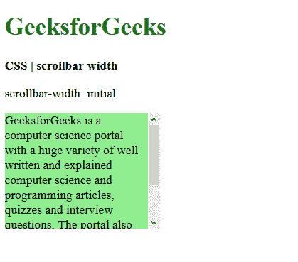

# CSS |滚动条宽度属性

> 原文:[https://www.geeksforgeeks.org/css-scrollbar-width-property/](https://www.geeksforgeeks.org/css-scrollbar-width-property/)

当显示时，**滚动条宽度**属性用于设置元素滚动条的宽度或厚度。这个属性可以用在用户界面要求元素显示得更突出的页面上，缩小滚动条宽度可以给元素更多的空间。
这目前是一个实验性质，一些主要的浏览器可能不被支持。
**语法:**

```
scrollbar-width: auto | thin | none | initial | inherit
```

**房产价值:**

*   **自动:**用于设置浏览器自动设置的滚动条宽度。这是默认值。
    **例:**

## 超文本标记语言

```
<!DOCTYPE html>
<html>

<head>
    <title>CSS | scrollbar-width property</title>

    <style>
        .scrollbar-auto {
            scrollbar-width: auto;
            background-color: lightgreen;
            height: 150px;
            width: 200px;
            overflow-y: scroll;
        }
    </style>
</head>

<body>
    <h1 style="color: green">
        GeeksforGeeks
    </h1>

    <b>CSS | scrollbar-width</b>

<p>scrollbar-width: auto</p>

    <div class="scrollbar-auto">
        GeeksforGeeks is a computer science
        portal with a huge variety of well
        written and explained computer science
        and programming articles, quizzes and
        interview questions. The portal also
        has dedicated GATE preparation and
        competitive programming sections.
    </div>
</body>

</html>
```

*   **输出:**


*   **thin:** 用于将滚动条宽度设置为默认滚动条的较细变体。
    **例:**

## 超文本标记语言

```
<!DOCTYPE html>
<html>

<head>
    <title>CSS | scrollbar-width</title>

    <style>
        .scrollbar-thin {
            scrollbar-width: thin;
            background-color: lightgreen;
            height: 150px;
            width: 200px;
            overflow-y: scroll;
        }
    </style>
</head>

<body>
    <h1 style="color: green">
        GeeksforGeeks
    </h1>

    <b>CSS | scrollbar-width</b>

<p>scrollbar-width: thin</p>

    <div class="scrollbar-thin">
        GeeksforGeeks is a computer science
        portal with a huge variety of well
        written and explained computer science
        and programming articles, quizzes and
        interview questions. The portal also
        has dedicated GATE preparation and
        competitive programming sections.
    </div>
</body>

</html>
```

*   **输出:**


*   **无:**用于完全隐藏滚动条，但内容仍可滚动。
    **例:**

## 超文本标记语言

```
<!DOCTYPE html>
<html>

<head>
    <title>CSS | scrollbar-width</title>

    <style>
        .scrollbar-none {
            scrollbar-width: none;
            background-color: lightgreen;
            height: 150px;
            width: 200px;
            overflow-y: scroll;
        }
    </style>
</head>

<body>
    <h1 style="color: green">
        GeeksforGeeks
    </h1>

    <b>CSS | scrollbar-width</b>

<p>scrollbar-width: none</p>

    <div class="scrollbar-none">
        GeeksforGeeks is a computer science
        portal with a huge variety of well
        written and explained computer science
        and programming articles, quizzes and
        interview questions. The portal also
        has dedicated GATE preparation and
        competitive programming sections.
    </div>
</body>

</html>
```

*   **输出:**


*   **初始:**用于将滚动条宽度设置为默认值。
    **例:**

## 超文本标记语言

```
<!DOCTYPE html>
<html>

<head>
    <title>CSS | scrollbar-width</title>

    <style>
        .scrollbar-initial {
            scrollbar-width: initial;
            background-color: lightgreen;
            height: 150px;
            width: 200px;
            overflow-y: scroll;
        }
    </style>
</head>

<body>
    <h1 style="color: green">
        GeeksforGeeks
    </h1>

    <b>CSS | scrollbar-width</b>

<p>scrollbar-width: initial</p>

    <div class="scrollbar-initial">
        GeeksforGeeks is a computer science
        portal with a huge variety of well
        written and explained computer science
        and programming articles, quizzes and
        interview questions. The portal also
        has dedicated GATE preparation and
        competitive programming sections.
    </div>
</body>

</html>
```

*   **输出:**



*   **继承:**用于从其父级继承滚动条宽度。
    **例:**

## 超文本标记语言

```
<!DOCTYPE html>
<html>

<head>
    <title>CSS | scrollbar-width</title>
    <style>
        .scrollbar-thin {
            scrollbar-width: thin;
            background-color: lightgreen;
            height: 150px;
            width: 200px;
            overflow-y: scroll;
            margin: 10px;
        }

        .scrollbar-inherit {
            scrollbar-width: inherit;
            background-color: green;
            height: 50px;
            width: 150px;
            overflow-y: scroll;
        }
    </style>
</head>

<body>
    <h1 style="color: green">
        GeeksforGeeks
    </h1>

    <b>CSS | scrollbar-width</b>

<p>scrollbar-width: inherit</p>

    <div class="scrollbar-thin">
        <div class="scrollbar-inherit">
            This text is inside a parent element.
            This div has an inherited scrollbar.
        </div>
        GeeksforGeeks is a computer science
        portal with a huge variety of well
        written and explained computer science
        and programming articles, quizzes and
        interview questions. The portal also
        has dedicated GATE preparation and
        competitive programming sections.
    </div>
</body>

</html>
```

*   **输出:**


**支持的浏览器:**滚动条宽度属性支持的浏览器如下:

*   谷歌 Chrome
*   微软公司出品的 web 浏览器
*   火狐浏览器
*   歌剧
*   狩猎