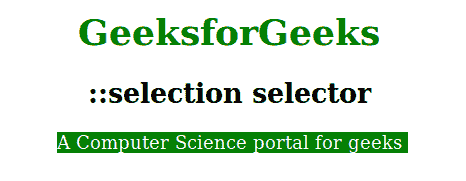

# CSS |::选择选择器

> 原文:[https://www.geeksforgeeks.org/css-selection-selector/](https://www.geeksforgeeks.org/css-selection-selector/)

选择选择器用于将 CSS 属性设置为用户选择的文档部分(例如在文本上单击并拖动鼠标)。只有一些 CSS 属性与::选择选择器一起使用。支持的 CSS 属性有颜色、背景、光标和轮廓。

**语法:**

```html
::selection {
    // CSS Property
}

```

**示例:**

```html
<!DOCTYPE html>
<html>
    <head>
        <title>::selection Selector</title>
        <style>
            h1 {
                color: green;
            }
            body {
                text-align:center;
            }

            /* CSS property for Firefox */
            ::-moz-selection { 
                color: white;
                background: green;
            }

            ::selection {
                color: white;
                background: green;
            }
        </style>
    </head>
    <body>
        <h1>GeeksforGeeks</h1>
        <h2>::selection selector</h2>
        <p>A Computer Science portal for geeks </p>
    </body>
</html>                    
```

**输出:**


**支持的浏览器:**以下列出了::选择选择器支持的浏览器:

*   苹果 Safari 3.1
*   谷歌 Chrome 4.0
*   火狐 62.0 2.0-moz-
*   歌剧 10.1
*   Internet Explorer 9.0