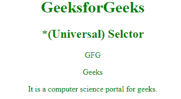

# CSS | *选择器

> 原文:[https://www.geeksforgeeks.org/css-selector/](https://www.geeksforgeeks.org/css-selector/)

CSS 中的*选择器用于选择 HTML 文档中的所有元素。它还会选择另一个元素下面的所有元素。它也被称为通用选择器。

**语法:**

```css
* {
    // CSS property
} 
```

**例 1:**

## 超文本标记语言

```css
<!DOCTYPE html>
<html>
    <head>
        <title>* Selector</title>

        <!-- CSS property of * selector -->
        <style>
            * {
                color:green;
                text-align:center;
            }
        </style>
    </head>

    <body>
        <h1>GeeksforGeeks</h1>
        <h2>*(Universal) Selector</h2>
        <div>

<p>GFG</p>

<p>Geeks</p>

        </div>

<p>It is a computer science portal for geeks.</p>

    </body>
</html>                                     
```

**输出:**



**例 2:**

## 超文本标记语言

```css
<!DOCTYPE html>
<html>
    <head>
        <title>* selector</title>

        <!-- CSS property for * selector -->
        <style>
            * {
                background: green;
                font-weight:bold;
                margin-left:70px;
                color:white;
            }
        </style>
    </head>

    <body>
        <h1>GeeksforGeeks</h1>
        <h2>*(Universal) Selector</h2>

        <ul>
            <li>Data Structure</li>
            <li>Computer Network</li>
            <li>Operating System</li>
        </ul>

        <ol>
            <li>Java</li>
            <li>Ruby</li>
            <li>Pascal</li>
        </ol>

    </body>
</html>                                 
```

**输出:**


**支持的浏览器:**以下列出了*(通用)选择器支持的浏览器:

*   苹果 Safari 3.1
*   谷歌 Chrome 4.0
*   Firefox 3.0
*   歌剧 9.6
*   Internet Explorer 7.0