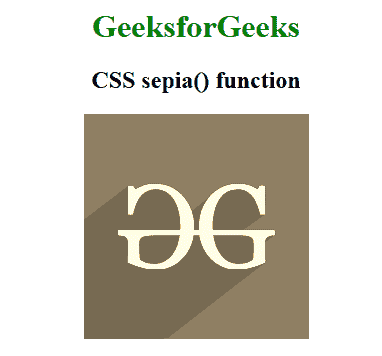

# CSS | sepia()函数

> 原文:[https://www.geeksforgeeks.org/css-sepia-function/](https://www.geeksforgeeks.org/css-sepia-function/)

**棕褐色()函数**是一个内置函数，用于对图像应用滤镜，将图像转换为棕褐色图像。

**语法:**

```
sepia( amount )
```

**参数:**该功能接受保存棕褐色值的单参数**量**。乌贼的价值是根据价值和百分比设定的。值 0%代表原始图像，100%代表完整的棕褐色图像。

下面的例子说明了 **sepia()函数**在 CSS 中:
T3】例子:

```
<!DOCTYPE html> 
<html> 

<head> 
    <title>CSS sepia() Function</title> 

    <style>
        h1 {
            color:green;
        }
        body {
            text-align:center;
        }
        .sepia_effect {
            filter: sepia(100%);
        }
    </style>
</head> 

<body> 
    <h1>GeeksforGeeks</h1> 

    <h2>CSS sepia() function</h2>

     
</body> 

</html>
```

**输出:**


**支持的浏览器:****sepia()功能**支持的浏览器如下:

*   谷歌 Chrome
*   微软公司出品的 web 浏览器
*   火狐浏览器
*   旅行队
*   歌剧