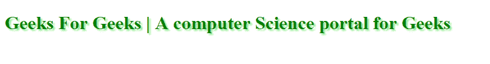
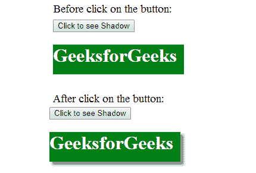

# CSS |阴影效果

> 原文:[https://www.geeksforgeeks.org/css-shadow-effect/](https://www.geeksforgeeks.org/css-shadow-effect/)

CSS 中的**阴影效果属性**用于在 HTML 文档中添加文本和图像阴影。

**文字阴影:**CSS 文字-阴影属性用来显示有阴影的文字。此属性保存阴影的像素长度、宽度和宽度以及阴影的颜色。

**语法:**

```css
Text-shadow: 3px 3px 3px green;
```

**示例:**

```css
<!DOCTYPE html>
<html>
    <head>
        <title>text-shadow property</title>
        <style>
            h1 {
                color: green;
                text-shadow: 3px 3px 3px lightgreen;
            }
        </style>
    </head>
    <body>
        <h1>Geeks For Geeks | A computer Science portal for Geeks</h1>
    </body>
</html>                    
```

**输出:**


**文本框阴影:**CSS box Shadow 属性对文本框应用阴影。该属性保存阴影的像素长度、宽度和宽度以及阴影的颜色。

**语法:**

```css
boxShadow: 3px 3px 3px green;
```

**示例:**

```css
<!DOCTYPE html>
<html>
     <head>
         <title>box shadow property</title>
         <style>
               #Gfg {
                   width: 220px;
                   height: 50px;
                   background-color: green;
                   color: white;
               }
          </style>
          <script>

               // function that show Shadow Effect.
               function Shadow() {
                  document.getElementById("Gfg").style.boxShadow 
                                           = "5px 5px 5px gray";
               }
          </script>
     </head>
     <body>
          <button onclick = "Shadow()">Click to see Shadow</button>
          <div id = "Gfg">
            <h1>GeeksforGeeks</h1>
          </div>
     </body>
</html>
```

**输出:**
