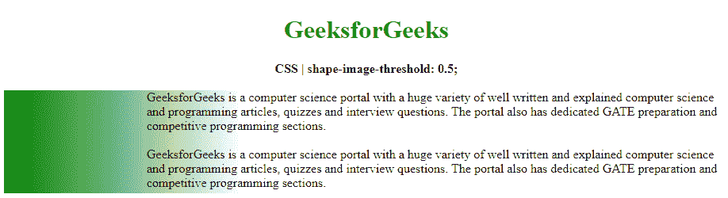
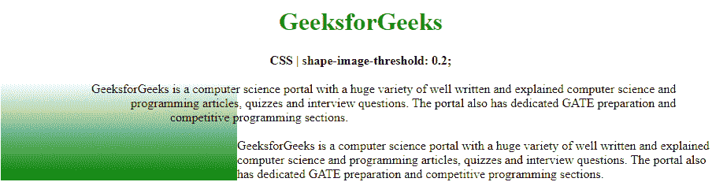

# CSS |形状-图像-阈值属性

> 原文:[https://www . geesforgeks . org/CSS-shape-image-threshold-property/](https://www.geeksforgeeks.org/css-shape-image-threshold-property/)

**形状-图像-阈值**属性用于设置阿尔法通道的阈值，该通道用于在形状外部使用图像时提取形状。

**语法:**

```
shape-image-threshold: <alpha-value>
```

**属性值:**

*   **α值:**用于设置提取形状的阈值。大于阈值的像素将被考虑用于该形状。从 0.0 到 1.0 的十进制值可用于将阈值从完全透明设置为完全不透明。如果值超出范围，它们将被限制在此范围内。

以下示例说明了**形状-图像-阈值属性**:

**示例 1:** 在本例中，我们将阈值设置为 0.5

```
<!DOCTYPE html>
<html>

<head>
    <title>
        CSS | shape-image-threshold
    </title>
    <style>
        .outline {
            shape-outside: linear-gradient(
                    to right, green, transparent);

            /* shape-image-threshold effect */
            shape-image-threshold: 0.4;
            background-image: linear-gradient(
                    to right, green, transparent);
            width: 300px;
            height: 130px;
            float: left;
        }
    </style>
</head>

<body>
    <center>
        <h1 style="color: green">
            GeeksforGeeks
        </h1>

        <b>
            CSS | shape-image-threshold: 0.5;
        </b>

        <br><br>
    </center>

    <div class="outline"></div>

    <div class="container">
        GeeksforGeeks is a computer science portal
        with a huge variety of well written and
        explained computer science and programming 
        articles, quizzes and interview questions.
        The portal also has dedicated GATE preparation
        and competitive programming sections.
        <br><br> 
        GeeksforGeeks is a computer science portal
        with a huge variety of well written and 
        explained computer science and programming
        articles, quizzes and interview questions.
        The portal also has dedicated GATE preparation
        and competitive programming sections.
    </div>
</body>

</html>
```

**输出:**


**示例 2:** 在本例中，我们将阈值设置为 0.2

```
<!DOCTYPE html>
<html>

<head>
    <title>
        CSS | shape-image-threshold
    </title>
    <style>
        .outline {
            shape-outside: linear-gradient(20deg,
                rgb(77, 26, 103), transparent 80%,
                transparent);         

            /* shape-image-threshold effect */
            shape-image-threshold: 0.2;
            background-image: linear-gradient(
                to top, green, transparent);
            width: 300px;
            height: 125px;
            float: left;
        }
    </style>
</head>

<body>
    <center>
        <h1 style="color: green">
            GeeksforGeeks
        </h1>

        <b>
            CSS | shape-image-threshold: 0.2;
        </b>

        <br><br>
    </center>

    <div class="outline"></div>

    <div class="container">
        GeeksforGeeks is a computer science portal
        with a huge variety of well written and
        explained computer science and programming 
        articles, quizzes and interview questions.
        The portal also has dedicated GATE preparation
        and competitive programming sections.
        <br><br> 
        GeeksforGeeks is a computer science portal
        with a huge variety of well written and 
        explained computer science and programming
        articles, quizzes and interview questions.
        The portal also has dedicated GATE preparation
        and competitive programming sections.
    </div>
</body>

</html>
```

**输出:**


**支持的浏览器:***形状-图像-阈值*属性支持的浏览器如下:

*   谷歌 Chrome
*   Internet Explorer 9
*   火狐浏览器
*   旅行队
*   歌剧