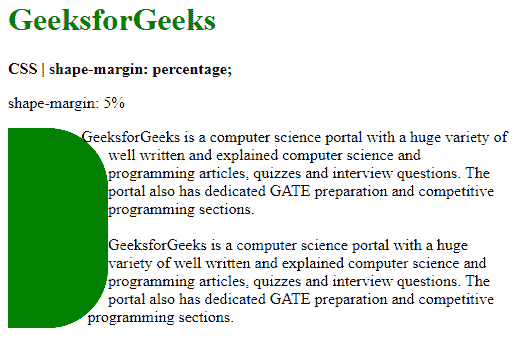

# CSS |形状边距属性

> 原文:[https://www.geeksforgeeks.org/css-shape-margin-property/](https://www.geeksforgeeks.org/css-shape-margin-property/)

**形状边距**属性用于设置由形状外部属性创建的形状的边距。此边距用于调整形状边缘和周围内容之间的间距。

**语法:**

```
shape-margin: <length> | <percentage>
```

**属性值:**

*   **length:** It is used to set the margin in measurement units. It can also take values in whole numbers or decimals.

    **示例:**本示例以像素为单位设置边距。

    ```
    <!DOCTYPE html>
    <html>

    <head>
        <title>
            CSS | shape-margin
        </title>
        <style>
            .outline {
                shape-margin: 10px;
                shape-outside: circle(43%);
                border-radius: 0px 60px 60px 0px;
                width: 50px;
                height: 150px;
                float: left;
                background-color: green;
            }

            .container {
                width: 500px;
            }
        </style>
    </head>

    <body>
        <h1 style="color: green">
            GeeksforGeeks
        </h1>
        <b>
            CSS | shape-margin: length;
        </b>
        <p>
            shape-margin: 10px
        </p>
        <div class="outline">
            <div class="logospace"></div>
        </div>
        <div class="container">
          GeeksforGeeks is a computer science portal with a huge 
          variety of well written and explained computer science
          and programming articles, quizzes and interview questions. 
          The portal also has dedicated GATE preparation and competitive
          programming sections.
          <br>
          <br> 
          GeeksforGeeks is a computer science portal with a huge 
          variety of well written and explained computer science 
          and programming articles, quizzes and interview questions.
          The portal also has dedicated GATE preparation and competitive
          programming sections.
        </div>
    </body>

    </html>
    ```

    **输出:**

    

*   **percentage:** It is used to set the margin in percentage values. The percentage is based on the width of the element’s containing block.

    **示例:**

    ```
    <!DOCTYPE html>
    <html>

    <head>
        <title>
            CSS | shape-margin
        </title>
        <style>
            .outline {
                shape-margin: 5%;
                shape-outside: circle(25%);
                border-radius: 0px 60px 60px 0px;
                width: 100px;
                height: 200px;
                float: left;
                background-color: green;
            }

            .container {
                width: 500px;
            }
        </style>
    </head>

    <body>
        <h1 style="color: green">
            GeeksforGeeks
        </h1>
        <b>
            CSS | shape-margin: percentage;
        </b>
        <p>
            shape-margin: 5%
        </p>
        <div class="outline">
            <div class="logospace"></div>
        </div>
        <div class="container">
          GeeksforGeeks is a computer science portal with a huge 
          variety of well written and explained computer science
          and programming articles, quizzes and interview questions. 
          The portal also has dedicated GATE preparation and competitive
          programming sections.
          <br>
          <br> 
          GeeksforGeeks is a computer science portal with a huge 
          variety of well written and explained computer science 
          and programming articles, quizzes and interview questions.
          The portal also has dedicated GATE preparation and competitive
          programming sections.
        </div>
    </body>

    </html>
    ```

    **输出:**

    

**支持的浏览器:****形状边距**属性支持的浏览器如下:

*   谷歌 Chrome 37
*   Firefox 62
*   Safari 10.1
*   歌剧 24