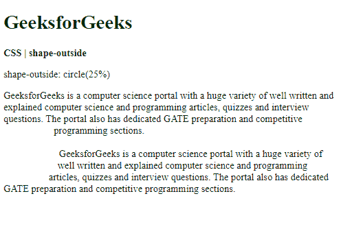

# CSS |形状外属性

> 原文:[https://www.geeksforgeeks.org/css-shape-outside-property/](https://www.geeksforgeeks.org/css-shape-outside-property/)

**形状外部**属性用于定义相邻内联内容可能环绕的形状。它可以用来定义复杂的形状，包括可以用来环绕文本的图像，而不是简单的框。

**语法:**

```
shape-outside: <basic-shape> | <shape-box> | <image> | none |  initial | inherit
```

**属性值:**

*   **basic-shape:** It is used to define the shape that should be used to calculate the float area. The shape can be created using one of the supported functions:
    *   **圆形():**用于制作圆形。
    *   **椭圆():**用于制作椭圆形状。
    *   **插图():**用于制作矩形。
    *   **多边形():**用于制作顶点数超过 3 个的形状。
    *   **path():** 用于创建具有直线、圆弧或曲线的形状。

    **例 1:** 本例实现了 circle()函数。

    ```
    <!DOCTYPE html>
    <html>
    <head>
      <title>
        CSS | shape-outside
      </title>
      <style>
        .outline {
          shape-outside: circle(25%);

          width: 100px;
          height: 200px;
          float: left;
        }
      </style>
    </head>
    <body>
      <h1 style="color: green">
        GeeksforGeeks
      </h1>
      <b>
        CSS | shape-outside
      </b>
      <p>
        shape-outside: circle(25%)
      </p>
      <div class="outline">
      </div>
      <div class="container">
        GeeksforGeeks is a computer science
        portal with a huge variety of well
        written and explained computer science
        and programming articles, quizzes and
        interview questions. The portal also
        has dedicated GATE preparation and
        competitive programming sections.
        <br><br>
        GeeksforGeeks is a computer science
        portal with a huge variety of well
        written and explained computer science
        and programming articles, quizzes and
        interview questions. The portal also
        has dedicated GATE preparation and
        competitive programming sections.
      </div>
    </body>
    </html>
    ```

    **输出:**
    

    **示例 2:** 本示例实现了 inset()函数。

    ```
    <!DOCTYPE html>
    <html>
    <head>
      <title>
        CSS | shape-outside
      </title>
      <style>
        .outline {
          shape-outside: inset(50px 50px);

          width: 150px;
          height: 150px;
          float: left;
        }
      </style>
    </head>
    <body>
      <h1 style="color: green">
        GeeksforGeeks
      </h1>
      <b>
        CSS | shape-outside
      </b>
      <p>
        shape-outside: inset(50px 50px)
      </p>
      <div class="outline">
      </div>
      <div class="container">
        GeeksforGeeks is a computer science
        portal with a huge variety of well
        written and explained computer science
        and programming articles, quizzes and
        interview questions. The portal also
        has dedicated GATE preparation and
        competitive programming sections.
        <br><br>
        GeeksforGeeks is a computer science
        portal with a huge variety of well
        written and explained computer science
        and programming articles, quizzes and
        interview questions. The portal also
        has dedicated GATE preparation and
        competitive programming sections.
      </div>
    </body>
    </html>
    ```

    **输出:**
    

*   **shape-outside:** It is used to define which one of the box model is used for positioning inside the shape. These values are used after the shape value is defined. There are 4 values that can be used:
    *   **边距框:**用于定义被外侧边距包围的形状。拐角半径是根据边界半径和边距值确定的。这是将使用的默认值。
    *   **边框:**用于定义由外侧边缘包围的形状。遵循默认的边界半径成形规则。
    *   **填充框:**用于定义由外部填充边包围的形状。遵循默认的边界半径成形规则。
    *   **内容框:**用于定义由外部内容边缘包围的形状。
*   **image:** It is used to specify the image of which the alpha value would be extracted to compute the float area. The url() function can be used to define the image. A gradient can also be used in place of the image.

    **示例:**

    ```
    <!DOCTYPE html>
    <html>

    <head>
      <title>
        CSS | shape-outside
      </title>
      <style>
        .outline {
          shape-outside: url(
    "https://media.geeksforgeeks.org/wp-content/uploads/20191118233732/circle-img1.png"
    );

          background: url(
    "https://media.geeksforgeeks.org/wp-content/uploads/20191118233732/circle-img1.png"
    ) no-repeat;
          width: 150px;
          height: 150px;
          float: left;
        }
      </style>
    </head>

    <body>
      <h1 style="color: green">
        GeeksforGeeks
      </h1>
      <b>
        CSS | shape-outside
      </b>
      <p>shape-outside: url()</p>
      <div class="outline">
      </div>
      <div class="container">
        GeeksforGeeks is a computer science
        portal with a huge variety of well
        written and explained computer science
        and programming articles, quizzes and
        interview questions. The portal also
        has dedicated GATE preparation and
        competitive programming sections.
        <br><br>
        GeeksforGeeks is a computer science
        portal with a huge variety of well
        written and explained computer science
        and programming articles, quizzes and
        interview questions. The portal also
        has dedicated GATE preparation and
        competitive programming sections.
      </div>
    </body>

    </html>
    ```

    **输出:**
    

*   **none:** It is used to set the property to have no float area. The inline content wraps around the margin-box as default.
*   **initial:** It is used to set the property to its default value.
*   **继承:**用于设置属性从其父级继承。

**支持的浏览器:***形状外*属性支持的浏览器如下:

*   铬合金 37
*   Firefox 62
*   Safari 10.1
*   歌剧 24