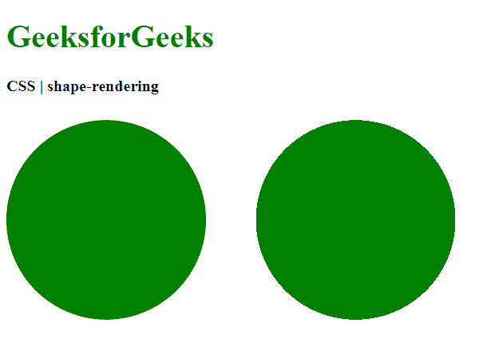
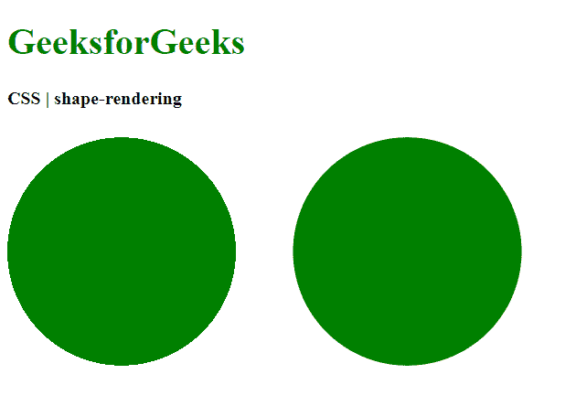

# CSS |形状渲染属性

> 原文:[https://www.geeksforgeeks.org/css-shape-rendering-property/](https://www.geeksforgeeks.org/css-shape-rendering-property/)

**形状渲染**属性用于提示渲染器在渲染圆形、矩形或路径等形状时必须进行的权衡。可以告诉渲染器使形状在几何上精确，或者优化形状以在某些情况下加快渲染速度。

**语法:**

```html
shape-rendering: auto | optimizeSpeed | crispEdges | geometricPrecision | initial | inherit
```

**属性值:**

*   **auto:** It is used to indicate that the user agent would automatically make the decision to balance the speed, have crisp edges or have good geometric precision. Generally, good precision is given more importance than speed and crisp edges. This is the default value.

    **示例:**

    ```html
    <!DOCTYPE html>
    <html>
    <head>
      <title>
        CSS | shape-rendering property
      </title>
      <style>
        .shape-crisp {
          /* Assume the crispEdges
          value for demonstration */
          shape-rendering: crispEdges;

          fill: green;
        }

        .shape-auto {
          shape-rendering: auto;

          fill: green;
        }
      </style>
    </head>
    <body>
      <h1 style="color: green">
        GeeksforGeeks
      </h1>
      <b>
        CSS | shape-rendering
      </b>
      <div class="container">
        <svg height="250px" width="500px"
          xmlns="http://www.w3.org/2000/svg"
          version="1.1">
          <circle class="shape-crisp"
            cx="100" cy="125" r="100"/>
          <circle class="shape-auto"
            cx="350" cy="125" r="100"/>
        </svg>
      </div>
    </body>
    </html>
    ```

    **输出:**将 crispEdges 值与自动值
    进行比较

*   **optimizeSpeed:** It is used to indicate that shape will be rendered in a manner to emphasize speed over geometric precision or crisp edges. This may cause the user agent to turn off anti-aliasing for all shapes.

    **示例:**

    ```html
    <!DOCTYPE html>
    <html>
    <head>
      <title>
        CSS | shape-rendering property
      </title>
      <style>
        .shape-auto {
          /* Assume the auto
          value for demonstration */
          shape-rendering: auto;

          fill: green;
        }

        .shape-optimizespeed {
          shape-rendering: optimizeSpeed;

          fill: green;
        }
      </style>
    </head>
    <body>
      <h1 style="color: green">
        GeeksforGeeks
      </h1>
      <b>
        CSS | shape-rendering
      </b>
      <div class="container">
        <svg height="250px" width="500px"
          xmlns="http://www.w3.org/2000/svg"
          version="1.1">
          <circle class="shape-auto"
            cx="100" cy="125" r="100"/>
          <circle class="shape-optimizespeed"
            cx="350" cy="125" r="100"/>
        </svg>
      </div>
    </body>
    </html>
    ```

    **输出:**将自动值与优化速度值进行比较
    

*   **crispEdges:** It is used to indicate that the shape will be rendered with an emphasis given to the contrast of clean edges over geometric precision or speed. The user agent may turn off anti-aliasing for shapes and adjust the line positions and widths to align with the pixels of the device.

    **示例:**

    ```html
    <!DOCTYPE html>
    <html>
    <head>
      <title>
        CSS | shape-rendering property
      </title>
      <style>
        .shape-auto {
          /* Assume the auto
          value for demonstration */
          shape-rendering: auto;

          fill: green;
        }

        .shape-crisp {
          shape-rendering: crispEdges;

          fill: green;
        }
      </style>
    </head>
    <body>
      <h1 style="color: green">
        GeeksforGeeks
      </h1>
      <b>
        CSS | shape-rendering
      </b>
      <div class="container">
        <svg height="250px" width="500px"
          xmlns="http://www.w3.org/2000/svg"
          version="1.1">
          <circle class="shape-auto"
            cx="100" cy="125" r="100"/>
          <circle class="shape-crisp"
            cx="350" cy="125" r="100"/>
        </svg>
      </div>
    </body>
    </html>
    ```

    **输出:**将自动值与 crispEdges 值进行比较
    

*   **geometricPrecision:** It is used to indicate that the shape will be rendered with geometric precision rather than focusing on the speed or crisp edges.

    **示例:**

    ```html
    <!DOCTYPE html>
    <html>

    <head>
        <title>
            CSS | shape-rendering property
        </title>

        <style>
            .shape-auto {
                /* Assume the auto
                value for demonstration */
                shape-rendering: auto;
                fill: green;
            }

            .shape-crisp {
                shape-rendering: geometricPrecision;
                fill: green;
            }
        </style>
    </head>

    <body>
        <h1 style="color: green">
            GeeksforGeeks
        </h1>

        <b>
            CSS | shape-rendering
        </b>

        <div class="container">
            <svg height="250px" width="500px"
                xmlns="http://www.w3.org/2000/svg"
                version="1.1">

                <circle class="shape-auto"
                    cx="100" cy="125" r="100"/>

                <circle class="shape-crisp"
                    cx="350" cy="125" r="100"/>
            </svg>
        </div>
    </body>

    </html>
    ```

    **输出:**将 crispEdges 值与几何精度值进行比较
    

*   **initial:** It is used to set the property to its default value.

    **示例:**

    ```html
    <!DOCTYPE html>
    <html>

    <head>
      <title>
        CSS | shape-rendering
      </title>

      <style>
        .shape-crisp {
          /* Assume the crispEdges
          value for demonstration */
          shape-rendering: crispEdges;

          fill: green;
        }

        .shape-initial {
          shape-rendering: initial;

          fill: green;
        }
      </style>
    </head>

    <body>
      <h1 style="color: green">
        GeeksforGeeks
      </h1>
      <b>
        CSS | shape-rendering
      </b>
      <div class="container">
        <svg height="250px" width="500px"
          xmlns="http://www.w3.org/2000/svg"
        version="1.1">
          <circle class="shape-crisp"
            cx="100" cy="125" r="100"/>
          <circle class="shape-initial"
            cx="350" cy="125" r="100"/>
        </svg>
      </div>
    </body>

    </html>
    ```

    **输出:**比较舍入值和初始值
    

*   **inherit:** 用于设置属性从其父元素继承。

**支持的浏览器:***形状渲染*属性支持的浏览器如下:

*   铬
*   火狐浏览器
*   旅行队
*   歌剧
*   Internet Explorer 9