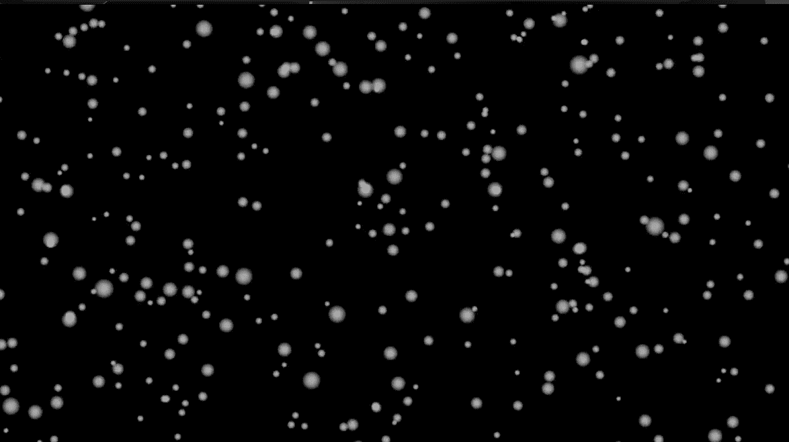
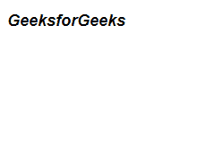
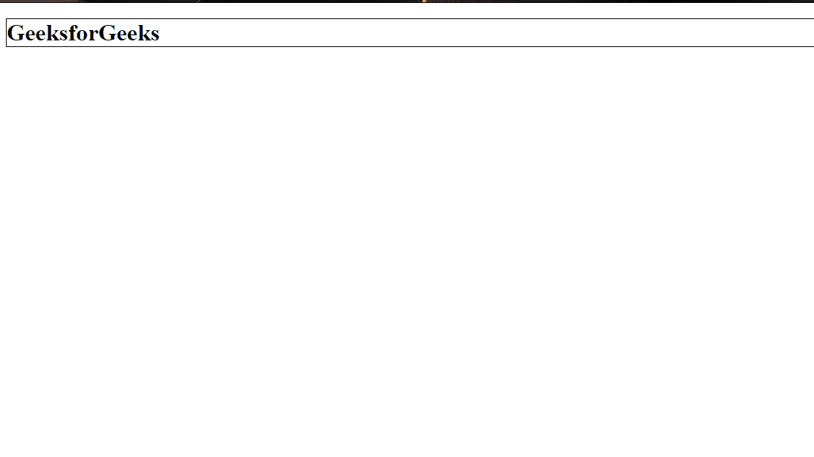
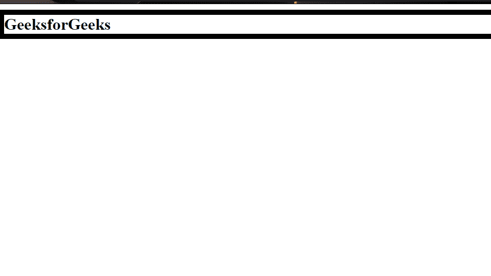
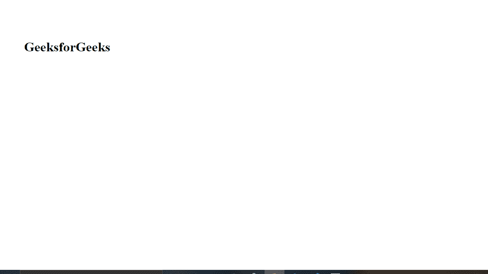
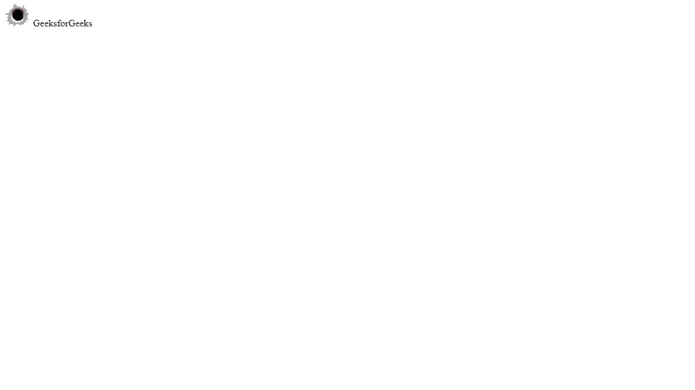

# CSS |速记属性

> 原文:[https://www.geeksforgeeks.org/css-shorthand-properties/](https://www.geeksforgeeks.org/css-shorthand-properties/)

速记属性允许我们在一行中以紧凑的方式编写多个属性。它们很有用，因为它们提供了干净的代码，还减少了代码行。

我们将介绍的速记属性:

1.  背景
2.  字体
3.  边境
4.  概述
5.  边缘
6.  填料
7.  目录

**背景:**CSS Background 属性用于设置网页上的背景。背景可以应用于任何元素，如 body、h1、p、div 等。背景有许多属性，如颜色、图像、位置等。其中一些在下面的代码中使用。

*   **龙兰道:**

    ```html
    background-color:#000;
    background-image: url(images/bg.png);
    background-repeat: no-repeat;
    background-position:left top;
    ```

*   **简写方式:**

    ```html
    background:#000 url(images/bg.png) no-repeat left top;
    ```

*   **例:**

    ```html
    <!DOCTYPE html>
    <html lang="en">

    <head>
        <meta charset="UTF-8" />
        <meta name="viewport" content="width=device-width,
              initial-scale=1.0" />
        <title>Document</title>

        <style>
            body {
                background: #000 url(images/bg.png) no-repeat left top;
            }
        </style>
    </head>

    <body></body>

    </html>
    ```

*   **输出:**
    

**字体:**CSS 字体属性用于对网页上的文本应用不同的字体。使用字体可以设置的各种属性有字体系列、字体大小、字体粗细等。其中一些在下面的代码中使用。

*   **龙兰道:**

    ```html
    font-style:italic;
    font-weight:bold;
    font-size:18px;
    line-height:150%;
    font-family:Arial,sans-serif;
    ```

*   **简写方式:**

    ```html
    font: italic bold 18px/150% Arial, sans-serif;
    ```

*   **例:**

    ```html
    <!DOCTYPE html>
    <html lang="en">

    <head>
        <meta charset="UTF-8" />
        <meta name="viewport" content="width=device-width,
                                       initial-scale=1.0" />
        <title>Document</title>

        <style>
            h1 {
                font: italic bold 18px/150% Arial, sans-serif;

            }
        </style>
    </head>

    <body>
        <h1>GeeksforGeeks</h1>
    </body>

    </html>
    ```

*   **输出:**
    

**边框:**CSS 边框属性用于将边框应用于网页的不同元素。边框有许多属性，如宽度、样式、颜色等。

*   **龙兰道:**

    ```html
    border-width: 1px;
    border-style: solid;
    border-color: #000; 
    ```

*   **简写方式:**

    ```html
    border: 1px solid #000;
    ```

*   **例:**

    ```html
    <!DOCTYPE html>
    <html lang="en">

    <head>
        <meta charset="UTF-8" />
        <meta name="viewport" content="width=device-width,
                              initial-scale=1.0" />
        <title>Document</title>

        <style>
            h1 {
                border: 1px solid #000;
            }
        </style>
    </head>

    <body>
        <h1>GeeksforGeeks</h1>
    </body>

    </html>
    ```

*   **输出:**
    

**轮廓:**CSS 轮廓属性用于将轮廓应用于网页中存在的各种元素。

*   **龙兰道:**

    ```html
    outline-width: 1px;
    outline-style: solid;
    outline-color: #000;
    ```

*   **简写方式:**

    ```html
    outline: 1px solid #000;
    ```

*   **例:**

    ```html
    <!DOCTYPE html>
    <html lang="en">

    <head>
        <meta charset="UTF-8" />
        <meta name="viewport" content="width=device-width,
                                       initial-scale=1.0" />
        <title>Document</title>

        <style>
            h1 {
                outline: 10px solid #000;
            }
        </style>
    </head>

    <body>
        <h1>GeeksforGeeks</h1>
    </body>

    </html>
    ```

*   **输出:**
    

**边距:**CSS 边距属性用于在任何定义的边框之外的元素周围创建空间。我们可以定义所有 4 个边的边距，即顶部、底部、左侧和右侧。

*   **龙兰道:**

    ```html
    margin-top: 10px;
    margin-right: 5px;
    margin-bottom: 10px;
    margin-left :5px;
    ```

*   **简写方式:**

    ```html
    margin : 10px 5px 10px 5px;
    ```

*   **例:**

    ```html
    <!DOCTYPE html>
    <html lang="en">

    <head>
        <meta charset="UTF-8" />
        <meta name="viewport" content="width=device-width,
                              initial-scale=1.0" />
        <title>Document</title>

        <style>
            h1 {
                margin: 100px 50px 100px 50px;
            }
        </style>
    </head>

    <body>
        <h1>GeeksforGeeks</h1>
    </body>

    </html>
    ```

*   **输出:**
    

**填充:**CSS 填充属性用于在元素内容周围的任何定义的边框内生成空间。填充也可以应用为顶部、底部、左侧和右侧填充。

*   **龙兰道:**

    ```html
    padding-top: 10px;
    padding-right: 5px;
    padding-bottom: 10px;
    padding-left :5px;
    ```

*   **简写方式:**

    ```html
    padding : 10px 5px 10px 5px;
    ```

*   **例:**

    ```html
    <!DOCTYPE html>
    <html lang="en">

    <head>
        <meta charset="UTF-8" />
        <meta name="viewport" content="width=device-width,
                              initial-scale=1.0" />
        <title>Document</title>

        <style>
            h1 {
                padding: 100px 50px 100px 50px;
            }
        </style>
    </head>

    <body>
        <h1>GeeksforGeeks</h1>
    </body>

    </html>
    ```

*   **输出:**
    

**列表:**CSS 中主要有两类列表:
1。有序列表< ol >
2。无序列表< ul >
无序列表有项目符号，有序列表有数字。

*   **龙兰道:**

    ```html
    list-style-type: disc;
    list-style-position: inside;
    list-style-image: url(disc.png);
    ```

*   **简写方式:**

    ```html
    list-style: disc inside url(disc.png);
    ```

*   **例:**

    ```html
    <!DOCTYPE html>
    <html lang="en">

    <head>
        <meta charset="UTF-8" />
        <meta name="viewport" content="width=device-width,
                           initial-scale=1.0" />
        <title>Document</title>

        <style>
            li {
                list-style: disc inside url(assets/hole.png);
            }
        </style>
    </head>

    <body>
        <li>GeeksforGeeks</li>
    </body>

    </html>
    ```

*   **输出:**
    