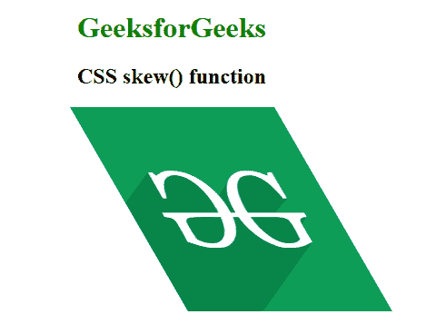
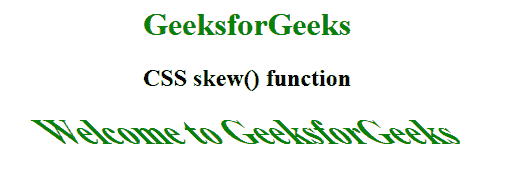

# CSS | skew()函数

> 原文:[https://www.geeksforgeeks.org/css-skew-function/](https://www.geeksforgeeks.org/css-skew-function/)

**偏斜()函数**是一个内置函数，用于转换 2D 平面中的元素。倾斜一个元素意味着选择一个点，并向不同的方向推或拉它。

**语法:**

```
skew( ax )
```

或者

```
skew( ax, ay )
```

**参数:**

*   **ax:** 此参数保存代表水平轴扭曲元素的角度。
*   **ay:** 此参数保存代表垂直轴扭曲元素的角度。如果未定义，则取默认值零。意思是在 x 方向完全歪斜。

下面的例子说明了 CSS 中的 skew()函数:

**例 1:**

```
<!DOCTYPE html> 
<html> 

<head> 
    <title>CSS skew() function</title> 

    <style> 
        body {
            text-align:center;
        }
        h1 {
            color:green;
        }
        .skew_image {
            transform-origin: top left;
            transform: skew(30deg, 0);
        }
    </style> 
</head> 

<body> 
    <h1>GeeksforGeeks</h1>
    <h2>CSS skew() function</h2>

     
</body> 

</html>    
```

**输出:**


**例 2:**

```
<!DOCTYPE html> 
<html> 

<head> 
    <title>CSS skew() function</title> 

    <style> 
        body {
            text-align:center;
        }
        h1 {
            color:green;
        }
        .GFG {
            font-size:35px;
            font-weight:bold;
            color:green;
            transform: skew(45deg);
        }
    </style> 
</head> 

<body> 
    <h1>GeeksforGeeks</h1>
    <h2>CSS skew() function</h2>

    <div class="GFG">Welcome to GeeksforGeeks</div> 
</body> 

</html>    
```

**输出:**


**支持的浏览器:**skew()函数支持的浏览器如下:

*   谷歌 Chrome
*   微软公司出品的 web 浏览器
*   火狐浏览器
*   旅行队
*   歌剧