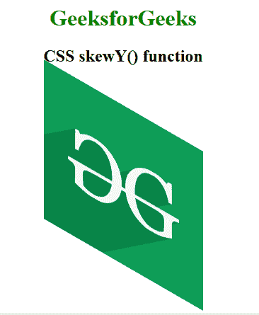
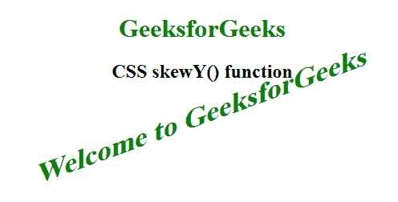

# CSS | skyy()函数

> 原文:[https://www.geeksforgeeks.org/css-skewy-function/](https://www.geeksforgeeks.org/css-skewy-function/)

**skyy()函数**是一个内置函数，用于在 2D 平面的垂直方向上变换元素。

**语法:**

```css
skewY( a )
```

**参数:**该功能接受单个参数 **a** ，该参数保存代表垂直轴的角度。

下面的例子说明了 CSS 中的 skewY()函数:

**例 1:**

```css
<!DOCTYPE html> 
<html> 

<head> 
    <title>CSS skewY() function</title> 

    <style> 
        body {
            text-align:center;
        }
        h1 {
            color:green;
        }
        .skewY_image {
            transform: skewY(30deg);
        }
    </style> 
</head> 

<body> 
    <h1>GeeksforGeeks</h1>
    <h2>CSS skewY() function</h2>
    <br><br>

     
</body> 
</html>                            
```

**输出:**


**例 2:**

```css
<!DOCTYPE html> 
<html> 

<head> 
    <title>CSS skewY() function</title> 

    <style> 
        body {
            text-align:center;
        }
        h1 {
            color:green;
        }
        .GFG {
            font-size:35px;
            font-weight:bold;
            color:green;
            transform: skewY(-20deg);
        }
    </style> 
</head> 

<body> 
    <h1>GeeksforGeeks</h1>
    <h2>CSS skewY() function</h2>

    <div class="GFG">Welcome to GeeksforGeeks</div> 
</body> 

</html>                        
```

**输出:**


**支持的浏览器:**skyy()函数支持的浏览器如下:

*   谷歌 Chrome
*   微软公司出品的 web 浏览器
*   火狐浏览器
*   旅行队
*   歌剧