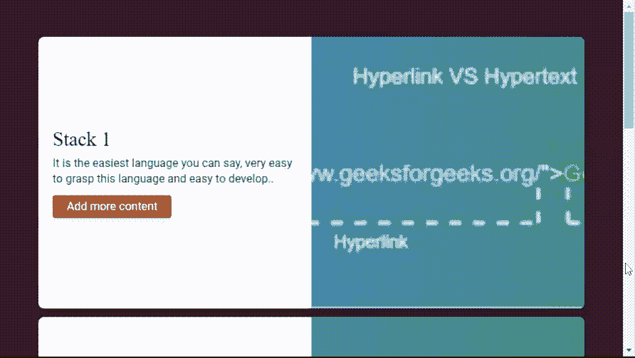

# CSS 堆叠页面插件

> 原文:[https://www.geeksforgeeks.org/css-stacking-page-plugin/](https://www.geeksforgeeks.org/css-stacking-page-plugin/)

在本文中，我们将学习如何使用 CSS**codihouse-framework**插件实现网站界面的堆叠页面效果。它是一种堆叠网页样式，用于开发网页，包括一些吸引人的交互界面。它为开发人员提供了一个轻量级的接口或框架。

**注意:**请下载工作文件夹中的 CSS[**codihouse-framework**](https://github.com/CodyHouse/codyhouse-framework)插件，并在你的 HTML 代码头部包含所需文件。此外，创建一个“图像”文件夹，并将所有用于图像源的所需图像保存在代码中。请相应地注意文件路径。

> <link href="”https://fonts.googleapis.com/css?" type="”text/css”/">
> 
> <link href="”style.css”" rel="”stylesheet”" type="”text/css”/">
> <脚本 src =></脚本>

**示例:**以下示例使用 HTML 元素和基于 CSS 的**codihouse-framework**插件演示了给定网页的堆叠页面效果。像*“main”、“li”、“p”、“div”*这样的 HTML 元素被用来设计页面结构以获得更好的外观。插件的“栈卡”、“网格”、“文本组件”、“容器”、“对象封面”等不同的类以及“style.css”文件的更多类被附加到 HTML 标签上，如下所示，以获得预期的输出。

## 超文本标记语言

```css
<!DOCTYPE html>
<html lang="en">
    <head>
        <meta charset="UTF-8" />
        <meta name="viewport"
              content="width=device-width, initial-scale=1" />
        <link href=
"https://fonts.googleapis.com/css?family=Playfair+Display|Roboto:400,700&display=swap"
              rel="stylesheet"/>
        <link rel="stylesheet" href="style.css" />
        <title>Stacking Page Plugins</title>
    </head>
    <body data-theme="dark">
        <main class="padding-y-xl">
            <div class="container 
                        max-width-adaptive-md 
                        margin-bottom-lg">

                <!-- Plugin's classes are used -->
                <ul class="stack-cards js-stack-cards">
                    <li data-theme="default" 
                        class="stack-cards__item 
                               js-stack-cards__item bg 
                               radius-lg shadow-md">
                        <div class="grid">
                            <div class="col-6 flex 
                                        items-center 
                                        height-100%">
                                <div class="text-component padding-md">
                                    <h2>Stack 1</h2>
                                    <p class="display@xs">
                                      It is the easiest language you can say, 
                                      very easy to grasp this language and 
                                      easy to develop..
                                    </p>

<p>
                                      <a href=
"https://www.geeksforgeeks.org/hyperlink-vs-hypertext/" 
                                         class="btn btn--accent">
                                        Add more content
                                      </a>
                                    </p>

                                </div>
                            </div>
                            <div class="col-6 height-100%">
                                
                            </div>
                        </div>
                    </li>

                    <li data-theme="default"
                        class="stack-cards__item bg 
                               js-stack-cards__item 
                               radius-lg shadow-md">
                        <div class="grid">
                            <div class="col-6 flex 
                                        items-center 
                                        height-100%">
                                <div class="text-component padding-md">
                                    <h2>Stack 2</h2>
                                    <p class="display@xs">
                                      This language is so much flexible that
                                      you can create whatever you want, a 
                                      flexible way to design web pages along
                                      with the text..
                                    </p>

<p>
                                        <a href=
"https://www.geeksforgeeks.org/html-tutorials/" 
                                           class="btn btn--accent">
                                            Add more content
                                        </a>
                                    </p>

                                </div>
                            </div>

                            <div class="col-6 height-100%">
                                
                            </div>
                        </div>
                    </li>

                    <li data-theme="default" 
                        class="stack-cards__item bg 
                               js-stack-cards__item
                               radius-lg shadow-md">
                        <div class="grid">
                            <div class="col-6 flex 
                                        items-center 
                                        height-100%">
                                <div class="text-component 
                                            padding-md">
                                    <h2>Stack 3</h2>
                                    <p class="display@xs">
                                        You can make linkable text like 
                                      users can connect from one page to 
                                      another page or website through these 
                                      characteristics.
                                    </p>

<p>
                                        <a href=
"https://www.geeksforgeeks.org/css-tutorials/" 
                                           class="btn btn--accent">
                                            Add more content
                                        </a>
                                    </p>

                                </div>
                            </div>

                            <div class="col-6 height-100%">
                                
                            </div>
                        </div>
                    </li>
                </ul>
            </div>

            <div class="container max-width-adaptive-sm">
                <div class="text-component 
                            line-height-lg 
                            v-space-md">

<p>
                        HTML stands for HyperText Markup Language. 
                      It is used to design web pages using a markup 
                      language. HTML is the combination of Hypertext
                      and Markup language. Hypertext defines the link 
                      between the web pages. A markup language is used
                      to define the text document within tag which defines
                      the structure of web pages. HTML is a markup language
                      that is used by the browser to manipulate text, images,
                      and other content to display it in the required format.
                    </p>

                </div>
            </div>
        </main>
    </body>
</html>
```

**输出:**

