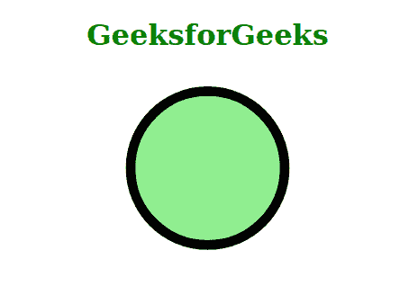
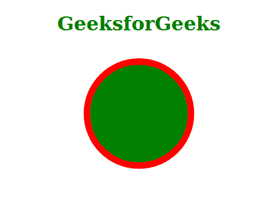

# CSS 笔画颜色属性

> 原文:[https://www.geeksforgeeks.org/css-stroke-color-property/](https://www.geeksforgeeks.org/css-stroke-color-property/)

CSS **描边颜色**属性设置截至边框的描边颜色。

**注意:**由于没有浏览器支持**笔画颜色**属性，因此，我们使用笔画作为速记属性，来定义笔画的颜色。

**语法:**

```css
stroke-color: currentColor 
/* Or */
stroke-color: color-name 
/* Or */
stroke-color: rgb value 
/* Or */
stroke-color: hexadecimal value

```

**属性值:**该属性接受上面提到的和下面描述的属性值:

*   **currentColor** :该属性值指的是与文本颜色相同的笔画颜色。
*   **颜色-名称**:该属性值是指颜色的名称，例如:*红、绿、蓝、*等。
*   **rgb_value** :该属性值是指颜色的 rgb 值，例如: *rgb(255，0，0)，rgb(255，350，1)，*等。
*   **十六进制-值**:这个属性值是指颜色的十六进制值，例如: *#fff，#000，*等。

**示例 1:** 以下是使用 *currentColor* 属性值演示**笔画颜色**属性的使用的示例

```css
<!DOCTYPE html>
<html>

    <head>
        <style>

            .geek{
                fill:lightgreen;
                stroke-width:10px; 
                stroke: currentcolor;
            }

        </style>
    </head>

    <body>
        <h1 style="color: green; text-align: center;">
            GeeksforGeeks
        </h1>

        <svg viewBox="0 0 1200 400">
        <circle cx="600" cy="100" r="80" 
                class="geek">
        </circle>
        </svg>

    </body>

</html>
```

**输出:**



**示例 2:** 下面是使用颜色名称属性值演示**笔画颜色**属性的使用的示例

```css
<!DOCTYPE html>
<html>

    <head>
        <style>

            .geek{
                fill:green;
                stroke-width:10px; 
                stroke: red;
            }

        </style>
    </head>

    <body>
        <h1 style="color: green; text-align: center;">
            GeeksforGeeks
        </h1>

        <svg viewBox="0 0 1200 400">
        <circle cx="600" cy="100" r="80" 
                class="geek">
        </circle>
        </svg>

    </body>

</html>
```

**输出:**



**支持的浏览器:**

*   Chrome(不支持)
*   Safari(不支持)
*   火狐(不支持)
*   歌剧(不支持)
*   边缘(不支持)
*   互联网浏览器(不支持)