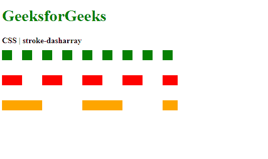
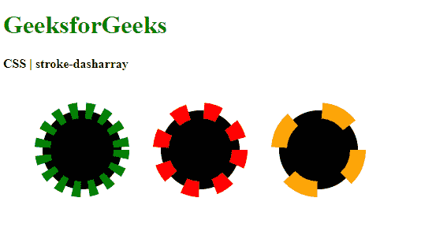
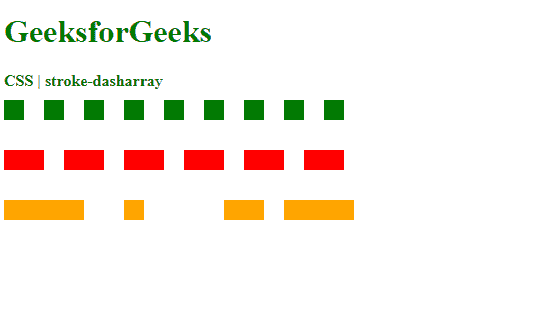

# CSS |笔画缓冲器属性

> 原文:[https://www . geesforgeks . org/CSS-stroke-dash array-property/](https://www.geeksforgeeks.org/css-stroke-dasharray-property/)

**笔划缓冲器阵列**属性用于设置用于 SVG 形状笔划的虚线和间隙的图案。值越大，表示破折号越多。可以在数组参数中指定不同的值来更改模式。

**语法:**

```html
stroke-dasharray: <dasharray> | none
```

**属性值:**

*   **dasharray:** It is used to set the pattern with a list of values separated by commas or white space. The values can be both in terms of length units or percentages that specify the dashes and gaps in the pattern.

    **示例 1:** 设置线中虚线的密度。

    ```html
    <!DOCTYPE html>
    <html>
    <head>
      <title>
        CSS | stroke-dasharray property
      </title>
      <style>
        .stroke1 {
          stroke-dasharray: 20;

          stroke: green;
          stroke-width: 20;
        }

        .stroke2 {
          stroke-dasharray: 40;

          stroke: red;
          stroke-width: 20;
        }

        .stroke3 {
          stroke-dasharray: 80;

          stroke: orange;
          stroke-width: 20;
        }
      </style>
    </head>

    <body>
      <h1 style="color: green">
        GeeksforGeeks
      </h1>
      <b>
        CSS | stroke-dasharray
      </b>
      <div class="container">
        <svg height="250px" width="500px"
          xmlns="http://www.w3.org/2000/svg"
          version="1.1">
          <line class="stroke1" x1="0"
            x2="350" y1="20" y2="20" />
          <line class="stroke2" x1="0"
            x2="350" y1="70" y2="70" />
          <line class="stroke3" x1="0"
            x2="350" y1="120" y2="120" />
        </svg>
      </div>
    </body>
    </html> 
    ```

    **输出:**
    

    **示例 2:** 设置圆圈中虚线的密度。

    ```html
    <!DOCTYPE html>
    <html>
    <head>
      <title>
        CSS | stroke-dasharray property
      </title>
      <style>
        .stroke1 {
          stroke-dasharray: 10;

          stroke: green;
          stroke-width: 20;
        }

        .stroke2 {
          stroke-dasharray: 20;

          stroke: red;
          stroke-width: 20;
        }

        .stroke3 {
          stroke-dasharray: 40;

          stroke: orange;
          stroke-width: 20;
        }
      </style>
    </head>
    <body>
      <h1 style="color: green">
        GeeksforGeeks
      </h1>
      <b>
        CSS | stroke-dasharray
      </b>
      <div class="container">
        <svg height="250px" width="500px"
          xmlns="http://www.w3.org/2000/svg"
          version="1.1">
          <circle class="stroke1" cx="100"
            cy="100" r="50"/>
          <circle class="stroke2" cx="250"
           cy="100" r="50"/>
          <circle class="stroke3" cx="400"
           cy="100" r="50"/>
        </svg>
      </div>
    </body>
    </html>
    ```

    **输出:**
    

    **示例 3:** 设置破折号的图案。

    ```html
    <!DOCTYPE html>
    <html>
    <head>
      <title>
        CSS | stroke-dasharray property
      </title>
      <style>
        .stroke1 {
          stroke-dasharray: 20;

          stroke: green;
          stroke-width: 20;
        }

        .stroke2 {
          /* pattern with even number
          of values */ 
          stroke-dasharray: 40 20;

          stroke: red;    
          stroke-width: 20;
        }

        .stroke3 {
          /* pattern with odd number
          of values */ 
          stroke-dasharray: 80 40 20;

          stroke: orange;
          stroke-width: 20;
        }
      </style>
    </head>
    <body>
      <h1 style="color: green">
        GeeksforGeeks
      </h1>
      <b>
        CSS | stroke-dasharray
      </b>
      <div class="container">
        <svg height="250px" width="500px"
          xmlns="http://www.w3.org/2000/svg"
          version="1.1">
          <line class="stroke1" x1="0"
            x2="350" y1="20" y2="20" />
          <line class="stroke2" x1="0"
            x2="350" y1="70" y2="70" />
          <line class="stroke3" x1="0"
            x2="350" y1="120" y2="120" />
        </svg>
      </div>
    </body>
    </html>
    ```

    **输出:**
    

*   **无:**用于指定不使用模式。这是默认值。

**支持的浏览器:***笔画数组*属性支持的浏览器如下:

*   铬
*   火狐浏览器
*   旅行队
*   歌剧
*   Internet Explorer 9