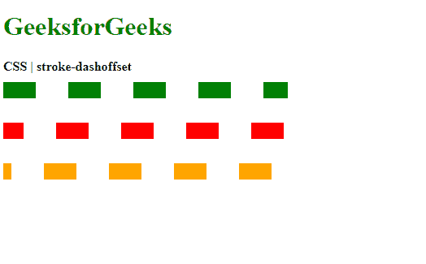
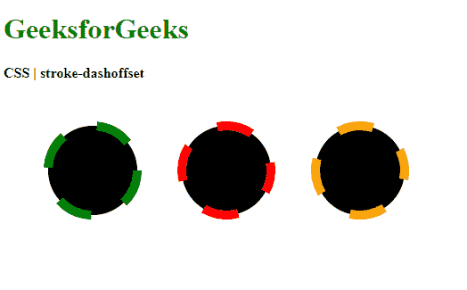
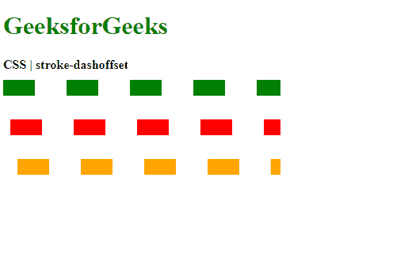

# CSS |笔画偏移属性

> 原文:[https://www . geesforgeks . org/CSS-stroke-dash offset-property/](https://www.geeksforgeeks.org/css-stroke-dashoffset-property/)

**笔划-dashoffset** 属性用于设置沿 SVG 路径的位置，笔划的虚线图案将从该位置开始。较高的值意味着破折号将从更远的位置开始。

**语法:**

```
stroke-dasharray: <length> | <percentage>
```

**属性值:**

*   **length:** It is used to set the offset in length units. The values are resolved on the basis of the path length of the element.

    **示例 1:** 设置线中虚线的偏移量。

    ```
    <!DOCTYPE html>
    <html>
    <head>
      <title>
        CSS | stroke-dashoffset
      </title>
      <style>
        .stroke1 {
          stroke-dashoffset: 0;

          stroke: green;
          stroke-dasharray: 40;
          stroke-width: 20px;
        }

        .stroke2 {
          stroke-dashoffset: 15px;

          stroke: red;
          stroke-dasharray: 40;
          stroke-width: 20px;
        }

        .stroke3 {
          stroke-dashoffset: 30px;

          stroke: orange;
          stroke-dasharray: 40;
          stroke-width: 20px;
        }
      </style>
    </head>
    <body>
      <h1 style="color: green">
        GeeksforGeeks
      </h1>
      <b>
        CSS | stroke-dashoffset
      </b>
      <div class="container">
        <svg width="400px"
          xmlns="http://www.w3.org/2000/svg"
          version="1.1">
          <line class="stroke1" x1="0"
            x2="350" y1="20" y2="20" />
          <line class="stroke2" x1="0"
            x2="350" y1="70" y2="70" />
          <line class="stroke3" x1="0"
            x2="350" y1="120" y2="120" />
        </svg>
      </div>
    </body>
    </html>
    ```

    **输出:**
    

    **示例 2:** 设置圆圈中虚线的偏移量。

    ```
    <!DOCTYPE html>
    <html>
    <head>
      <title>
        CSS | stroke-dashoffset
      </title>
      <style>
        .stroke1 {
          stroke-dashoffset: 0;

          stroke: green;
          stroke-dasharray: 40;
          stroke-width: 10px;
        }

        .stroke2 {
          stroke-dashoffset: 15px;

          stroke: red;
          stroke-dasharray: 40;
          stroke-width: 10px;
        }

        .stroke3 {
          stroke-dashoffset: 30px;

          stroke: orange;
          stroke-dasharray: 40;
          stroke-width: 10px;
        }
      </style>
    </head>
    <body>
      <h1 style="color: green">
        GeeksforGeeks
      </h1>
      <b>
        CSS | stroke-dashoffset
      </b>
      <div class="container">
        <svg width="500px" height="250px"
          xmlns="http://www.w3.org/2000/svg"
          version="1.1">
          <circle class="stroke1" cx="100"
            cy="100" r="50"/>
          <circle class="stroke2" cx="250"
            cy="100" r="50"/>
          <circle class="stroke3" cx="400"
            cy="100" r="50"/>
        </svg>
      </div>
    </body>
    </html>
    ```

    **输出:**
    

*   **percentage:** It is used to set the offset in percentage values. The values are resolved as a percentage of the current viewport.

    **示例:**设置线中虚线的偏移量。

    ```
    <!DOCTYPE html>
    <html>
    <head>
      <title>
        CSS | stroke-dashoffset
      </title>
      <style>
        .stroke1 {
          stroke-dashoffset: 0%;

          stroke: green;
          stroke-dasharray: 40;
          stroke-width: 20px;
        }

        .stroke2 {
          stroke-dashoffset: 50%;

          stroke: red;
          stroke-dasharray: 40;
          stroke-width: 20px;
        }

        .stroke3 {
          stroke-dashoffset: 100%;

          stroke: orange;
          stroke-dasharray: 40;
          stroke-width: 20px;
        }
      </style>
    </head>
    <body>
      <h1 style="color: green">
        GeeksforGeeks
      </h1>
      <b>
        CSS | stroke-dashoffset
      </b>
      <div class="container">
        <svg width="400px"
          xmlns="http://www.w3.org/2000/svg"
          version="1.1">
          <line class="stroke1" x1="0"
            x2="350" y1="20" y2="20" />
          <line class="stroke2" x1="0"
            x2="350" y1="70" y2="70" />
          <line class="stroke3" x1="0"
            x2="350" y1="120" y2="120" />
        </svg>
      </div>
    </body>
    </html>
    ```

    **输出:**
    

**支持的浏览器:***笔画偏移*属性支持的浏览器如下:

*   铬
*   火狐浏览器
*   旅行队
*   歌剧
*   Internet Explorer 9