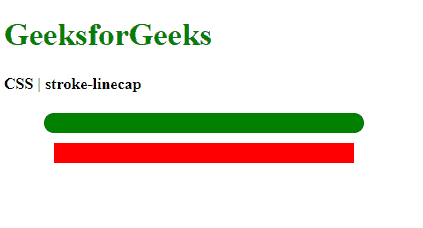
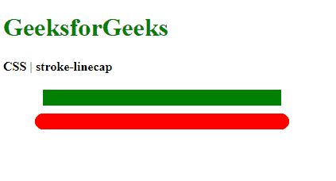

# CSS |描边线帽属性

> 原文:[https://www.geeksforgeeks.org/css-stroke-linecap-property/](https://www.geeksforgeeks.org/css-stroke-linecap-property/)

**描边线帽**属性用于定义在开放子路径末端使用的形状。

**语法:**

```
stroke-linecap: butt | round | square | initial | inherit
```

**属性值:**

*   **butt:** It is used to indicate that the stroke will not extend beyond the endpoints of the stroke. It makes the stroke appear to end at a sharp right angle.

    **示例:**

    ```
    <!DOCTYPE html>
    <html>
    <head>
      <title>
        CSS | stroke-linecap
      </title>
      <style>
        /* Assume the round
           value for
           demonstration */
        .stroke-round {
          stroke-linecap: round;

          stroke-width: 20px;
          stroke: green;
        }

        .stroke-butt {
          stroke-linecap: butt;

          stroke-width: 20px;
          stroke: red;
        }
      </style>
    </head>
    <body>
      <h1 style="color: green">
        GeeksforGeeks
      </h1>
      <b>
        CSS | stroke-linecap
      </b>
      <div class="container">
        <svg width="400px"
          xmlns="http://www.w3.org/2000/svg"
          version="1.1">
          <line class="stroke-round" x1="50"
            x2="350" y1="30" y2="30" />
          <line class="stroke-butt" x1="50"
             x2="350" y1="60" y2="60" />
        </svg>
      </div>
    </body>
    </html>
    ```

    **输出:**比较回合值和对接值
    

*   **round:** It is used to indicate that the ends of the stroke are extended with a semicircle of the diameter equal to the stroke width. A zero length subpath would have a full circle that is centered at the subpath’s point.

    **示例:**

    ```
    <!DOCTYPE html>
    <html>
    <head>
      <title>
        CSS | stroke-linecap
      </title>
      <style>
        /* This is the
           default value */
        .stroke-butt {
          stroke-linecap: butt;

          stroke-width: 20px;
          stroke: green;
        }

        .stroke-round {
          stroke-linecap: round;

          stroke-width: 20px;
          stroke: red;
        }
      </style>
    </head>
    <body>
      <h1 style="color: green">
        GeeksforGeeks
      </h1>
      <b>
        CSS | stroke-linecap
      </b>
      <div class="container">
        <svg width="400px" 
          xmlns="http://www.w3.org/2000/svg"
          version="1.1">
          <line class="stroke-butt" x1="50"
            x2="350" y1="30" y2="30" />
          <line class="stroke-round" x1="50"
            x2="350" y1="60" y2="60" />
        </svg>
      </div>
    </body>
    </html>
    ```

    **输出:**将对接值与圆值
    进行比较

*   **square:** It is used to indicate that the ends of the stroke is extended with a rectangle whose height is equal to the width of the stroke and the width is equal to half the width of the stroke. A zero-length subpath would have a square that is centered at the subpath’s point.

    **示例:**

    ```
    <!DOCTYPE html>
    <html>
    <head>
      <title>
        CSS | stroke-linecap
      </title>
      <style>
        /* This is the default
           value */
        .stroke-butt {
          stroke-linecap: butt;

          stroke-width: 20px;
          stroke: green;
        }

        .stroke-square {
          stroke-linecap: square;

          stroke-width: 20px;
          stroke: red;
        }
      </style>
    </head>
    <body>
      <h1 style="color: green">
        GeeksforGeeks
      </h1>
      <b>
        CSS | stroke-linecap
      </b>
      <div class="container">
        <svg width="400px" 
          xmlns="http://www.w3.org/2000/svg"
          version="1.1">
          <line class="stroke-butt" x1="50"
            x2="350" y1="30" y2="30" />
          <line class="stroke-square" x1="50"
            x2="350" y1="60" y2="60" />
        </svg>
      </div>
    </body>
    </html>
    ```

    **输出:**比较对接值和平方值
    

*   **initial:** It is used to set the property to its default value.

    **示例:**

    ```
    <!DOCTYPE html>
    <html>
    <head>
      <title>
        CSS | stroke-linecap
      </title>
      <style>
        /* Assume the round
           value for
           demonstration */
        .stroke-round {
          stroke-linecap: round;

          stroke-width: 20px;
          stroke: green;
        }

        .stroke-butt {
          stroke-linecap: butt;

          stroke-width: 20px;
          stroke: red;
        }
      </style>
    </head>

    <body>
      <h1 style="color: green">
        GeeksforGeeks
      </h1>
      <b>
        CSS | stroke-linecap
      </b>
      <div class="container">
        <svg width="400px"
          xmlns="http://www.w3.org/2000/svg" 
          version="1.1">
          <line class="stroke-round" x1="50"
            x2="350" y1="30" y2="30" />
          <line class="stroke-butt" x1="50"
            x2="350" y1="60" y2="60" />
        </svg>
      </div>
    </body>
    </html>
    ```

    **输出:**比较舍入值和初始值
    

*   **继承:**用于设置属性从其父级继承。

**支持的浏览器:**由*笔画线帽*属性支持的浏览器如下:

*   铬
*   火狐浏览器
*   旅行队
*   歌剧
*   Internet Explorer 9