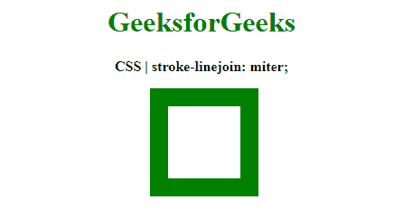
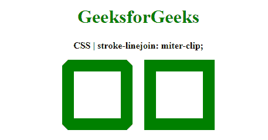
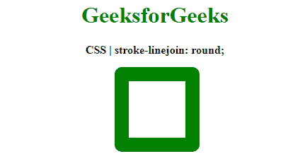
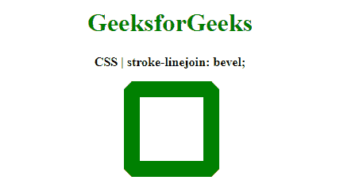
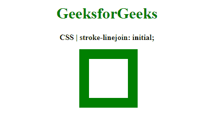

# CSS |描线连接属性

> 原文:[https://www.geeksforgeeks.org/css-stroke-linejoin-property/](https://www.geeksforgeeks.org/css-stroke-linejoin-property/)

**笔划线连接**属性是一个用于定义形状的内置属性，该形状用于结束笔划的开放子路径。

**语法:**

```html
stroke-linejoin: miter | miter-clip | round | bevel | arcs | initial | inherit
```

**属性值:**

*   **miter:** It is used to indicate that a sharp corner would be used to join the two ends. The outer edges of the stroke are extended to the tangents of the path segments until they intersect. This gives the ending a sharp corner.

    **示例:**

    ```html
    <!DOCTYPE html>
    <html>

    <head>
        <title>
            CSS | stroke-linejoin property
        </title>
        <style>
            .stroke1 {
                stroke-linejoin: miter;
                stroke-width: 20px;
                stroke: green;
                fill: none;
            }
        </style>
    </head>

    <body>
        <center>
            <h1 style="color: green">
                GeeksforGeeks
            </h1>
            <b>
                CSS | stroke-linejoin: miter;
            </b>
            <div class="container">
                <svg width="400px"
                     height="200px" 
                     xmlns="http://www.w3.org/2000/svg"
                     version="1.1">
                    <rect x="153" y="25" 
                          width="100" 
                          height="100" 
                          class="stroke1" />
                </svg>
            </div>
        </center>
    </body>

    </html>
    ```

    **输出:**
    

*   **miter-clip:** It is used to indicate that a sharp corner would be used to join the two ends. The outer edges of the stroke are extended to the tangents of the path segments until they intersect.

    除了另一个属性之外，它给结束一个像斜接值一样的尖角。**行程限制**用于确定如果斜接超过某个值是否会被修剪。它用于在非常尖锐的连接或动画上提供更好看的斜接。

    **示例:**

    ```html
    <!DOCTYPE html>
    <html>

    <head>
        <title>
            CSS | stroke-linejoin property
        </title>
        <style>
            .stroke1 {
                stroke-linejoin: miter-clip;

                /* setting a lower miterlimit */
                stroke-miterlimit: 1;
                stroke-width: 20px;
                stroke: green;
                fill: none;
            }

            .stroke2 {
                stroke-linejoin: miter-clip;

                /* setting a higher miterlimit */
                stroke-miterlimit: 2;
                stroke-width: 20px;
                stroke: green;
                fill: none;
            }
        </style>
    </head>

    <body>
        <center>
            <h1 style="color: green">
                GeeksforGeeks
            </h1>

            <b>
                CSS | stroke-linejoin: miter-clip;
            </b>
            <div class="container">
                <svg width="400px" 
                     height="200px" 
                     xmlns="http://www.w3.org/2000/svg" 
                     version="1.1">
                    <rect x="80" y="25" 
                          width="100" 
                          height="100" 
                          class="stroke1" />
                    <rect x="220" y="25"
                          width="100" 
                          height="100" 
                          class="stroke2" />
                </svg>
            </div>
        </center>
    </body>

    </html>
    ```

    **输出:**
    

*   **round:** It is used to indicate that rounded the corner would be used to join the two ends.

    **示例:**

    ```html
    <!DOCTYPE html>
    <html>

    <head>
        <title>
            CSS | stroke-linejoin property
        </title>
        <style>
            .stroke1 {
                stroke-linejoin: round;
                stroke-width: 20px;
                stroke: green;
                fill: none;
            }
        </style>
    </head>

    <body>
        <center>
            <h1 style="color: green">
                GeeksforGeeks
            </h1>
            <b>
                CSS | stroke-linejoin: round;
            </b>
            <div class="container">
                <svg width="400px" 
                     height="200px" 
                     xmlns="http://www.w3.org/2000/svg" 
                     version="1.1">
                    <rect x="153" y="25" 
                          width="100" 
                          height="100" 
                          class="stroke1" />
                </svg>
            </div>
        </center>
    </body>

    </html>
    ```

    **输出:**
    

*   **bevel:** It is used to indicate that the connecting point is cropped perpendicular to the joint.

    **示例:**

    ```html
    <!DOCTYPE html>
    <html>
    <head>
        <title>
            CSS | stroke-linejoin property
        </title>
        <style>
            .stroke1 {
                stroke-linejoin: bevel;
                stroke-width: 20px;
                stroke: green;
                fill: none;
            }
        </style>
    </head>

    <body>
        <center>
            <h1 style="color: green">
                GeeksforGeeks
            </h1>

            <b>CSS | stroke-linejoin: bevel;</b>

            <div class="container">
                <svg width="400px" height="200px" 
                     xmlns="http://www.w3.org/2000/svg" 
                     version="1.1">
                    <rect x="152" y="25" 
                          width="100" 
                          height="100" 
                          class="stroke1" />
                </svg>
            </div>
        </center>
    </body>

    </html>
    ```

    **输出:**
    

*   **弧:**用于表示弧角用于连接路径段。这种形状是由笔画外边缘的延伸形成的，其曲率与外边缘在连接点处的曲率相同。
*   **initial:** It is used to set the property to its default value.

    **示例:**

    ```html
    <!DOCTYPE html>
    <html>

    <head>
        <title>
            CSS | stroke-linejoin
        </title>
        <style>
            .stroke1 {
                stroke-linejoin: initial;
                stroke-width: 20px;
                stroke: green;
                fill: none;
            }
        </style>
    </head>

    <body>
        <center>
            <h1 style="color: green">
                GeeksforGeeks
            </h1>
            <b>
                CSS | stroke-linejoin: initial;
            </b>
            <div class="container">
                <svg width="400px" 
                     height="200px" 
                     xmlns="http://www.w3.org/2000/svg"
                     version="1.1">
                    <rect x="153" y="25" 
                          width="100"
                          height="100"
                          class="stroke1" />
                </svg>
            </div>
        </center>
    </body>

    </html>
    ```

    **输出:**
    

*   **继承:**用于设置属性从其父级继承。

**支持的浏览器:**由**描线连接**属性支持的浏览器如下:

*   铬
*   Internet Explorer 9
*   火狐浏览器
*   旅行队
*   歌剧

**注意:**各大浏览器都不支持`stroke-linejoin: arcs;`。