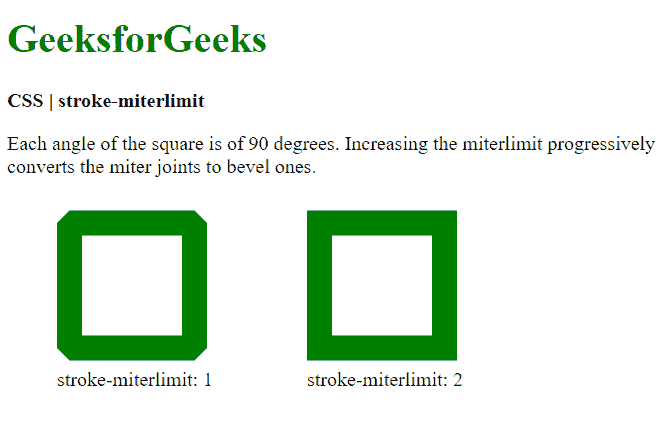
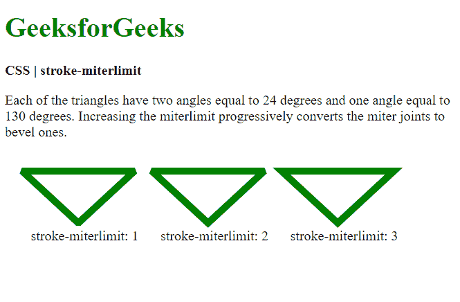

# CSS |笔画限制属性

> 原文:[https://www . geeksforgeeks . org/CSS-stroke-miterlimit-property/](https://www.geeksforgeeks.org/css-stroke-miterlimit-property/)

**笔划限制属性**用于表示斜接长度与笔划宽度之比的限制，用于绘制斜接连接。当斜接延伸超过线的厚度时，会使用此属性。如果超过指定的限制，连接的“斜接”类型将转换为“斜角”。

这将裁剪垂直于连接的连接点，而不是尖锐的连接。

**语法:**

```html
stroke-miterlimit: number|initial|inherit
```

**属性值:**

*   **number:** It is used to define the ratio limit. It can be any value greater than or equal to 1\. The default value is 4.

    **例 1:**

    ```html
    <!DOCTYPE html>
    <html>

    <head>
        <title>
            CSS | stroke-miterlimit property
        </title>

        <style>
            rect {
                stroke-linejoin: miter;
                stroke-width: 20px;
                stroke: green;
                fill: none;
            }
        </style>
    </head>

    <body>
        <h1 style="color: green">
            GeeksforGeeks
        </h1>

        <b>
            CSS | stroke-miterlimit
        </b>

        <p>
            Each angle of the square is of 90 degrees.
            Increasing the miterlimit progressively
            converts the miter joints to bevel ones.
        </p>

        <div class="container">
            <svg width="500px" height="200px"
                    xmlns="http://www.w3.org/2000/svg"
                    version="1.1">

                <rect x="50" y="20" width="100"
                    height="100" stroke-miterlimit=1 />

                <text x="40" y="150">
                    stroke-miterlimit: 1
                </text>

                <rect x="250" y="20" width="100" 
                    height="100" stroke-miterlimit=2 />

                <text x="240" y="150">
                    stroke-miterlimit: 2
                </text>
            </svg>
        </div>
    </body>

    </html>
    ```

    **输出:**
    

    **例 2:**

    ```html
    <!DOCTYPE html>
    <html>

    <head>
        <title>
            CSS | stroke-miterlimit property
        </title>

        <style>
            polygon {
                stroke-linejoin: miter;
                stroke-width: 8px;
                stroke: green;
                fill: none;
            }
        </style>
    </head>

    <body>
        <h1 style="color: green">
            GeeksforGeeks
        </h1>

        <b>
            CSS | stroke-miterlimit
        </b>

        <p>
            Each of the triangles have two angles
            equal to 24 degrees and one angle 
            equal to 130 degrees. Increasing the
            miterlimit progressively converts the
            miter joints to bevel ones.
        </p>

        <div class="container">
            <svg width="500px" height="200px"
                    xmlns="http://www.w3.org/2000/svg"
                    version="1.1">
                <polygon points="20, 20 150, 20 85, 80"
                        stroke-miterlimit=1 />

                <text x="30" y="100">
                    stroke-miterlimit: 1
                </text>

                <polygon points="170, 20 300, 20 235, 80"
                        stroke-miterlimit=2 />

                <text x="180" y="100">
                    stroke-miterlimit: 2
                </text>

                <polygon points="320, 20 450, 20 385, 80"
                        stroke-miterlimit=3 />
                <text x="330" y="100">
                    stroke-miterlimit: 3
                </text>
            </svg>
        </div>
    </body>

    </html>
    ```

    **输出:**
    

*   **初始值:**用于将属性设置为默认值。
*   **inherit:** 用于设置属性从其父元素继承。

**支持的浏览器:***笔画限制属性*支持的浏览器如下:

*   谷歌 Chrome
*   火狐浏览器
*   歌剧
*   Internet Explorer 9