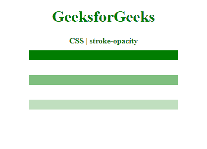

# CSS |笔画不透明度属性

> 原文:[https://www.geeksforgeeks.org/css-stroke-opacity-property/](https://www.geeksforgeeks.org/css-stroke-opacity-property/)

**笔画不透明度**属性用于设置应用于形状笔画的颜色或图案的不透明度。十进制或百分比值可用于使笔划可见、不可见或半透明。

**语法:**

```css
stroke-opacity: [0-1] | <percentage>
```

**参数:**该属性接受两种类型的参数，如上所述，如下所述:

*   **[0-1]:** 用于设置不透明度为从 0 到 1 的十进制值。值为 0 意味着笔画是完全透明和不可见的。值为 1 表示笔画完全不透明且可见。这两个值之间的十进制值会产生半透明的笔画。
*   **百分比:**用于以百分比值设置不透明度。0%的值意味着笔划完全透明和不可见。值为 100%意味着笔划完全不透明且可见。这两个值之间的百分比值将给出半透明的笔画。

以下示例将说明 CSS 中的**笔画不透明度**属性:

**示例 1:** 本示例使用 0 到 1 的值来设置笔画不透明度。

```css
<!DOCTYPE html>
<html>

<head>
    <title>
        CSS | stroke-opacity property
    </title>

    <style>
        .stroke1 {

            /* completely visible stroke */
            stroke-opacity: 1.0;
            stroke: green;
            stroke-width: 20px;
        }

        .stroke2 {

            /* 50-50 visible transparent */
            stroke-opacity: 0.5;
            stroke: green;
            stroke-width: 20px;
        }

        .stroke3 {

            /* 25-75 visible transparent */
            stroke-opacity: 0.25;
            stroke: green;
            stroke-width: 20px;
        }

        .stroke4 {

            /* completely transparent stroke */
            stroke-opacity: 0;
            stroke: green;
            stroke-width: 20px;
        }
    </style>
</head>

<body style="text-align:center;">

    <h1 style="color: green">
        GeeksforGeeks
    </h1>

    <b>
        CSS | stroke-opacity
    </b>

    <div class="container">

        <!-- Strokes lines-->
        <svg width="400px">
            <line class="stroke1" x1="50"
                    x2="350" y1="20" y2="20" />

            <line class="stroke2" x1="50"
                    x2="350" y1="70" y2="70" />

            <line class="stroke3" x1="50"
                    x2="350" y1="120" y2="120" />

            <line class="stroke4" x1="50"
                    x2="350" y1="170" y2="170" />
        </svg>
    </div>
</body>

</html>
```

**输出:**


**示例 2:** 本示例使用百分比值来设置笔画不透明度。

```css
<!DOCTYPE html>
<html>

<head>
    <title>
        CSS | stroke-opacity property
    </title>

    <style>
        .stroke1 {

            /* completely visible stroke */
            stroke-opacity: 100%;
            stroke: green;
            stroke-width: 20px;
        }

        .stroke2 {

            /* 50-50 visible transparent */
            stroke-opacity: 50%;
            stroke: green;
            stroke-width: 20px;
        }

        .stroke3 {

            /* 25-75 visible transparent */
            stroke-opacity: 25%;
            stroke: green;
            stroke-width: 20px;
        }

        .stroke4 {

            /* completely transparent stroke */
            stroke-opacity: 0%;
            stroke: green;
            stroke-width: 20px;
        }
    </style>
</head>

<body style="text-align:center;">

    <h1 style="color: green">
        GeeksforGeeks
    </h1>

    <b>
        CSS | stroke-opacity
    </b>

    <div class="container">

        <!-- Strokes lines-->
        <svg width="400px">
            <line class="stroke1" x1="50"
                    x2="350" y1="20" y2="20" />

            <line class="stroke2" x1="50"
                    x2="350" y1="70" y2="70" />

            <line class="stroke3" x1="50"
                    x2="350" y1="120" y2="120" />

            <line class="stroke4" x1="50"
                    x2="350" y1="170" y2="170" />
        </svg>
    </div>
</body>

</html>
```

**输出:**


**支持的浏览器:**CSS 笔画不透明度属性支持的浏览器如下:

*   铬
*   Internet Explorer 9
*   火狐浏览器
*   旅行队
*   歌剧