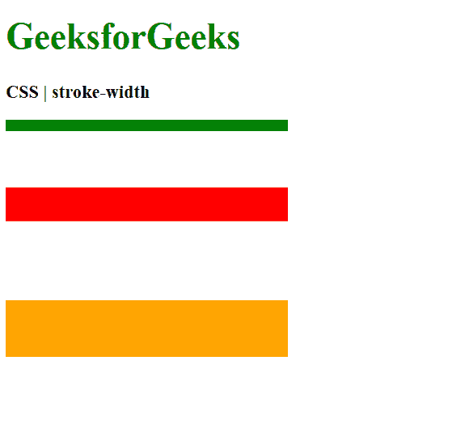
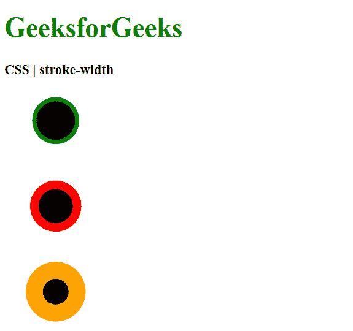
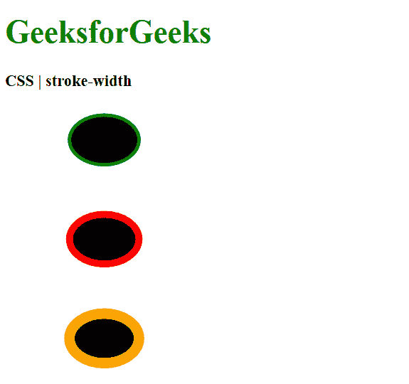

# CSS |笔画宽度属性

> 原文:[https://www.geeksforgeeks.org/css-stroke-width-property/](https://www.geeksforgeeks.org/css-stroke-width-property/)

**描边宽度**属性用于设置 SVG 形状中边框的宽度。此属性只能应用于具有形状或为文本内容元素的元素。

**语法:**

```css
stroke-width: <length> | <percentage>
```

**属性值:**

*   **length:** It is used to set the stroke width in measurement units. It can take values in whole numbers or percentages decimals.
    A value is not required to have a unit identifier like ‘px’ or ’em’. The value without units will be based on the coordinate system of the SVG view box.

    **示例 1:** 本示例设置不带单位的笔画宽度。

    ```css
    <!DOCTYPE html>
    <html>

    <head>
        <title>CSS | stroke-width</title>

        <style>
            .stroke1 {
                stroke-width: 10;
                stroke: green;
            }
            .stroke2 {
                stroke-width: 30;
                stroke: red;
            }
            .stroke3 {
                stroke-width: 50;
                stroke: orange;
            }
        </style>
    </head>

    <body>
        <h1 style="color: green">
            GeeksforGeeks
        </h1>

        <b>CSS | stroke-width</b>

        <div class="container">
            <svg height="300px" width="400px"
                xmlns="http://www.w3.org/2000/svg">
                <line class="stroke1" x1="0" x2="250"
                    y1="20" y2="20" />
                <line class="stroke2" x1="0" x2="250"
                    y1="90" y2="90" />
                <line class="stroke3" x1="0" x2="250"
                y1="200" y2="200" />
            </svg>
        </div>
    </body>

    </html>
    ```

    **输出:**
    

    **示例 2:** 本示例以像素为单位设置笔画宽度。

    ```css
    <!DOCTYPE html>
    <html>

    <head>
        <title>CSS | stroke-width</title>

        <style>
            .stroke1 {
                stroke-width: 5px;
                stroke: green;
            }
            .stroke2 {
                stroke-width: 10px;
                stroke: red;
            }
            .stroke3 {
                stroke-width: 20px;
                stroke: orange;
            }
        </style>
    </head>

    <body>
        <h1 style="color: green">
            GeeksforGeeks
        </h1>

        <b>CSS | stroke-width</b>

        <div class="container">
            <svg height="300px" width="400px"
                xmlns="http://www.w3.org/2000/svg">
                <circle class="stroke1" cx="60"
                    cy="50" r="25"/>
                <circle class="stroke2" cx="60"
                    cy="150" r="25"/>
                <circle class="stroke3" cx="60"
                    cy="250" r="25"/>
            </svg>
        </div>
    </body>

    </html>
    ```

    **输出:**
    

*   **percentage:** It is used to set the stroke width in percentage.

    **示例:**

    ```css
    <!DOCTYPE html>
    <html>

    <head>
        <title>CSS | stroke-width</title>

        <style>
            .stroke1 {
                stroke-width: 1%;
                stroke: green;
            }
            .stroke2 {
                stroke-width: 2%;
                stroke: red;
            }
            .stroke3 {
                stroke-width: 3%;
                stroke: orange;
            }
        </style>
    </head>

    <body>
        <h1 style="color: green">
            GeeksforGeeks
        </h1>

        <b>CSS | stroke-width</b>

        <div class="container">
            <svg height="300px" width="400px"
                xmlns="http://www.w3.org/2000/svg">
                <ellipse class="stroke1" cx="100"
                    cy="50" rx="35" ry="25" />
                <ellipse class="stroke2" cx="100"
                    cy="150" rx="35" ry="25" />
                <ellipse class="stroke3" cx="100"
                    cy="250" rx="35" ry="25" />
            </svg>
        </div>
    </body>

    </html>
    ```

    **输出:**
    

**支持的浏览器:**笔画宽度属性支持的浏览器如下:

*   铬
*   火狐浏览器
*   旅行队
*   歌剧
*   Internet Explorer 9