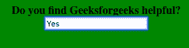

# CSS |样式表单

> 原文:[https://www.geeksforgeeks.org/css-styling-forms/](https://www.geeksforgeeks.org/css-styling-forms/)

CSS 表单用于为用户创建交互式表单。它提供了许多设置样式的方法。


有许多 CSS 属性可用于创建 HTML 表单并为其设置样式，以使其更具交互性，下面列出了其中一些属性:

*   **Attribute Selector:** The attribute type of the input form can take a variety of form depending on user’s choice. It could be anything out of the possible types like text, search, url, tel, email, password, date pickers, number, checkbox, radio, file etc. User needs to specify type while creating a form.

    **示例:**

    ```
    <!DOCTYPE html>
    <html>
        <head>
            <style>
            body{
                background-color:green;
            }
            </style>
        </head>

        <body>
            <center>
                <b>Is Geeksforgeeks useful ?</b>
                <form>
                    <input type="radio" name="useful" value="yes" checked> 
                    Yes <br>
                    <input type="radio" name="useful" value="def_yes"> 
                    Definitely Yes  
                </form>
            </center>
        </body>
    </html>                    
    ```

    **输出** :
    

    考虑另一个输入类型只是文本的例子:

    ```
    <!DOCTYPE html>
    <html>
    <head>
        <style>
            body{
                background-color:green;
            }
        </style>
    </head>

    <body>
        <center>
        <form>
            <b>Do you find Geeksforgeeks helpful?</b>   
                <br>
            <input type="text" name="info"><br>
        </form>
        </center>
    </body>
    </html>                    
    ```

    **输出** :
    

*   **Styling the Width of Input**: The **width** property is used to set the width of the input field. Consider the below example where the width is set to be 10% of the entire screen.

    ```
    <!DOCTYPE html>
    <html>
    <head>
        <style>
            input{
                width:10%;
            }

            body{
                background-color:green;
            }
        </style>
    </head>

    <body>
        <center>
        <form>
            <b>Do you find Geeksforgeeks helpful?</b>
                <br>
            <input type="text" name="info"><br>
        </form>
        </center>
    </body>
    </html>                    
    ```

    **输出** :
    

*   **Add Padding in Inputs**: The **padding** property is used to add spaces inside the text field. Consider the below example:

    ```
    <!DOCTYPE html>
    <html>
    <head>
        <style>
            input{
                width:10%;
                padding: 12px;
            }

            body{
                background-color:green;
            }
        </style>
    </head>

    <body>
        <center>
            <form>
                <b>Do you find Geeksforgeeks helpful?</b><br>
                <input type="text" name="info"><br>
            </form>
        </center>
    </body>
    </html>                    
    ```

    **输出** :
    

*   **Set Margin for Inputs**: The **margin** property is used to add space outside the input field. It is helpful when there are many inputs. Consider the example below with two inputs and observe the space (margin) between them.

    ```
    <!DOCTYPE html>
    <html>
    <head>
        <style>
            input{
                width:10%;
                margin: 8px;
            }

            body{
                background-color:green;
            }
        </style>
    </head>

    <body>
        <center>
        <form>
            <b>Mention two topics that you liked on Geeksforgeeks</b>
                <br>
            <input type="text" name="info"><br>
            <input type="text" name="info"><br>
        </form>
        </center>
    </body>
    </html>                    
    ```

    **输出** :
    

*   **Adding Border and Border-radius**: The **border** property is used to bring change in the size and color of the border whereas border-radius property is used for adding rounded corners.

    考虑下面的例子，其中 **2px** **纯红**边框被创建，其边框半径为 **4px** 。

    ```
    <!DOCTYPE html>
    <html>
    <head>
        <style>
            input{
                width:10%;
                margin: 8px;
                border: 2px solid red;
                border-radius: 4px;
            }

            body{
                background-color:green;
            }
        </style>
    </head>

    <body>
        <center>
            <form>
                <b>
                    Mention two topics that you liked on 
                    Geeksforgeeks
                </b>
                <br>
                <input type="text" name="info"><br>
                <input type="text" name="info"><br>
            </form>
        </center>
    </body>
    </html>                    
    ```

    **输出** :
    

    **注意:**用户还可以在任何特定的一侧有边框，并移除其他边框或拥有不同颜色的所有边框。考虑下面的例子，其中用户只想要顶部(蓝色)和底部(红色)的边框。

    ```
    <!DOCTYPE html>
    <html>
    <head>
        <style>
            input{
                width:10%;
                margin: 8px;
                border: none;
                border-top: 3px solid blue;
                border-bottom: 3px solid red;
            }

            body{
                background-color:green;
            }
        </style>
    </head>

    <body>
        <center>
            <form>
                <b>
                    Mention two topics that you liked on 
                    Geeksforgeeks
                </b>
                <br>
                <input type="text" name="info"><br>
                <input type="text" name="info"><br>
            </form>
        </center>
    </body>
    </html>                    
    ```

    **输出** :
    

*   **Adding Color to text and Background**: The **color** property is used to change the color of the text in the input and the **background-color** property is used to change the color of the background of the input field.

    考虑以下示例，其中文本颜色为黑色，背景颜色设置为绿色。

    ```
    <!DOCTYPE html>
    <html>
    <head>
        <style>
            input{
                width:10%;
                margin: 8px;
                border: none;
                background-color: green;
                color: black;
            }

            body{
                background-color:white;
            }
        </style>
    </head>

    <body>
        <center>
            <form>
                <b>
                    Mention two topics that you liked 
                    on Geeksforgeeks
                </b>
                <br>
                <input type="text" name="info"><br>
                <input type="text" name="info"><br>
            </form>
        </center>
    </body>
    </html>                    
    ```

    **输出** :
    

*   **Focus Selector**: When we click on the input field it gets an outline of blue color. You can change this behaviour by using :focus selector.

    考虑下面的例子，用户想要一个 3px 的红色轮廓和绿色背景。

    ```
    <!DOCTYPE html>
    <html>
    <head>
        <style>
            input{
                width:10%;
                margin: 8px;
                color: black;
            }

            input[type=text]:focus {
            border: 3px solid red;
            background-color: green;
            }

            body{
                background-color:white;
            }
        </style>
    </head>

    <body>
        <center>
        <form>
            <b>
                Mention two topics that you liked 
                on Geeksforgeeks
            </b>
            <br>
            <input type="text" name="info"><br>
            <input type="text" name="info"><br>
        </form>
        </center>
    </body>
    </html>                    
    ```

    **输出** :
    

*   **Adding images in the Input form**: The **background-image** property can be used to put an image inside the input form and it can be positioned using background-position property and user can also decide whether to repeat or not.

    考虑下面的例子，图像在无重复模式的背景中。

    ```
    <!DOCTYPE html>
    <html>
    <head>
        <style>
            input{
                width: 20%;
                background-image: url('search.png');
                background-position: 10px 10px; 
                background-repeat: no-repeat;
                padding: 12px 20px 12px 40px;
            }

            body{
                background-color:white;
            }
        </style>
    </head>

    <body>
        <center>
        <form>
            <b>Search on Geeksforgeeks</b><br>
            <input type="text" name="info" placeholder="Search.."><br>
        </form>
        </center>
    </body>
    </html>                    
    ```

    **输出** :
    

*   **Transition Property**: The **transition** property can be used over the input field to bring change in the size of the field by specifying the relaxed width and focused width along with the time period for which operation will take place.

    考虑下面的例子，其中松弛的输入场宽度为 15%，当聚焦时在 1 秒内变为 30%。

    ```
    <!DOCTYPE html>
    <html>
    <head>
        <style>
            input{
                width: 15%;
                -webkit-transition: width 1s ease-in-out;
                transition: width 1s ease-in-out;
            }

            input[type=text]:focus {
                width: 30%;
                border:4px solid blue;
            }

            body{
                background-color:green;
            }
        </style>
    </head>

    <body>
        <center>
        <form>
            <b>Search on Geeksforgeeks</b><br>
            <input type="text" name="info" placeholder="Search.."><br>
        </form>
        </center>
    </body>
    </html>                    
    ```

    **输出**:放松时
    -
    
    专注时-
    