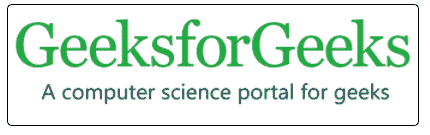
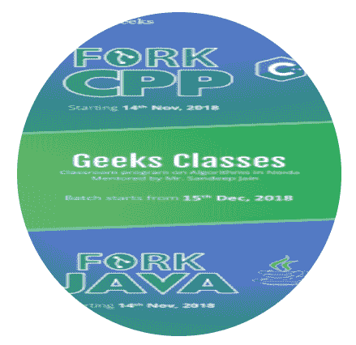
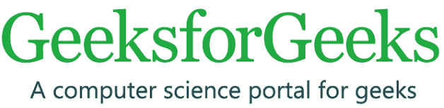
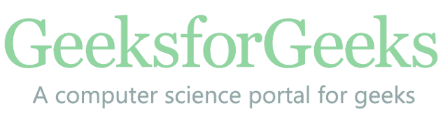

# CSS 样式图像

> 原文:[https://www.geeksforgeeks.org/css-styling-images/](https://www.geeksforgeeks.org/css-styling-images/)

**在 CSS 中设置图像的样式**的工作方式与使用内容的填充、边框和边距的[框模型](https://www.geeksforgeeks.org/css-box-model/)设置任何元素的样式完全相同。下面列出了许多设置图像样式的方法:

*   缩略图
*   [圆形图像](https://www.geeksforgeeks.org/how-to-create-a-circular-rounded-images-using-css/)
*   [响应图像](https://www.geeksforgeeks.org/resize-image-proportionally-with-css/)
*   [透明图像](https://www.geeksforgeeks.org/css-opacity-transparency/)
*   将图像居中

我们将依次讨论所有的图像样式化方法&也将通过示例了解它们。

**缩略图:**边框属性用于创建缩略图。

**示例:**本示例说明了使用**样式图像**属性创建缩略图图像。

## 超文本标记语言

```
<!DOCTYPE html>
<html>
<head>
    <title>Thumbnail image</title>
    <style>
    img {
        border: 1px solid black;
        border-radius: 5px;
        padding: 5px;
    }
    </style>
</head>

<body>
  
</body>
</html>
```

**输出:**



**边框半径属性:**边框半径属性用于设置边框图像的半径。该属性可以包含一个、两个、三个或四个值。它是四个属性的组合:边框-左上角半径、边框-右上角半径、边框-左下角半径、边框-右下角半径。

**示例:**此示例说明了使用**造型图像**属性创建圆角图像。

## 超文本标记语言

```
<!DOCTYPE html>
<html>
<head>
    <style>
    img {
        border-radius: 50%;
    }
    </style>
</head>

<body>
    
</body>
</html>
```

**输出:**



**响应图像:**响应图像用于将图像自动调整到指定的框中。

**示例:**该示例说明了使用**造型图像**属性来创建响应图像。

## 超文本标记语言

```
<!DOCTYPE html>
<html>
<head>
    <style>
    img {
        max-width: 100%;
        height: auto;
    }
    </style>
</head>

<body>
    
</body>
</html>
```

**输出:**



**透明图像:**不透明度属性用于设置图像透明。不透明度值介于 0.0 到 1.0 之间。

**示例:**该示例说明了使用**造型图像**属性创建透明图像。

## 超文本标记语言

```
<!DOCTYPE html>
<html>
<head>
    <title>style image</title>
    <style>
    img {
        opacity: 0.5;
    }
    </style>
</head>

<body>
    
</body>
</html>
```

**输出:**



**将图像居中:**可以使用左边距和右边距属性将图像居中到框中。

**示例:**该示例说明了使用**造型图像**属性将图像定位到中心。

## 超文本标记语言

```
<!DOCTYPE html>
<html>
<head>
    <title>style image</title>
    <style>
    img {
        display: block;
        margin-left: auto;
        margin-right: auto;
    }
    </style>
</head>

<body>
 
</body>
</html>
```

**输出:**


**支持的浏览器:***造型图*支持的浏览器如下:

*   谷歌 Chrome
*   微软公司出品的 web 浏览器
*   微软边缘
*   火狐浏览器
*   歌剧
*   旅行队