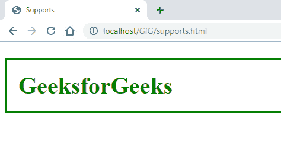
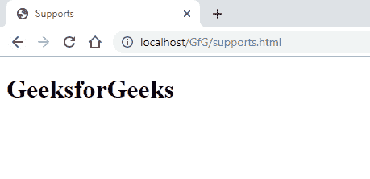
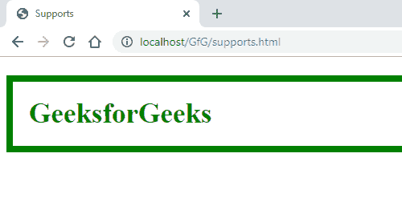

# CSS | @支持规则

> 原文:[https://www.geeksforgeeks.org/css-supports-rule/](https://www.geeksforgeeks.org/css-supports-rule/)

**CSS @supports 规则**为浏览器上的功能支持指定了一个支持条件，即可以指定一个特定的 CSS 样式属性作为条件来检查其在浏览器上的支持，如果条件为真，则执行代码块，否则不执行。这是一个 **CSS 条件规则**，属于 **CSS at 规则**。

**语法:**

```
@supports (condition) {
    //  Style you want to apply
}
```

**示例:**

```
<!DOCTYPE html>
<html>
<head>
    <title>Supports</title>
    <style>
        @supports (display: flex) {
            div h1 {
                display: flex;
                justify-content: flex-start;
                color: green;
                border: 3px solid green;
                padding: 20px;
                font-size: 40px;
            }
        }
    </style>
</head>
<body>
    <div>
        <h1>GeeksforGeeks</h1>
    </div>
</body>
</html>
```

**输出:**


在上面的示例中，浏览器支持 display flex，因此应用了样式。
有 3 个关键词可以和@supports 一起使用。这些是:

*   **不是***   **和***   **or**

    **not 关键字:**的“ **not** 关键字可以用来检查条件指定的反面。
    为了解释这个关键词，下面是一个例子，如果不支持显示是灵活的，应用样式。

    **示例:**

    ```
    <!DOCTYPE html>
    <html>
    <head>
        <title>Supports</title>
        <style>
            @supports not (display: flex) {
                div h1 {
                    display: flex;
                    justify-content: flex-start;
                    color: green;
                    border: 3px solid green;
                    padding: 20px;
                    font-size: 40px;
                }
            }
        </style>
    </head>
    <body>
        <div>
            <h1>GeeksforGeeks</h1>
        </div>
    </body>
    </html>
    ```

    **输出:**
    

    在上面的示例中，因为浏览器支持显示为 flex，所以没有应用样式。

    **和关键字:**使用“**和**关键字检查两个条件，如果两个条件都为真，则执行样式块。

    **示例:**

    ```
    <!DOCTYPE html>
    <html>
    <head>
        <title>Supports</title>
        <style>
            @supports (display: flex) and (display: -webkit-flex) {
                div h1 {
                    display: flex;
                    justify-content: flex-start;
                    color: green;
                    border: 8px solid green;
                    padding: 20px;
                    font-size: 35px;
                }
            }
        </style>
    </head>
    <body>
        <div>
            <h1>GeeksforGeeks</h1>
        </div>
    </body>
    </html>
    ```

    **输出:**
    

    **或关键字:**当我们想要执行样式块时，即使指定的多个条件中有一个为真，也要使用“**或**”关键字。

    **示例:**

    ```
    <!DOCTYPE html>
    <html>
    <head>
        <title>Supports</title>
        <style>
            @supports (display: flex) or (display: -webkit-flex) {
                div h1 {
                    display: flex;
                    justify-content: flex-start;
                    color: green;
                    border: 8px solid green;
                    padding: 20px;
                    font-size: 35px;
                }
            }
        </style>
    </head>
    <body>
        <div>
            <h1>GeeksforGeeks</h1>
        </div>
    </body>
    </html>
    ```

    **输出:**
    

    **支持的浏览器:**支持的浏览器 **CSS @supports rule** 属性如下:

    *   谷歌 Chrome
    *   微软边缘
    *   火狐浏览器
    *   旅行队
    *   歌剧