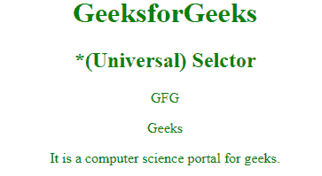

# CSS 语法和选择器

> 原文:[https://www.geeksforgeeks.org/css-syntax-and-selectors/](https://www.geeksforgeeks.org/css-syntax-and-selectors/)

一个 **CSS 语法**规则由一个选择器、属性及其值组成。选择器指向要应用 CSS 样式的 HTML 元素。CSS 属性用分号分隔。它是选择器名称后跟为特定选择器定义的属性:值对的组合。

**语法:**

```
selector { Property: value; }
```

例如，我们已经声明了一个标题标签(h1)，并分配了一些*属性:值*对，用于设置标题标签的样式。这里，*h1***T5】是选择器， *{颜色:绿色；字体系列:无衬线字体；}* 是一个声明块&它可以包含一个或多个用分号分隔的声明，*颜色:绿色；*是一个*属性:值*对，应用于 HTML 元素以设置它们的样式。**

```
h1 { color: green; font-family: sans-serif;}
```

每个声明都有一个 CSS 属性名和值，用冒号分隔&用大括号括起来。对于声明多个 CSS 属性，可以用分号分隔。

**示例:**这个示例说明了使用 **CSS 语法**来设置 HTML 元素的样式。

## 超文本标记语言

```
<!DOCTYPE html>
<html>
<head>

    <!-- Style of h1 selector -->
    <style>
    h1 {
        color: green;
        text-align: center;
    }
    </style>
</head>

<body>
    <h1>GeeksforGeeks</h1>
</body>
</html>
```

**输出:**


一 **CSS 选择器**用于根据 HTML 元素的元素名称、id、属性等选择 HTML 元素。它可以同时选择一个或多个元素。

**CSS 选择器可以分为 5 类:**

*   **简单选择器:**用于根据元素名称、id、属性等选择 HTML 元素。
*   [**组合子选择器:**](https://www.geeksforgeeks.org/css-combinators/) 用于解释两个选择器之间的关系。'
*   [**伪类选择器** :](https://www.geeksforgeeks.org/css-pseudo-classes/) 用于定义元素的特殊状态。
*   [**伪元素选择器**](https://www.geeksforgeeks.org/css-pseudo-elements/) :这是一个添加到选择器中的关键字，可以让您为所选元素的特定部分设置样式。
*   [**属性选择器:**](https://www.geeksforgeeks.org/css-attribute-selector/) 用于选择具有特定属性或属性值的元素。

我们将专注于简单选择器&并通过示例了解它的实现。

简单选择器有三种分类方式:

[**CSS 元素选择器**](https://www.geeksforgeeks.org/css-element-selector/)**:**CSS 中的元素选择器用于选择需要样式化的 HTML 元素。在选择器声明中，有 HTML 元素的名称，应用于该元素的 CSS 属性写在括号{}内。

**语法:**

```
element_name {
    // CSS Property
}
```

**示例:**该示例说明了如何使用元素选择器，通过元素名称&选择 HTML 元素，并为其设置样式。

## 超文本标记语言

```
<!DOCTYPE html>
<html>
<head>

    <!-- Syntax of h1 selector -->
    <style>
    h1 {
        color: green;
        text-align: center;
    }
    </style>
</head>

<body>
    <h1>GeeksforGeeks</h1>
</body>
</html>
```

**输出:**


[**CSS id 选择器**](https://www.geeksforgeeks.org/css-id-selector/)**:**id 选择器用于设置给定 id 的样式。id 属性是 HTML 文档中的唯一标识符。id 选择器与#字符一起使用。

**语法:**

```
#id_name { 
    // CSS Property
}
```

**示例:**这个示例说明了如何使用 id 选择器来根据 HTML 元素的 id &样式选择它们。

## 超文本标记语言

```
<!DOCTYPE html>
<html>
<head>

    <!-- Style of id selector -->
    <style>
    #heading {
        color: green;
        text-align: center;
        font-size: 40px;
        font-weight: bold;
    }
    </style>
</head>

<body>
    <div id="heading"> GeeksforGeeks </div>
</body>
</html>
```

**输出:**


[**CSS 类选择器:**](https://www.geeksforgeeks.org/css-class-selector/) The。类选择器用于选择属于特定类属性的所有元素。要选择具有特定类的元素，请使用()。)字符，指定类名。类名主要用于给定类设置 CSS 属性。

**语法:**

```
.class_name {
    // CSS Property
}
```

**示例:**这个示例说明了如何使用类选择器通过类&样式选择 HTML 元素。

## 超文本标记语言

```
<!DOCTYPE html>
<html>
<head>

    <!-- Style of class selector -->
    <style>
    .heading {
        color: green;
        text-align: center;
        font-size: 40px;
        font-weight: bold;
    }
    </style>
</head>

<body>
    <div class="heading"> GeeksforGeeks </div>
</body>
</html>
```

**输出:**


为了将通用的 CSS 样式属性应用于所有的 HTML 元素，我们可以使用**通用选择器**，用星号(*)表示。

[**CSS *选择器**](https://www.geeksforgeeks.org/css-selector/)**:**CSS 中的*选择器用于选择一个 HTML 文档中的所有元素。它还会选择另一个元素下面的所有元素。它也被称为通用选择器。

**语法:**

```
* {
    // CSS property
} 
```

**示例:**这个示例说明了通用选择器的使用，用于选择包含通用 CSS 属性&的所有 HTML 元素，并为它们设置样式。

## 超文本标记语言

```
<!DOCTYPE html>
<html>
<head>
    <title>* Selector</title>

    <!-- CSS property of * selector -->
    <style>
    * {
        color: green;
        text-align: center;
    }
    </style>
</head>

<body>
    <h1>GeeksforGeeks</h1>
    <h2>*(Universal) Selector</h2>
    <div>

<p>GFG</p>

<p>Geeks</p>

    </div>

<p>It is a computer science portal for geeks.</p>

</body>
</html>
```

**输出:**



**支持的浏览器:**

*   谷歌 Chrome 94.0
*   微软边缘 94.0
*   IE 11.0
*   Firefox 93.0
*   Opera 80.0
*   Safari 15.0