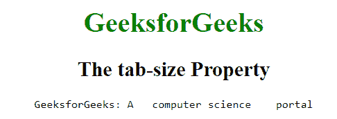

# CSS |制表符大小属性

> 原文:[https://www.geeksforgeeks.org/css-tab-size-property/](https://www.geeksforgeeks.org/css-tab-size-property/)

CSS 中的制表符大小属性用于指定制表符的宽度。标签大小通常在 HTML 文档中显示一个空格字符。一些像<textarea>和<pre>这样的元素显示标签尺寸。<br/> <strong>语法:</strong> <br/></pre></textarea>

```css
tab-size: number|length|initial|inherit;
```

**属性值:**制表符大小属性值如下:

*   **数字:**用于设置一个制表符中的空格字符数。它的默认值是 8。
*   **长度:**用于设置长度字符。但是大多数浏览器都不支持它。
*   **初始值:**该属性用于设置默认值。
*   **继承:**用于从其父代继承财产。

**例:**

## 超文本标记语言

```css
<!DOCTYPE html>
<html>
    <head>
        <title>tab-size Property</title>
        <style>

            /* CSS property for tab-size */
            #geeks {

                /* Used for Firefox support */
                -moz-tab-size: 6;

                /* Used for Opera 10.6-12.1 support */
                -o-tab-size: 6;
                tab-size: 6;
            }
            body {
                text-align:center;
            }
            h1 {
                color:green;
            }
        </style>
    </head>

    <body style = "text-align:center">

        <h1 style = "color:green">
            GeeksforGeeks
        </h1>

        <h2>
            The tab-size Property
        </h2>

        <!-- tab-size property used here -->
        <pre id="Geeks1">
         GeeksforGeeks: A     computer science     portal
        </pre>

    </body>
</html>                   
```

**输出:**



**支持的浏览器:**标签大小属性支持的浏览器如下:

*   谷歌 Chrome 21.0
*   火狐 4.0 -moz-
*   Opera 15.0，10.6 -o-
*   Safari 6.1