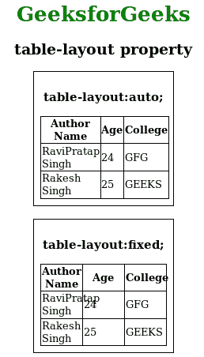

# CSS 表格布局属性

> 原文:[https://www.geeksforgeeks.org/css-table-layout-property/](https://www.geeksforgeeks.org/css-table-layout-property/)

CSS 中的**表格布局**属性用于显示表格的布局。该属性主要用于设置用于布局[<>](https://www.geeksforgeeks.org/html-tables/)表格的单元格、行和列的算法。

**语法:**

```css
table-layout: auto|fixed|initial|inherit;
```

**默认值:**其默认值为自动。

**属性值:**

*   **自动:**用于在浏览器上设置自动表格布局。此属性通过单元格中不可破解的内容来设置列宽。
*   **固定:**用于设置固定的表格布局。表格和列的宽度由表格和列的宽度或第一行单元格的宽度设置。其他行中的单元格不影响列宽。如果第一行没有宽度，则列宽将根据表格内容在表格中平均分配。
*   [](https://www.geeksforgeeks.org/css-value-initial/)****:**用于将元素的 CSS 属性设置为默认值。**
*   **[**继承**](https://www.geeksforgeeks.org/css-value-inherit/) **:** 用于从元素的父元素属性值继承元素的属性。**

****示例:**本示例说明了**表格布局**属性的使用，其中值被指定为*自动* & *固定*。**

## **超文本标记语言**

```css
<!DOCTYPE html>
<html>
<head>
    <title>table-layout property</title>
    <style>
    table {
        border-collapse: collapse;
        border: 1px solid black;
    }

    th,
    td {
        border: 1px solid black;
    }

    table#table1 {
        table-layout: auto;
        width: 200px;
    }

    table#table2 {
        table-layout: fixed;
        width: 200px;
    }

    div {
        max-width: 200px;
        padding: 10px;
        border: 1px solid black;
    }

    h1 {
        color: green;
    }
    </style>
</head>

<body>
    <center>
        <h1>GeeksforGeeks</h1>
        <h2>table-layout property</h2>
        <div>
            <h3>table-layout:auto;</h3>
            <table id="table1">
                <tr>
                    <th>Author Name</th>
                    <th>Age</th>
                    <th>College</th>
                </tr>
                <tr>
                    <td>RaviPratap Singh</td>
                    <td>24</td>
                    <td>GFG</td>
                </tr>
                <tr>
                    <td>Rakesh Singh</td>
                    <td>25</td>
                    <td>GEEKS</td>
                </tr>
            </table>
        </div>
        <br>
        <div>
            <h3>table-layout:fixed;</h3>
            <table id="table2">
                <tr>
                    <th>Author Name</th>
                    <th>Age</th>
                    <th>College</th>
                </tr>
                <tr>
                    <td>RaviPratap Singh</td>
                    <td>24</td>
                    <td>GFG</td>
                </tr>
                <tr>
                    <td>Rakesh Singh</td>
                    <td>25</td>
                    <td>GEEKS</td>
                </tr>
            </table>
        </div>
    </center>
</body>
</html>
```

****输出:****

****

****支持的浏览器:****表格布局**属性支持的浏览器如下:**

*   **谷歌 Chrome 14.0**
*   **Internet Explorer 5.0**
*   **微软边缘 12.0**
*   **Firefox 1.0**
*   **Safari 1.0**
*   **Opera 7.0**