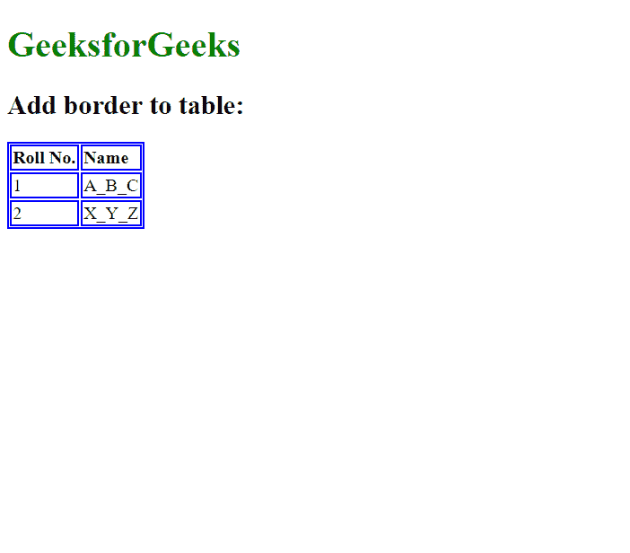
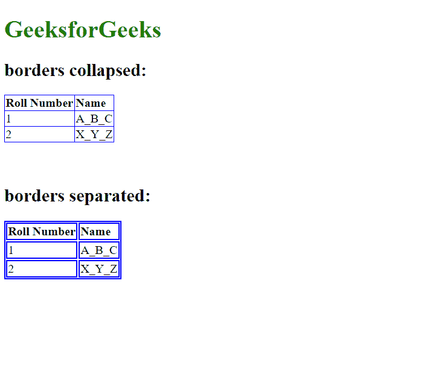
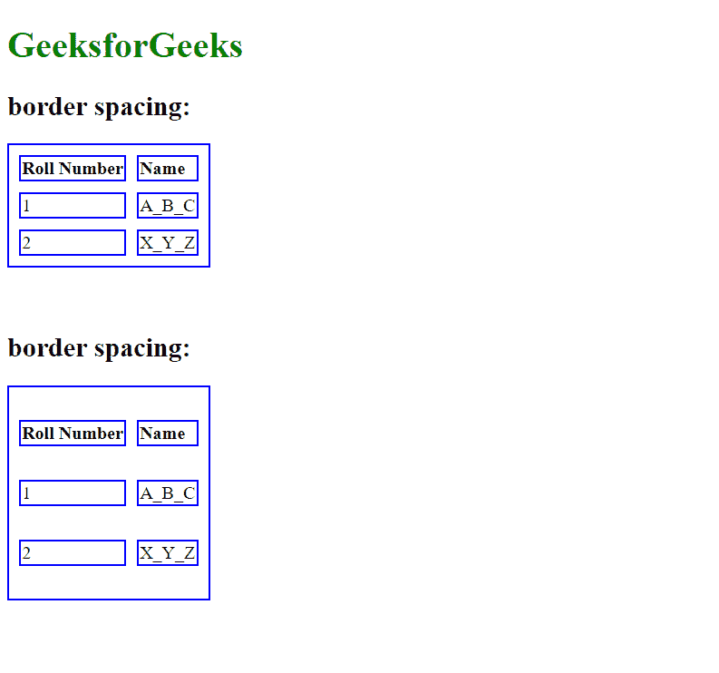
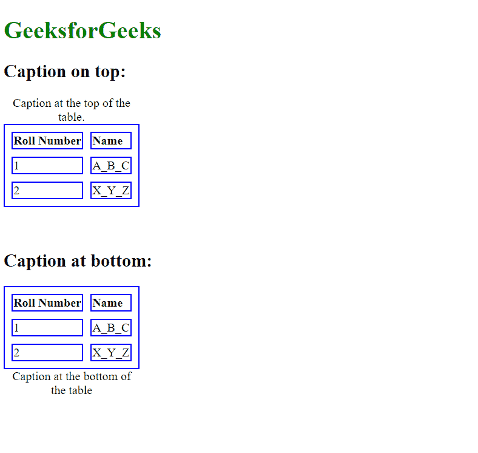
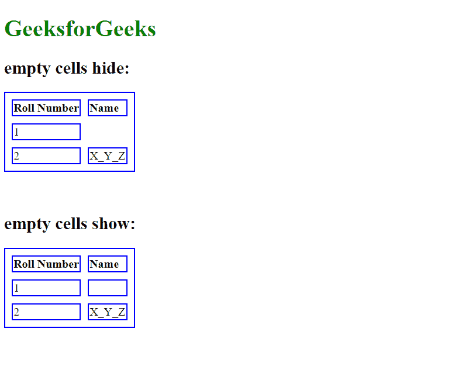
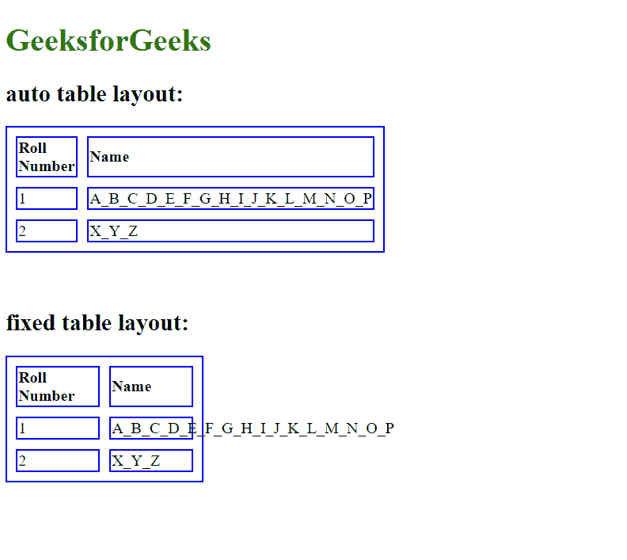

# CSS 表格

> 原文:[https://www.geeksforgeeks.org/css-tables/](https://www.geeksforgeeks.org/css-tables/)

CSS 中的**表格**用于将各种样式属性应用到 [HTML 表格](https://www.geeksforgeeks.org/html-tables/)元素中，以行和列的方式排列数据，或者以适当组织的方式以更复杂的结构排列数据。表格广泛应用于通信、研究和数据分析。CSS 中的[表格布局](https://www.geeksforgeeks.org/css-table-layout-property/)属性可以用来显示表格的布局。该属性主要用于设置布局<表格>单元格、行和列的算法。

**属性:**

[**边框**](https://www.geeksforgeeks.org/css-border-property/) **:用于指定表格中的边框。**

**语法:**

```css
  border: table_width table_color;
```

**示例 1:** 本示例描述了应用边框属性的 CSS 表格。

## 超文本标记语言

```css
<!DOCTYPE html>
<html>

<head>
    <style>
    body {
        text-align: left;
    }

    h1 {
        color: green;
    }

    table,
    th,
    td {

        /* Styling the border. */
        border: 1.5px solid blue;
    }
    </style>
</head>

<body>
    <h1>GeeksforGeeks</h1>
    <h2>Add border to table:</h2>
    <table>
        <tr>
            <th>Roll No.</th>
            <th>Name</th>
        </tr>
        <tr>
            <td>1</td>
            <td>A_B_C</td>
        </tr>
        <tr>
            <td>2</td>
            <td>X_Y_Z</td>
        </tr>
    </table>
</body>

</html>
```

**输出:**



[**【边框折叠】**](https://www.geeksforgeeks.org/css-border-collapse-property/) **:** 边框折叠属性告诉我们浏览器是否应该控制彼此接触的相邻边框的外观，或者每个单元格是否应该保持其样式。

**语法:**

```css
border-collapse: collapse/separate;
```

**示例 2:** 本示例通过应用边框折叠属性来描述 CSS 表格。

## 超文本标记语言

```css
<!DOCTYPE html>
<html>

<head>
    <style>
    body {
        text-align: left;
    }

    h1 {
        color: green;
    }

    table.one {

        /* Styling border collapse for table one. */
        border-collapse: collapse;
    }

    table.two {

        /* Styling border separate for table two. */
        border-collapse: separate;
    }

    table,
    td,
    th {
        border: 1.5px solid blue;
    }
    </style>
</head>

<body>
    <h1>GeeksforGeeks</h1>
    <h2>borders collapsed:</h2>
    <table class="one">
        <tr>
            <th>Roll Number</th>
            <th>Name</th>
        </tr>
        <tr>
            <td>1</td>
            <td>A_B_C</td>
        </tr>
        <tr>
            <td>2</td>
            <td>X_Y_Z</td>
        </tr>
    </table>
    <br>
    <br>
    <h2>borders separated:</h2>
    <table class="two">
        <tr>
            <th>Roll Number</th>
            <th>Name</th>
        </tr>
        <tr>
            <td>1</td>
            <td>A_B_C</td>
        </tr>
        <tr>
            <td>2</td>
            <td>X_Y_Z</td>
        </tr>
    </table>
</body>

</html>
```

**输出:**



[**边框间距**](https://www.geeksforgeeks.org/css-border-spacing-property/) **:** 该属性指定相邻单元格边框之间的间距。

**语法:**

```css
border-spacing: value;
```

**示例 3:** 本示例通过应用边框间距属性来描述 CSS 表格。

## 超文本标记语言

```css
<!DOCTYPE html>
<html>

<head>
    <style>
    body {
        text-align: left;
    }

    h1 {
        color: green;
    }

    table.one {
        border-collapse: separate;

        /* Styling the border-spacing 
               between adjacent cells. */
        border-spacing: 10px;
    }

    table.two {
        border-collapse: separate;

        /* Styling the border-spacing 
              between adjacent cells. */
        border-spacing: 10px 30px;
    }

    table,
    td,
    th {
        border: 1.5px solid blue;
    }
    </style>
</head>

<body>
    <h1>GeeksforGeeks</h1>
    <h2>border spacing:</h2>
    <table class="one">
        <tr>
            <th>Roll Number</th>
            <th>Name</th>
        </tr>
        <tr>
            <td>1</td>
            <td>A_B_C</td>
        </tr>
        <tr>
            <td>2</td>
            <td>X_Y_Z</td>
        </tr>
    </table>
    <br>
    <br>
    <h2>border spacing:</h2>
    <table class="two">
        <tr>
            <th>Roll Number</th>
            <th>Name</th>
        </tr>
        <tr>
            <td>1</td>
            <td>A_B_C</td>
        </tr>
        <tr>
            <td>2</td>
            <td>X_Y_Z</td>
        </tr>
    </table>
</body>

</html>
```

**输出:**



[**【字幕侧】**](https://www.geeksforgeeks.org/css-caption-side-property/) **:** 字幕侧属性用于控制字幕在表格中的放置。默认情况下，标题位于表格上方。

**语法:**

```css
caption-side: top/bottom;
```

**示例 4:** 本示例通过应用标题侧属性来控制表格标题的位置，从而描述 CSS 表格。

## 超文本标记语言

```css
<!DOCTYPE html>
<html>

<head>
    <style>
    body {
        text-align: left;
    }

    h1 {
        color: green;
    }

    table.one {
        border-collapse: separate;
        border-spacing: 10px;

        /* Controlling the placement of caption. */
        caption-side: top;
    }

    table.two {
        border-collapse: separate;
        border-spacing: 10px;

        /* Controlling the placement of caption. */
        caption-side: bottom;
    }

    table,
    td,
    th {
        border: 1.5px solid blue;
    }
    </style>
</head>

<body>
    <h1>GeeksforGeeks</h1>
    <h2>Caption on top:</h2>
    <table class="one">
        <caption>Caption at the top of the table.</caption>
        <tr>
            <th>Roll Number</th>
            <th>Name</th>
        </tr>
        <tr>
            <td>1</td>
            <td>A_B_C</td>
        </tr>
        <tr>
            <td>2</td>
            <td>X_Y_Z</td>
        </tr>
    </table>
    <br>
    <br>
    <h2>Caption at bottom:</h2>
    <table class="two">
        <caption> Caption at the bottom of the table </caption>
        <tr>
            <th>Roll Number</th>
            <th>Name</th>
        </tr>
        <tr>
            <td>1</td>
            <td>A_B_C</td>
        </tr>
        <tr>
            <td>2</td>
            <td>X_Y_Z</td>
        </tr>
    </table>
</body>

</html>
```

**输出:**



[**【空单元格】**](https://www.geeksforgeeks.org/css-empty-cells-property/) **:** 此属性指定是否在表格中的空单元格上显示边框和背景。

**语法:**

```css
empty-cells:show/hide;
```

**示例 5:** 本示例通过应用指定是否在表格的空单元格中显示边框的空单元格属性来描述 CSS 表格。

## 超文本标记语言

```css
<!DOCTYPE html>
<html>

<head>
    <style>
    body {
        text-align: left;
    }

    h1 {
        color: green;
    }

    table.one {
        border-collapse: separate;
        border-spacing: 10px;

        /* Hiding empty cells border */
        empty-cells: hide;
    }

    table.two {
        border-collapse: separate;
        border-spacing: 10px;

        /* Display empty cells border */
        empty-cells: show;
    }

    table,
    td,
    th {
        border: 1.5px solid blue;
    }
    </style>
</head>

<body>
    <h1>GeeksforGeeks</h1>
    <h2>empty cells hide:</h2>
    <table class="one">
        <tr>
            <th>Roll Number</th>
            <th>Name</th>
        </tr>
        <tr>
            <td>1</td>
            <td></td>
        </tr>
        <tr>
            <td>2</td>
            <td>X_Y_Z</td>
        </tr>
    </table>
    <br>
    <br>
    <h2>empty cells show:</h2>
    <table class="two">
        <tr>
            <th>Roll Number</th>
            <th>Name</th>
        </tr>
        <tr>
            <td>1</td>
            <td></td>
        </tr>
        <tr>
            <td>2</td>
            <td>X_Y_Z</td>
        </tr>
    </table>
</body>

</html>
```

**输出:**



[**表格布局**](https://www.geeksforgeeks.org/css-table-layout-property/) **:** 表格布局属性用于设置表格使用的布局算法。

**语法:**

```css
table-layout:auto/fixed;
```

**示例 6:** 本示例通过应用表格布局属性来描述 CSS 表格。

## 超文本标记语言

```css
<!DOCTYPE html>
<html>

<head>
    <style>
    body {
        text-align: left;
    }

    h1 {
        color: green;
    }

    table.one {
        width: 80px border-collapse: separate;
        border-spacing: 10px;

        /* Layout of table is auto. */
        table-layout: auto;
    }

    table.two {
        width: 80px border-collapse: separate;
        border-spacing: 10px;
        /* Layout of table is fixed. */
        table-layout: fixed;
    }

    table,
    td,
    th {
        border: 1.5px solid blue;
        width: 80px;
    }
    </style>
</head>

<body>
    <h1>GeeksforGeeks</h1>
    <h2>auto table layout:</h2>
    <table class="one">
        <tr>
            <th>Roll Number</th>
            <th>Name</th>
        </tr>
        <tr>
            <td>1</td>
            <td>A_B_C_D_E_F_G_H_I_J_K_L_M_N_O_P</td>
        </tr>
        <tr>
            <td>2</td>
            <td>X_Y_Z</td>
        </tr>
    </table>
    <br>
    <br>
    <h2>fixed table layout:</h2>
    <table class="two">
        <tr>
            <th>Roll Number</th>
            <th>Name</th>
        </tr>
        <tr>
            <td>1</td>
            <td>A_B_C_D_E_F_G_H_I_J_K_L_M_N_O_P</td>
        </tr>
        <tr>
            <td>2</td>
            <td>X_Y_Z</td>
        </tr>
    </table>
</body>

</html>
```

**输出:**



**支持的浏览器:**T2 表格支持的浏览器

*   谷歌 Chrome
*   边缘
*   Mozilla Firefox
*   歌剧
*   旅行队