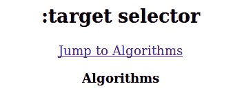
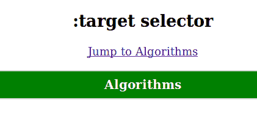
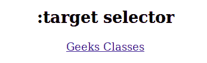
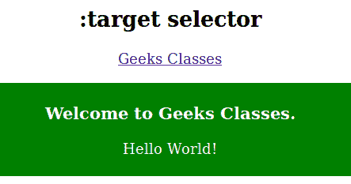

# CSS |:目标选择器

> 原文:[https://www.geeksforgeeks.org/css-target-selector/](https://www.geeksforgeeks.org/css-target-selector/)

目标选择器用于表示唯一的元素(目标元素)，其 id 与 URL 的片段相匹配。它可用于设置当前活动目标元素的样式。带有#后跟锚点名称的 URL 链接到文档中的某个元素。链接到的元素是目标元素。

**语法:**

```
:target {
    // CSS Property
} 

```

**例 1:**

```
<!DOCTYPE html>
<html>
    <head>
        <title>CSS | :target Selector</title>
        <style>

            /* CSS property of target selector */
            :target {
                border: 2px solid #D4D4D4;
                background-color: green;
                color: white;
                padding: 10px;
                font-size: 20px;
            }
        </style>
    </head>

    <body style = "text-align:center">
        <h2>
            :target selector
        </h2>

        <p>
            <a href="#geek">
                Jump to Algorithms
            </a>
        </p>

        <p id="geek">
            <b>Algorithms</b>
        </p>
    </body>
</html>                    
```

**输出:**
**之前点击链接:**


**点击链接后:**


**例 2:**

```
<!DOCTYPE html>
<html>
    <head>
        <title>:target Selector</title>
        <style>
            .tab div {
                display: none;
            }
            .tab div:target {
                display: block;
                color: white;
                background: green;
                padding: 5px;
                margin: 20px 5px;
            }
        </style>
    </head>

    <body style = "text-align:center">

        <h2>
            :target selector
        </h2>
        <div class = "tab">
            <a href = "#geek">Geeks Classes</a> 
            <div id = "geek">
                <h3>Welcome to Geeks Classes.</h3>
                <p>Hello World!</p>
            </div>
        </div>
    </body>
</html>                    
```

**输出:**
**之前点击链接:**


**点击链接后:**


**支持的浏览器:***:目标选择器*支持的浏览器如下:

*   苹果 Safari 3.2
*   谷歌 Chrome 4.0
*   Firefox 3.5
*   歌剧 9.6
*   Internet Explorer 9.0