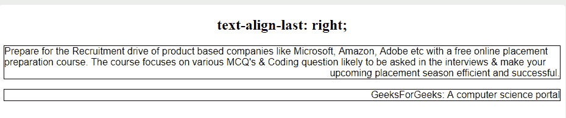

# CSS |文本-对齐-最后一个属性

> 原文:[https://www.geeksforgeeks.org/css-text-align-last-property/](https://www.geeksforgeeks.org/css-text-align-last-property/)

CSS 中的**文本-对齐-最后**属性用于设置段落的最后一行，就在换行符之前。换行可能是由于段落的自然结束，也可能是由于使用了< br >标签。text-align-last 属性设置应用了 text-align-last 属性的元素中所有最后一行的对齐方式。例如，如果文本对齐最后属性应用于< p >元素，则< p >元素的所有最后一行都将受到文本对齐最后属性的影响。

**语法:**

```
text-align-last: auto|start|end|left|right|center|justify|
initial|inherit;
```

**默认值:**其默认值为自动。

**属性值:**

*   **left:** It makes the last line of the paragraph left-aligned with respect to the container.

    **语法:**

    ```
    text-align-last: left;
    ```

    **示例:**

    ```
    <!DOCTYPE html>
    <html>
        <head>
            <title>
                text-align-last property
            </title>

            <!-- CSS style to text-align-last property -->
            <style>
                p {
                    text-align-last: left;
                    font-family: sans-serif;
                    border: 1px solid black;
                }
            </style>
        </head>

        <body>

            <h2 style = "text-align:center">
                text-align-last: left;
            </h2>

            <!-- text-align-last: left; property -->
            <p>
                Prepare for the Recruitment drive of product 
                based companies like Microsoft, Amazon, Adobe 
                etc with a free online placement preparation 
                course. The course focuses on various MCQ's 
                & Coding question likely to be asked in the 
                interviews & make your upcoming placement 
                season efficient and successful.
            </p>

            <!-- text-align-last: right; property -->
            <p> GeeksForGeeks: A computer science portal</p>

        </body>
    </html>                    
    ```

    **输出:**
    

*   **right:** It makes the last line of the paragraph right-aligned with respect to the container.

    **语法:**

    ```
    text-align-last: right;
    ```

    **示例:**

    ```
    <!DOCTYPE html>
    <html>
        <head>
            <title>
                text-align-last property
            </title>

            <!-- CSS style to text-align-last property -->
            <style>
                p {
                    text-align-last: right;
                    font-family: sans-serif;
                    border: 1px solid black;
                }
            </style>
        </head>

        <body>

            <h2 style = "text-align:center">
                text-align-last: right;
            </h2>

            <!-- text-align-last: left; property -->
            <p>
                Prepare for the Recruitment drive of product 
                based companies like Microsoft, Amazon, Adobe 
                etc with a free online placement preparation 
                course. The course focuses on various MCQ's 
                & Coding question likely to be asked in the 
                interviews & make your upcoming placement 
                season efficient and successful.
            </p>

            <!-- text-align-last: right; property -->
            <p> GeeksForGeeks: A computer science portal</p>

        </body>
    </html>                    
    ```

    **输出:**
    

*   **center:** It makes the last line center-aligned with respect to the container.

    **语法:**

    ```
    text-align-last: center;
    ```

    **示例:**

    ```
    <!DOCTYPE html>
    <html>
        <head>
            <title>
                text-align-last property
            </title>

            <!-- CSS style to text-align-last property -->
            <style>
                p {
                    text-align-last: center;
                    font-family: sans-serif;
                    border: 1px solid black;
                }
            </style>
        </head>

        <body>

            <h2 style = "text-align:center">
                text-align-last: center;
            </h2>

            <!-- text-align-last: left; property -->
            <p>
                Prepare for the Recruitment drive of product 
                based companies like Microsoft, Amazon, Adobe 
                etc with a free online placement preparation 
                course. The course focuses on various MCQ's 
                & Coding question likely to be asked in the 
                interviews & make your upcoming placement 
                season efficient and successful.
            </p>

            <!-- text-align-last: right; property -->
            <p> GeeksForGeeks: A computer science portal</p>

        </body>
    </html>                    
    ```

    **输出:**
    

*   **justify:** It makes the last line justified, i.e., the last line will occupy the entire width of the container, extra space is inserted between the words to achieve this property.

    **语法:**

    ```
    text-align-last: justify;
    ```

    **示例:**

    ```
    <!DOCTYPE html>
    <html>
        <head>
            <title>
                text-align-last property
            </title>

            <!-- CSS style to text-align-last property -->
            <style>
                p {
                    text-align-last: justify;
                    font-family: sans-serif;
                    border: 1px solid black;
                }
            </style>
        </head>

        <body>

            <h2 style = "text-align:center">
                text-align-last: justify;
            </h2>

            <!-- text-align-last: left; property -->
            <p>
                Prepare for the Recruitment drive of product 
                based companies like Microsoft, Amazon, Adobe 
                etc with a free online placement preparation 
                course. The course focuses on various MCQ's 
                & Coding question likely to be asked in the 
                interviews & make your upcoming placement 
                season efficient and successful.
            </p>

            <!-- text-align-last: right; property -->
            <p> GeeksForGeeks: A computer science portal</p>

        </body>
    </html>                    
    ```

    **输出:**
    

*   **start:** It makes the last line left-aligned, if the direction of text is left-to-right (LTR) and it makes the last line right-aligned, if the direction of text is right-to-left (RTL).

    **语法:**

    ```
    text-align-last: start;
    ```

    **示例:**

    ```
    <!DOCTYPE html>
    <html>
        <head>
            <title>
                text-align-last property
            </title>

            <!-- CSS style to text-align-last property -->
            <style>
                p {
                    text-align-last: start;
                    font-family: sans-serif;
                    border: 1px solid black;
                }
            </style>
        </head>

        <body>

            <h2 style = "text-align:center">
                text-align-last: start;
            </h2>

            <!-- text-align-last: left; property -->
            <p>
                Prepare for the Recruitment drive of product 
                based companies like Microsoft, Amazon, Adobe 
                etc with a free online placement preparation 
                course. The course focuses on various MCQ's 
                & Coding question likely to be asked in the 
                interviews & make your upcoming placement 
                season efficient and successful.
            </p>

            <!-- text-align-last: right; property -->
            <p> GeeksForGeeks: A computer science portal</p>

        </body>
    </html>                    
    ```

    **输出:**
    

*   **end:** It makes the last line right-aligned, if the direction of text is left-to-right (LTR) and it makes the last line left-aligned, if the direction of text is right-to-left (RTL).

    **语法:**

    ```
    text-align-last: end;
    ```

    **示例:**

    ```
    <!DOCTYPE html>
    <html>
        <head>
            <title>
                text-align-last property
            </title>

            <!-- CSS style to text-align-last property -->
            <style>
                p {
                    text-align-last: end;
                    font-family: sans-serif;
                    border: 1px solid black;
                }
            </style>
        </head>

        <body>

            <h2 style = "text-align:center">
                text-align-last: end;
            </h2>

            <!-- text-align-last: left; property -->
            <p>
                Prepare for the Recruitment drive of product 
                based companies like Microsoft, Amazon, Adobe 
                etc with a free online placement preparation 
                course. The course focuses on various MCQ's 
                & Coding question likely to be asked in the 
                interviews & make your upcoming placement 
                season efficient and successful.
            </p>

            <!-- text-align-last: right; property -->
            <p> GeeksForGeeks: A computer science portal</p>

        </body>
    </html>                    
    ```

    **输出:**
    

*   **auto:** It makes the last line of the paragraph to be aligned as per text-align property of the container when the text-align property is not set to justify.

    **语法:**

    ```
    text-align-last: auto;
    ```

    **示例:**

    ```
    <!DOCTYPE html>
    <html>
        <head>
            <title>
                text-align-last property
            </title>

            <!-- CSS style to text-align-last property -->
            <style>
                p {
                    text-align-last: auto;
                    font-family: sans-serif;
                    border: 1px solid black;
                }
            </style>
        </head>

        <body>

            <h2 style = "text-align:center">
                text-align-last: auto;
            </h2>

            <!-- text-align-last: left; property -->
            <p>
                Prepare for the Recruitment drive of product 
                based companies like Microsoft, Amazon, Adobe 
                etc with a free online placement preparation 
                course. The course focuses on various MCQ's 
                & Coding question likely to be asked in the 
                interviews & make your upcoming placement 
                season efficient and successful.
            </p>

            <!-- text-align-last: right; property -->
            <p> GeeksForGeeks: A computer science portal</p>

        </body>
    </html>                    
    ```

    **输出:**
    

*   **initial:** It makes the last line of the paragraph to be aligned as per its default value (left-aligned).

    **语法:**

    ```
    text-align-last: initial;
    ```

    **示例:**

    ```
    <!DOCTYPE html>
    <html>
        <head>
            <title>
                text-align-last property
            </title>

            <!-- CSS style to text-align-last property -->
            <style>
                p {
                    text-align-last: initial;
                    font-family: sans-serif;
                    border: 1px solid black;
                }
            </style>
        </head>

        <body>

            <h2 style = "text-align:center">
                text-align-last: initial;
            </h2>

            <!-- text-align-last: left; property -->
            <p>
                Prepare for the Recruitment drive of product 
                based companies like Microsoft, Amazon, Adobe 
                etc with a free online placement preparation 
                course. The course focuses on various MCQ's 
                & Coding question likely to be asked in the 
                interviews & make your upcoming placement 
                season efficient and successful.
            </p>

            <!-- text-align-last: right; property -->
            <p> GeeksForGeeks: A computer science portal</p>

        </body>
    </html>                    
    ```

    **输出:**
    

*   **继承:**根据其父元素的 text-align-last 属性，使段落的最后一行对齐。

**支持的浏览器:***文本对齐最后*属性支持的浏览器如下:

*   谷歌 Chrome 47.0
*   Internet Explorer 5.5
*   火狐 49.0， 12.0 -moz-
*   Opera 34.0