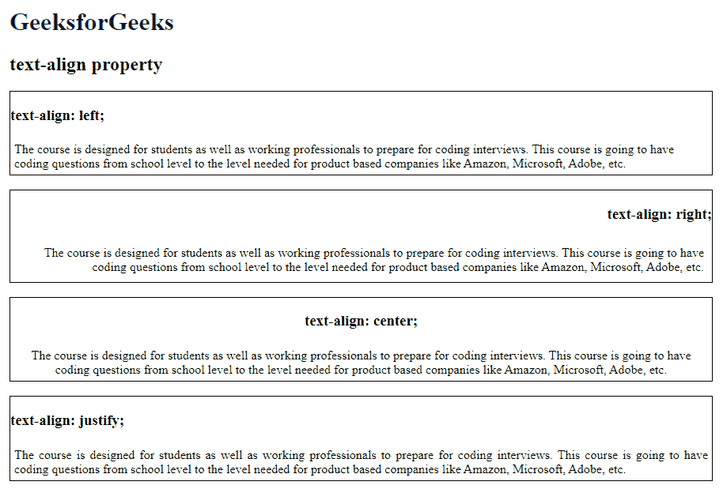

# CSS 文本对齐属性

> 原文:[https://www.geeksforgeeks.org/css-text-align-property/](https://www.geeksforgeeks.org/css-text-align-property/)

CSS 中的**文本对齐**属性用于指定元素 ie 中文本的水平对齐方式。，它用于在块元素或表格单元格框内水平设置内容的对齐方式。

**语法:**

```css
text-align: left|right|center|justify|initial|inherit;
```

**默认值:**方向为 ltr 时向左，方向为 rtl 时向右

**属性值:**

*   **左侧:**用于将文本对齐设置为左侧。这是默认属性。
*   **右侧:**用于将文本对齐设置为右侧。
*   **居中:**用于将文本对齐设置为居中。
*   [**正名**](https://www.geeksforgeeks.org/css-text-justify-property/) **:** 用于将词语展开成一条完整的线，即通过拉伸一个元素的内容。
*   [](https://www.geeksforgeeks.org/css-value-initial/)****:**用于将元素的 CSS 属性设置为默认值。**
*   **[**继承**](https://www.geeksforgeeks.org/css-value-inherit/) **:** 用于从元素的父元素属性值继承元素的属性。**

**详情请参考 [CSS 对齐](https://www.geeksforgeeks.org/css-align/)文章。**

****示例:**本示例说明了使用**文本对齐**属性，以便将其与指定值对齐。**

## **超文本标记语言**

```css
<!DOCTYPE html>
<html>
<head>
    <title>text-align property</title>
    <style>
    h1 {
        color: green;
    }

    .main {
        border: 1px solid black;
    }

    .gfg1 {
        text-align: left;
    }

    .gfg2 {
        text-align: right;
        ;
    }

    .gfg3 {
        text-align: center;
    }

    .gfg4 {
        text-align: justify;
    }
    </style>
</head>

<body>
    <h1>GeeksforGeeks</h1>
    <h2>text-align property</h2>
    <div class="main">
        <h3>text-align: left;</h3>
        <div class="gfg1">
        The course is designed for students
        as well as working professionals to
        prepare for coding interviews. This
        course is going to have coding questions
        from school level to the level needed
        for product based companies like Amazon,
        Microsoft, Adobe, etc.
        </div>
    </div>
    <br>
    <div class="main">
        <h3 style="text-align: right;">text-align: right;</h3>
        <div class="gfg2">
        The course is designed for students
        as well as working professionals to
        prepare for coding interviews. This
        course is going to have coding questions
        from school level to the level needed
        for product based companies like Amazon,
        Microsoft, Adobe, etc.
        </div>
    </div>
    <br>
    <div class="main">
        <h3 style="text-align: center;">text-align: center;</h3>
        <div class="gfg3">
        The course is designed for students
        as well as working professionals to
        prepare for coding interviews. This
        course is going to have coding questions
        from school level to the level needed for
        product based companies like Amazon,
        Microsoft, Adobe, etc.
        </div>
    </div>
    <br>
    <div class="main">
        <h3 style="text-align: justify;">text-align: justify;</h3>
        <div class="gfg4">
        The course is designed for students
        as well as working professionals to
        prepare for coding interviews. This
        course is going to have coding questions
        from school level to the level needed
        for product based companies like Amazon,
        Microsoft, Adobe, etc.
        </div>
    </div>
</body>
</html>
```

****输出:****

****

****支持的浏览器:**由*文本对齐属性*支持的浏览器如下:**

*   **谷歌 Chrome 1.0**
*   **Internet Explorer 3.0**
*   **微软边缘 12.0**
*   **Firefox 1.0**
*   **歌剧 3.5**
*   **Safari 1.0**