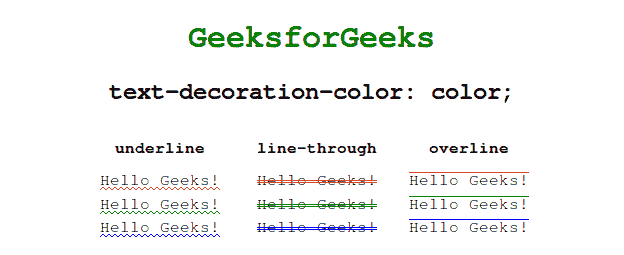
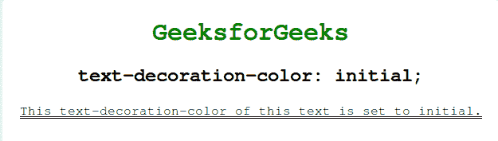

# CSS |文字-装饰-颜色属性

> 原文:[https://www . geesforgeks . org/CSS-text-decoration-color-property/](https://www.geeksforgeeks.org/css-text-decoration-color-property/)

此属性用于指定文本上的装饰颜色(上划线、下划线和换行符)。

**语法:**

```
text-decoration-color: color|initial|inherit;

```

**属性值:**

*   **color:** Sets the color of the text-decoration.
    **Syntax:**

    ```
    text-decoration-color: color;

    ```

    **示例:**

    ```
    <!DOCTYPE html>
    <html lang="en" dir="ltr">

    <head>
        <meta charset="utf-8">
        <title>text-decoration</title>
        <style>
            h1 {
                color: green;
            }

            body {
                text-align: center;
            }

            table {
                margin: auto;
            }

            th {
                padding: 10px 25px;
            }

            .underline {
                text-decoration: underline wavy;
            }

            .overline {
                text-decoration: overline solid;
            }

            .line-through {
                text-decoration: line-through double;
            }

            .red td {
                text-decoration-color: red;
            }

            .green td {
                text-decoration-color: green;
            }

            .blue td {
                text-decoration-color: blue;
            }
        </style>
    </head>

    <body>
        <h1>GeeksforGeeks</h1>

        <h2> text-decoration-color: color;</h2>
        <table>
            <tr>
                <th>underline</th>
                <th>line-through</th>
                <th>overline</th>
            </tr>
            <tr class="red">
                <td class="underline">Hello Geeks!</td>
                <td class="line-through">Hello Geeks!</td>
                <td class="overline">Hello Geeks!</td>
            </tr>
            <tr class="green">
                <td class="underline">Hello Geeks!</td>
                <td class="line-through">Hello Geeks!</td>
                <td class="overline">Hello Geeks!</td>
            </tr>
            <tr class="blue">
                <td class="underline">Hello Geeks!</td>
                <td class="line-through">Hello Geeks!</td>
                <td class="overline">Hello Geeks!</td>
            </tr>
        </table>
    </body>

    </html>
    ```

    **输出:**
    

*   **initial:** Sets this property to its default value.
    **Syntax:**

    ```
    text-decoration-color: initial;

    ```

    **示例:**

    ```
    <!DOCTYPE html>
    <html lang="en" dir="ltr">

    <head>
        <meta charset="utf-8">
        <title>text-decoration</title>
        <style>
            h1 {
                color: green;
            }

            body {
                text-align: center;
            }

            #example {
                text-decoration: underline double;
                text-decoration-color: initial;
            }
        </style>
    </head>

    <body>
        <h1>GeeksforGeeks</h1>
        <h2> text-decoration-color: initial;</h2>
        <div id="example">
         This text-decoration-color of this text is set to initial.
        </div>
    </body>

    </html>
    ```

    **输出:**
    

    **支持的浏览器:***文字-装饰-颜色属性*支持的浏览器如下:

    *   谷歌 Chrome 57.0
    *   Firefox 36.0
    *   Opera 44.0
    *   Safari 7.1