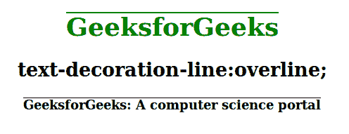
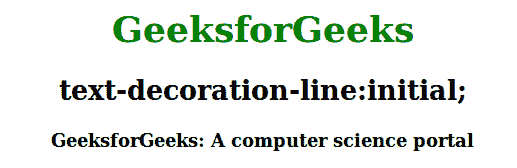

# CSS 文本-装饰-线条属性

> 原文:[https://www . geesforgeks . org/CSS-text-decoration-line-property/](https://www.geeksforgeeks.org/css-text-decoration-line-property/)

**文字装饰线**属性用于设置各种文字装饰。文本装饰可以包括许多值，例如下划线、上划线、换行等。可以组合多个文本装饰属性。例如，下划线和上划线值可用于在文本下方和上方显示线条。

**语法:**

```html
text-decoration-line: none| underline| overline| line-through| initial| inherit; 
```

[文字装饰](https://www.geeksforgeeks.org/css-text-decoration-property/)属性是[简写属性](https://www.geeksforgeeks.org/css-shorthand-properties/)，用于文字装饰线条(必需)、文字装饰颜色和文字装饰样式。

**属性值:**下面的例子很好地描述了所有的属性。

**无:**为默认值，用于指定文本无线条修饰文本。

**语法:**

```html
text-decoration-line: none;
```

**示例:**本示例演示了**文本装饰行**属性的使用，该属性的值设置为 *none。*

## 超文本标记语言

```html
<!DOCTYPE html>
<html>
<head>
    <title>text-decoration-line property</title>

    <!-- text-decoration-line property used here -->
    <style>
    h1 {
        color: green;
        text-decoration-line: none;
    }

    .gfg {
        text-decoration-line: none;
        font-weight: bold;
    }
    </style>
</head>

<body style="text-align:center">
    <h1>GeeksforGeeks</h1>
    <h2>text-decoration-line: none;</h2>
    <p class="gfg">
      GeeksforGeeks: A computer science portal
    </p>

</body>
</html>
```

**输出:**


**下划线:**用于在文字下方或下方显示一行。

**语法:**

```html
text-decoration-line: underline;
```

**示例:**该示例演示了使用**文本修饰行**属性，该属性的值设置为*下划线。*

## 超文本标记语言

```html
<!DOCTYPE html>
<html>
<head>
    <title> text-decoration-line property </title>

    <!-- text-decoration-line property used here -->
    <style>
    h1 {
        color: green;
        text-decoration-line: underline;
    }

    .gfg {
        text-decoration-line: underline;
        font-weight: bold;
    }
    </style>
</head>

<body style="text-align:center">
    <h1>GeeksforGeeks</h1>
    <h2>text-decoration-line:underline;</h2>
    <p class="gfg">
      GeeksforGeeks: A computer science portal
    </p>

</body>
</html>
```

**输出:**


**跨线:**用于在文本上显示一条线。

**语法:**

```html
text-decoration-line: overline;
```

**示例:**该示例演示了使用**文本修饰行**属性，该属性的值设置为*上划线。*

## 超文本标记语言

```html
<!DOCTYPE html>
<html>
<head>
    <title> text-decoration-line property </title>

    <!-- text-decoration-line property used here -->
    <style>
    h1 {
        color: green;
        text-decoration-line: overline;
    }

    .gfg {
        text-decoration-line: overline;
        font-weight: bold;
    }
    </style>
</head>

<body style="text-align:center">
    <h1>GeeksforGeeks</h1>
    <h2>text-decoration-line:overline;</h2>
    <p class="gfg">
      GeeksforGeeks: A computer science portal
    </p>

</body>
</html>
```

**输出:**



**穿越线:**用于显示一条穿越文本的线。

**语法:**

```html
text-decoration-line: line through;
```

**示例:**本示例演示了**文本-装饰-线条**属性的使用，该属性的值设置为*线条贯穿。*

## 超文本标记语言

```html
<!DOCTYPE html>
<html>
<head>
    <title> text-decoration-line property </title>
    <!-- text-decoration-line property used here -->
    <style>
    h1 {
        color: green;
        text-decoration-line: line-through;
    }

    .gfg {
        text-decoration-line: line-through;
        font-weight: bold;
    }
    </style>
</head>

<body style="text-align:center">
    <h1>GeeksforGeeks</h1>
    <h2>text-decoration-line:line-through;</h2>
    <p class="gfg">
      GeeksforGeeks: A computer science portal
    </p>

</body>
</html>
```

**输出:**


[](https://www.geeksforgeeks.org/css-value-initial/)****:**用于将元素的 CSS 属性设置为默认值。这和没有财产是一样的。**

****语法:****

```html
text-decoration-line: initial;
```

****示例:**本示例演示了**文本-装饰-线条**属性的使用，该属性的值设置为*初始值。***

## **超文本标记语言**

```html
<!DOCTYPE html>
<html>
<head>
    <title> text-decoration-line property </title>

    <!-- text-decoration-line property used here -->
    <style>
    h1 {
        color: green;
        text-decoration-line: initial;
    }

    .gfg {
        text-decoration-line: initial;
        font-weight: bold;
    }
    </style>
</head>

<body style="text-align:center">
    <h1>GeeksforGeeks</h1>
    <h2>text-decoration-line:initial;</h2>
    <p class="gfg">
      GeeksforGeeks: A computer science portal
    </p>

</body>
</html>
```

****输出:****

****

****支持的浏览器:**由**文本装饰行**属性支持的浏览器如下:**

*   **谷歌 Chrome 57.0**
*   **微软边缘 79.0**
*   **火狐 36.0， 6.0 -moz-**
*   **Apple Safari 7.1 -webkit-**
*   **Opera 44.0**