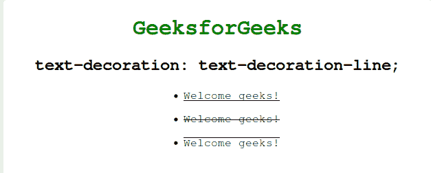
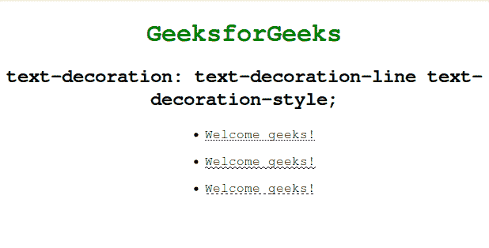
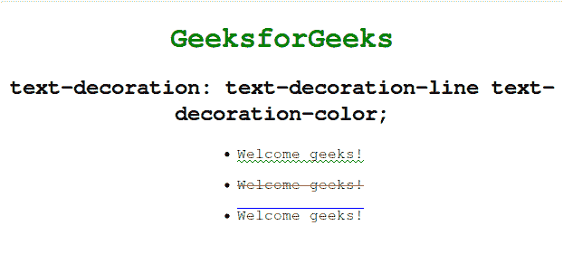
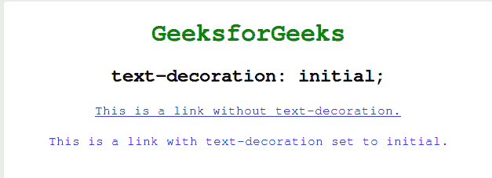
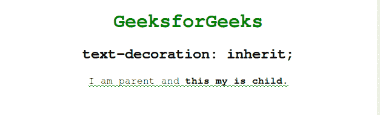

# CSS 文字装饰属性

> 原文:[https://www.geeksforgeeks.org/css-text-decoration-property/](https://www.geeksforgeeks.org/css-text-decoration-property/)

**文本修饰**属性用于“修饰”文本的内容。它本质上是用不同种类的线条装饰文本。是**文字装饰线条**(必选)**文字装饰色彩****文字装饰风格**的简写属性。文本装饰跨子文本元素绘制，这意味着如果父元素指定了文本装饰，则其子元素不能移除父元素指定的装饰。

**语法:**

```
text-decoration: text-decoration-line text-decoration-style text-decoration-color|initial|inherit;
```

**属性值:**下面的例子很好地描述了所有的属性。

[**文字装饰线**](https://www.geeksforgeeks.org/css-text-decoration-line-property/) :用于设置各种文字装饰(如下划线、上划线等)。

**语法:**

```
 text-decoration: text-decoration-line;
```

**示例:**该示例说明了**文本修饰行**属性的使用，该属性的值可以设置为*下划线、换行和上划线。*

## 超文本标记语言

```
<!DOCTYPE html>
<html lang="en" dir="ltr">
<head>
    <meta charset="utf-8">
    <title>text-decoration</title>
    <style>
    h1 {
        color: green;
    }

    body {
        text-align: center;
    }

    ul li {
        margin-top: 15px;
    }

    #example1 {
        text-decoration: underline;
    }

    #example2 {
        text-decoration: line-through;
    }

    #example3 {
        text-decoration: overline;
    }
    </style>
</head>

<body>
    <h1>GeeksforGeeks</h1>
    <h2> text-decoration: text-decoration-line;</h2>
    <ul>
        <li id="example1">Welcome geeks!</li>
        <li id="example2">Welcome geeks!</li>
        <li id="example3">Welcome geeks!</li>
    </ul>
</body>
</html>
```

**输出:**



[**【文字装饰风格】**](https://www.geeksforgeeks.org/css-text-decoration-style-property/) :用于设置元素的文字装饰(如点状、波浪形等)。

**语法:**

```
 text-decoration: text-decoration-line text-decoration-style;
```

**示例:**该示例说明了**文本装饰风格的**属性的使用。

## 超文本标记语言

```
<!DOCTYPE html>
<html lang="en" dir="ltr">
<head>
    <meta charset="utf-8">
    <title>text-decoration</title>
    <style>
    h1 {
        color: green;
    }

    body {
        text-align: center;
    }

    ul li {
        margin-top: 15px;
    }

    #example1 {
        text-decoration: underline dotted;
    }

    #example2 {
        text-decoration: underline wavy;
    }

    #example3 {
        text-decoration: underline dashed;
    }
    </style>
</head>

<body>
    <h1>GeeksforGeeks</h1>
    <h2>
      text-decoration:
      text-decoration-line text-decoration-style;
    </h2>
    <ul>
        <li id="example1">Welcome geeks!</li>
        <li id="example2">Welcome geeks!</li>
        <li id="example3">Welcome geeks!</li>
    </ul>
</body>
</html>
```

**输出:**



[**【文本-装饰-颜色】**](https://www.geeksforgeeks.org/css-text-decoration-color-property/) :用于指定文本上装饰的颜色(上划线、下划线和贯穿线)。

**语法:**

```
text-decoration: text-decoration-line text-decoration-color;
```

**示例:**该示例说明了**文本-装饰-颜色**属性的使用。

## 超文本标记语言

```
<!DOCTYPE html>
<html lang="en" dir="ltr">
<head>
    <meta charset="utf-8">
    <title>text-decoration</title>
    <style>
    h1 {
        color: green;
    }

    body {
        text-align: center;
    }

    ul li {
        margin-top: 15px;
    }

    #example1 {
        text-decoration: underline wavy green;
    }

    #example2 {
        text-decoration: line-through red;
    }

    #example3 {
        text-decoration: overline blue;
    }
    </style>
</head>

<body>
    <h1>GeeksforGeeks</h1>
    <h2>
         text-decoration:
         text-decoration-line text-decoration-color;
        </h2>
    <ul>
        <li id="example1">Welcome geeks!</li>
        <li id="example2">Welcome geeks!</li>
        <li id="example3">Welcome geeks!</li>
    </ul>
</body>
</html>
```

**输出:**



[**初始**](https://www.geeksforgeeks.org/css-value-initial/) :用于将元素的 CSS 属性设置为默认值。

**语法:**

```
 text-decoration: initial;
```

**示例:**本示例说明了**文本装饰**属性的使用，该属性的值设置为初始值。

## 超文本标记语言

```
<!DOCTYPE html>
<html lang="en" dir="ltr">
<head>
    <meta charset="utf-8">
    <title>text-decoration</title>
    <style>
    h1 {
        color: green;
    }

    body {
        text-align: center;
    }

    #example1 {
        text-decoration: initial;
    }
    </style>
</head>

<body>
    <h1>GeeksforGeeks</h1>
    <h2> text-decoration: initial;</h2> <a href="#">
     This is a link without text-decoration.
    </a>
    <br>
    <br> <a id="example1" href="#">
     This is a link with text-decoration set to initial.
    </a>
</body>
</html>
```

**输出:**



[**继承**](https://www.geeksforgeeks.org/css-value-inherit/) :用于从元素的父元素属性值继承元素的属性。

**语法:**

```
 text-decoration: inherit;
```

**示例:**该示例说明了**文本装饰**属性的使用，该属性的值被设置为继承。

## 超文本标记语言

```
<!DOCTYPE html>
<html lang="en" dir="ltr">
<head>
    <meta charset="utf-8">
    <title>text-decoration</title>
    <style>
    h1 {
        color: green;
    }

    body {
        text-align: center;
    }

    #example1 {
        text-decoration: underline wavy green;
    }

    #example1child {
        text-decoration: inherit;
        font-weight: bold;
    }
    </style>
</head>

<body>
    <h1>GeeksforGeeks</h1>
    <h2> text-decoration: inherit;</h2>
    <p id="example1"> I am parent and <span id="example1child">
     this my is child.</span> </p>

</body>
</html>
```

**输出:**



**支持的浏览器:***文字装饰*属性支持的浏览器如下:

*   谷歌 Chrome 1.0
*   Internet Explorer 3.0
*   微软边缘 12.0
*   Firefox 1.0
*   歌剧 3.5
*   Safari 1.0