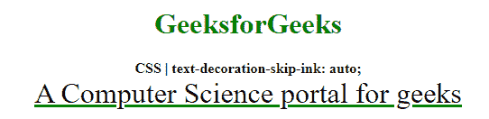
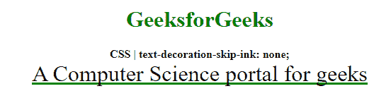

# CSS |文字-装饰-跳过-墨迹属性

> 原文:[https://www . geesforgeks . org/CSS-text-decoration-skip-ink-property/](https://www.geeksforgeeks.org/css-text-decoration-skip-ink-property/)

**文本-装饰-跳过-墨迹**属性用于指定下划线和上划线通过字符或字形时的渲染方式。

**语法:**

```
text-decoration-skip-ink: auto | none
```

**属性值:**

*   **自动:**该值用于指定跳过通过字符的下划线和上划线。这是默认值。
*   **无:**该值用于指定不跳过通过字符的下划线和上划线。它会切断像“g”和“t”这样的字符。

以下示例说明了 **CSS 文本-装饰-跳过-墨迹**属性:

**示例 1:** 在本例中，我们将使用**文本-装饰-跳过-墨迹:自动；**财产价值。

```
<!DOCTYPE html>
<html>

<head>
    <title>
        CSS | text-decoration-skip-ink
    </title>
    <style>
        .skip-ink-auto {
            font-size: 2em;
            text-decoration: underline green;

            /* text decoration-skip-ink effect */
            text-decoration-skip-ink: auto;
        }
    </style>
</head>

<body>
    <center>
        <h1 style="color: green">
            GeeksforGeeks
        </h1>

        <b>
            CSS | text-decoration-skip-ink: auto;
        </b>

        <div class="skip-ink-auto">
            A Computer Science portal for geeks
        </div>
    </center>
</body>

</html>
```

**输出:**


**例 2:** 在本例中，我们将使用**文本-装饰-跳过-墨迹:无；**财产价值。

```
<!DOCTYPE html>
<html>

<head>
    <title>
        CSS | text-decoration-skip-ink
    </title>
    <style>
        .skip-ink-none {
            font-size: 2em;
            text-decoration: underline green;

            /* text decoration-skip-ink effect */
            text-decoration-skip-ink: none;
        }
    </style>
</head>

<body>
    <center>
        <h1 style="color: green">
            GeeksforGeeks
        </h1>

        <b>
            CSS | text-decoration-skip-ink: none;
        </b>

        <div class="skip-ink-none">
            A Computer Science portal for geeks
        </div>
    </center>
</body>

</html>
```

**输出:**


**支持的浏览器:***文字-装饰-跳过-墨迹*属性支持的浏览器如下:

*   谷歌 Chrome 64
*   Firefox 70
*   歌剧 50