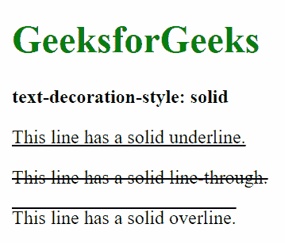
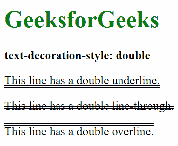
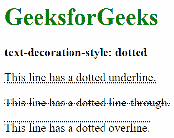
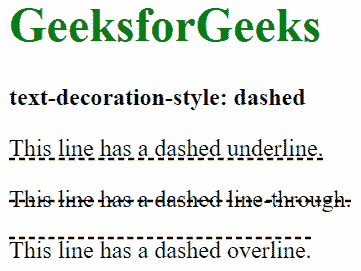
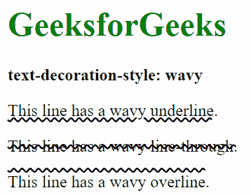
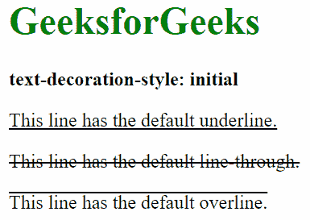
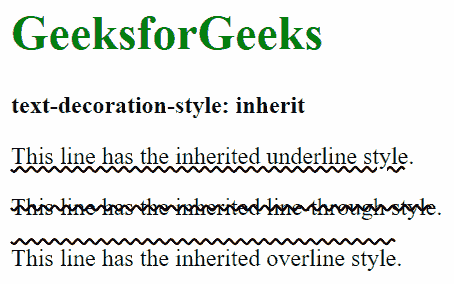

# CSS |文字装饰风格属性

> 原文:[https://www . geesforgeks . org/CSS-text-decoration-style-property/](https://www.geeksforgeeks.org/css-text-decoration-style-property/)

CSS 中的文本装饰样式属性用于设置元素的文本装饰。文字装饰属性是文字装饰线条、文字装饰风格和文字装饰色彩属性的组合。

**语法:**

```
text-decoration-style: solid|double|dotted|dashed|wavy|initial|
inherit;
```

**属性值:**

*   **solid:** It draw a solid single line. It is the default value of text-decoration-style property.

    **风格:**

    ```
    text-decoration-style: solid;
    ```

    **示例:**

    ```
    <!DOCTYPE html>
    <html>
        <head>
            <title>
                CSS text-decoration-style property
            </title>

            <!-- CSS style -->
            <style>
                p {
                    text-decoration-style: solid;
                }
                .GFG1 {
                    text-decoration-line: underline;
                }
                .GFG2 {
                    text-decoration-line: line-through;
                }
                .GFG3 {
                    text-decoration-line: overline;
                }
            </style>
        </head>

        <body>
            <h1 style="color: green">
                GeeksforGeeks
            </h1>

            <b>text-decoration-style: solid</b>

            <p class = "GFG1">
                This line has a solid underline.
            </p>
            <p class = "GFG2">
                This line has a solid line-through.
            </p>
            <p class = "GFG3">
                This line has a solid overline.
            </p>
        </body>
    </html>                    
    ```

    **输出:**
    

*   **double:** It draws double solid lines.

    **风格:**

    ```
    text-decoration-style: double;
    ```

    **示例:**

    ```
    <!DOCTYPE html>
    <html>
        <head>
            <title>
                CSS text-decoration-style property
            </title>

            <!-- CSS style -->
            <style>
                p {
                    text-decoration-style: double;
                }
                .GFG1 {
                    text-decoration-line: underline;
                }
                .GFG2 {
                    text-decoration-line: line-through;
                }
                .GFG3 {
                    text-decoration-line: overline;
                }
            </style>
        </head>

        <body>
            <h1 style="color: green">
                GeeksforGeeks
            </h1>

            <b>text-decoration-style: double</b>

            <p class = "GFG1">
                This line has a double underline.
            </p>
            <p class = "GFG2">
                This line has a double line-through.
            </p>
            <p class = "GFG3">
                This line has a double overline.
            </p>
        </body>
    </html>                    
    ```

    **输出:**
    

*   **dotted:** It draws a dotted line.

    **风格:**

    ```
    text-decoration-style: dotted;
    ```

    **示例:**

    ```
    <!DOCTYPE html>
    <html>
        <head>
            <title>
                CSS text-decoration-style property
            </title>

            <!-- CSS style -->
            <style>
                p {
                    text-decoration-style: dotted;
                }
                .GFG1 {
                    text-decoration-line: underline;
                }
                .GFG2 {
                    text-decoration-line: line-through;
                }
                .GFG3 {
                    text-decoration-line: overline;
                }
            </style>
        </head>

        <body>
            <h1 style="color: green">
                GeeksforGeeks
            </h1>

            <b>text-decoration-style: dotted</b>

            <p class = "GFG1">
                This line has a dotted underline.
            </p>
            <p class = "GFG2">
                This line has a dotted line-through.
            </p>
            <p class = "GFG3">
                This line has a dotted overline.
            </p>
        </body>
    </html>                    
    ```

    **输出:**
    

*   **dashed:** It draws a dashed line.

    **风格:**

    ```
    text-decoration-style: dashed;
    ```

    **示例:**

    ```
    <!DOCTYPE html>
    <html>
        <head>
            <title>
                CSS text-decoration-style property
            </title>

            <!-- CSS style -->
            <style>
                p {
                    text-decoration-style: dashed;
                }
                .GFG1 {
                    text-decoration-line: underline;
                }
                .GFG2 {
                    text-decoration-line: line-through;
                }
                .GFG3 {
                    text-decoration-line: overline;
                }
            </style>
        </head>

        <body>
            <h1 style="color: green">
                GeeksforGeeks
            </h1>

            <b>text-decoration-style: dashed</b>

            <p class = "GFG1">
                This line has a dashed underline.
            </p>
            <p class = "GFG2">
                This line has a dashed line-through.
            </p>
            <p class = "GFG3">
                This line has a dashed overline.
            </p>
        </body>
    </html>                    
    ```

    **输出:**
    

*   **wavy:** It draws a wavy line.

    **风格:**

    ```
    text-decoration-style: wavy;
    ```

    **示例:**

    ```
    <!DOCTYPE html>
    <html>
        <head>
            <title>
                CSS text-decoration-style property
            </title>

            <!-- CSS style -->
            <style>
                p {
                    text-decoration-style: wavy;
                }
                .GFG1 {
                    text-decoration-line: underline;
                }
                .GFG2 {
                    text-decoration-line: line-through;
                }
                .GFG3 {
                    text-decoration-line: overline;
                }
            </style>
        </head>

        <body>
            <h1 style="color: green">
                GeeksforGeeks
            </h1>

            <b>text-decoration-style: wavy</b>

            <p class = "GFG1">
                This line has a wavy underline.
            </p>
            <p class = "GFG2">
                This line has a wavy line-through.
            </p>
            <p class = "GFG3">
                This line has a wavy overline.
            </p>
        </body>
    </html>                    
    ```

    **输出:**
    

*   **initial:** It sets the text-decoration-style property to its default value.

    **风格:**

    ```
    text-decoration-style: initial;
    ```

    **示例:**

    ```
    <!DOCTYPE html>
    <html>
        <head>
            <title>
                CSS text-decoration-style property
            </title>

            <!-- CSS style -->
            <style>
                p {
                    text-decoration-style: initial;
                }
                .GFG1 {
                    text-decoration-line: underline;
                }
                .GFG2 {
                    text-decoration-line: line-through;
                }
                .GFG3 {
                    text-decoration-line: overline;
                }
            </style>
        </head>

        <body>
            <h1 style="color: green">
                GeeksforGeeks
            </h1>

            <b>text-decoration-style: initial</b>

            <p class = "GFG1">
                This line has a default underline.
            </p>
            <p class = "GFG2">
                This line has a default line-through.
            </p>
            <p class = "GFG3">
                This line has a default overline.
            </p>
        </body>
    </html>                    
    ```

    **输出:**
    

*   **inherit:** This property is inherited from its parent element.

    **风格:**

    ```
    text-decoration-style: inherit;
    ```

    **示例:**

    ```
    <!DOCTYPE html>
    <html>
        <head>
            <title>
                CSS text-decoration-style property
            </title>

            <!-- CSS style -->
            <style>
                p {
                    text-decoration-style: inherit;
                }
                .main {
                    text-decoration-style: wavy;
                }
                .GFG1 {
                    text-decoration-line: underline;
                }
                .GFG2 {
                    text-decoration-line: line-through;
                }
                .GFG3 {
                    text-decoration-line: overline;
                }
            </style>
        </head>

        <body>
            <h1 style="color: green">
                GeeksforGeeks
            </h1>

            <b>text-decoration-style: inherit</b>

            <div class = "main">
                <p class = "GFG1">
                    This line has a inherited underline style.
                </p>
                <p class = "GFG2">
                    This line has a inherited line-through style.
                </p>
                <p class = "GFG3">
                    This line has a inherited overline style.
                </p>
            </div>
        </body>
    </html>                    
    ```

    **输出:**
    

**支持的浏览器:***文字装饰风格属性*支持的浏览器如下:

*   谷歌 Chrome 57.0
*   Firefox 36.0
*   Opera 44.0