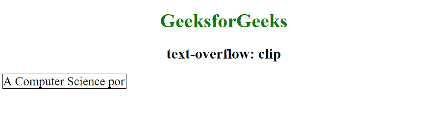
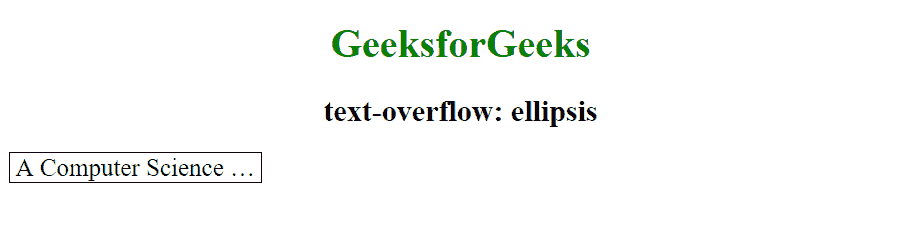
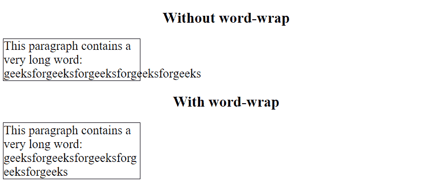
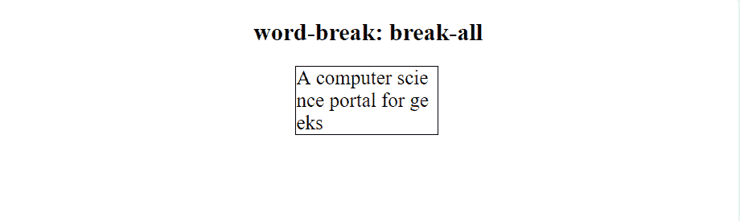
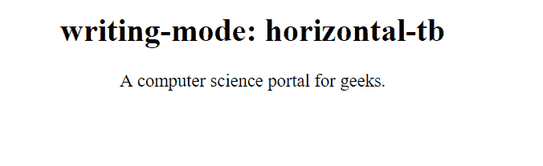
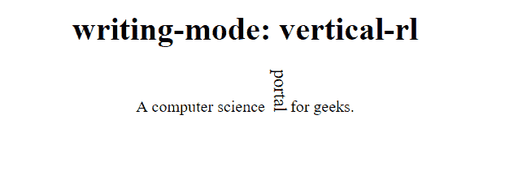

# CSS |文本效果

> 原文:[https://www.geeksforgeeks.org/css-text-effects/](https://www.geeksforgeeks.org/css-text-effects/)

CSS 是在各种网络文档中添加样式的机制。文本效果允许我们对 HTML 文档中使用的文本应用不同类型的效果。

以下是 CSS 中可用于给文本添加效果的一些属性:

1.  文本溢出
2.  自动换行
3.  断字
4.  书写模式

让我们详细了解其中的每一项:

1.  **Text-Overflow:** The CSS Text overflow property is a way to limit text that exceeds the width of it’s parent. It helps to specify the way to represent the portion of overflowing text which is not visible to the user.

    **语法:**

    ```
    element {
        text-overflow: clip | ellipsis;
        //CSS Property
    }

    ```

    **值**:

    *   **clip:** This is the default value for this property. This keyword value will truncate the text at the limit of the content area, therefore the truncation can happen in the middle of a character.

        ```
        <!DOCTYPE html>
        <html>
            <head>
                <style> 
                    div.geek {
                        white-space: nowrap; 
                        width: 200px; 
                        overflow: hidden; 
                        border: 1px solid #000000;
                        font-size: 20px;
                        text-overflow: clip;
                    }

                    div.geek:hover {
                        overflow: visible;
                    }
                </style>
            </head>
            <body style = "text-align: center">
                <h1 style = "color:green">
                    GeeksforGeeks
                </h1>

                <h2>
                    text-overflow: clip
                </h2>

                <div class="geek">
                    A Computer Science portal for geeks.
                </div>
            </body>
        </html>                    
        ```

        **输出:**
        

    *   **ellipsis:** This will display an ellipsis (‘…’) to represent clipped text. The ellipsis is displayed inside the content area, decreasing the amount of text displayed. If there is not enough space to display the ellipsis, it is clipped.

        ```
        <!DOCTYPE html>
        <html>
            <head>
                <style> 
                    div.geek {
                        white-space: nowrap; 
                        width: 200px; 
                        overflow: hidden; 
                        border: 1px solid #000000;
                        font-size: 20px;
                        text-overflow: ellipsis;
                    }

                    div.geek:hover {
                        overflow: visible;
                    }
                </style>
            </head>
            <body style = "text-align: center">
                <h1 style = "color:green">
                    GeeksforGeeks
                </h1>

                <h2>
                    text-overflow: ellipsis
                </h2>

                <div class="geek">
                    A Computer Science portal for geeks.
                </div>
            </body>
        </html>                    
        ```

        **输出:**
        

2.  **Word wrap:** The CSS word-wrap property defines whether the browser is allowed to line break within words when a word is too long to fit within its parent container. If a word is too long to fit within an area, it expands outside:
    **Syntax:**

    ```
    element {
        word-wrap: break-word;
        //CSS Property
    }

    ```

    **示例:**

    ```
    <!DOCTYPE html>
    <html>
        <head>
            <title>word wrap</title>
            <style> 
                p {
                    width: 11em; 
                    border: 1px solid #000000;
                    text-align: left;
                    font-size: 20px;
                }
                p.test {
                    word-wrap: break-word;
                }
            </style>
        </head>
        <body style = "text-align: center;">
            <h2>Without word-wrap</h2>

            <p>
                This paragraph contains a very long word: 
                geeksforgeeksforgeeksforgeeksforgeeks
            </p>

            <h2>With word-wrap</h2>

            <p class="test"> 
                This paragraph contains a very long word: geeks
                forgeeksforgeeksforgeeksforgeeks
            </p>
        </body>
    </html>                    
    ```

    **输出:**
    

3.  **断字:**断字 CSS 属性设置是否在文本溢出内容框的地方出现换行符。它指定了换行规则。
    **语法:**

    ```
    element {
        word-break: keep-all | break-all;
        //CSS Property
    }

    ```

    *   **break-all:** It is used to insert word break between any two characters to prevent word overflow.
        **Example:**

        ```
        <!DOCTYPE html>
        <html>
            <head>
                <title>word-break: break-all</title>
                <style> 
                    p.geek {
                        width: 140px; 
                        border: 1px solid #000000;
                        word-break: break-all; 
                        text-align: left;
                        font-size: 20px;
                    }
                </style>
            </head>

            <body style= "text-align: center;">
                <h2>word-break: break-all</h2>

                <p class="geek">
                    A computer science portal for geeks
                </p>
            </body>
        </html>                    
        ```

        **输出:**
        

    *   **keep-all:** It is used to break word in default style.
        **Example:**

        ```
        <!DOCTYPE html>
        <html>
            <head>
                <title>word-break: keep-all</title>
                <style> 
                    p.geek {
                        width: 140px; 
                        border: 1px solid #000000;
                        word-break: keep-all; 
                        text-align: left;
                        font-size: 20px;
                    }
                </style>
            </head>

            <body style= "text-align: center;">
                <h2>word-break: keep-all</h2>

                <p class="geek">
                    A computer science portal for geeks
                </p>
            </body>
        </html>                    
        ```

        **输出:**
        

4.  **Writing mode:** The CSS writing-mode property specifies whether lines of text are laid out horizontally or vertically.

    **语法:**

    ```
    element {
         writing-mode: horizontal-tb | vertical-rl;
        //CSS Property
    }

    ```

    *   **horizontal-tb:** This is the default value of the property i.e text is read from left to right and top to bottom. The next horizontal line is positioned below the previous line.
        **Example:**

        ```
        <!DOCTYPE html>
        <html>
            <head>
                <title>writing-mode: horizontal-tb</title>
                <style> 
                    p.geek {
                        writing-mode: horizontal-tb; 
                        font-size: 18px;
                    }
                </style>
            </head>

            <body style = "text-align: center;">
                <h1>writing-mode: horizontal-tb</h1>

                <p class="geek">
                    A computer science portal for geeks.
                </p>
            </body>
        </html>                    
        ```

        **输出:**
        

    *   **vertical-rl:** In this property the text is read from right to left and top to bottom. The next vertical line is positioned to the left of the previous line.
        **Example:**

        ```
        <!DOCTYPE html>
        <html>
            <head>
                <title>writing-mode: vertical-rl</title>
                <style> 
                    span.test2 {
                        writing-mode: vertical-rl;
                        font-size: 18px;
                    }
                </style>
            </head>

            <body style = "text-align: center;">
                <h1>writing-mode: vertical-rl</h1>
                    <p class="geek"></p>
                    <p>
                        computer science <span class="test2">portal </span>
                        for geeks.
                    </p>
            </body>
        </html>                    
        ```

        **输出:**
        