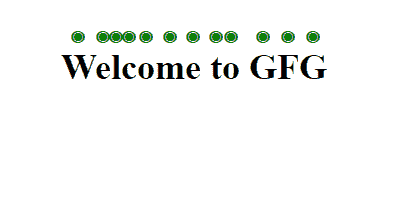

# CSS 文本强调属性

> 原文:[https://www.geeksforgeeks.org/css-text-emphasis-property/](https://www.geeksforgeeks.org/css-text-emphasis-property/)

在本文中，我们将讨论 CSS 中的 ***文本强调*** 属性。是*强调文字风格*和*强调文字颜色*的简写属性。它将强调属性应用于字符(空格和控制字符除外)。

**语法:**

```html
text-emphasis: text-emphasis-style text-emphasis-color;
```

**属性:**

*   **文字-强调-风格:**定义强调标记的形状。接受填充、开放、点、三角形、无等值。
*   **文本-强调-颜色:**定义强调标记的颜色。

**示例:**

## 超文本标记语言

```html
<!DOCTYPE html>
<html>

<head>
    <style>
    h2 {
        text-emphasis: filled double-circle green;
        -webkit-text-emphasis: filled double-circle green;
    }
    </style>
    <title>Text Emphasis</title>
</head>

<body>
    <center>
        <h2>Welcome to GFG</h2> 
    </center>
</body>

</html>
```

**输出:**



**支持的浏览器:**

*   Chrome 25 及以上
*   边缘 79 及以上
*   Firefox 46 及以上版本
*   歌剧 15 及以上
*   Safari 7 及以上版本