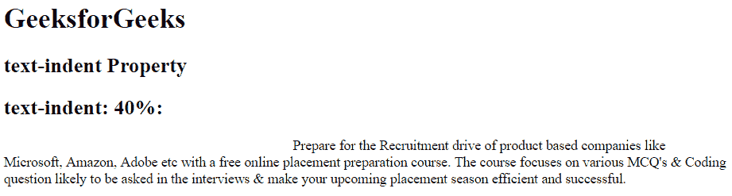
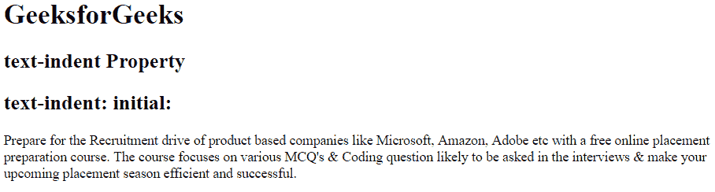

# CSS |文本缩进属性

> 原文:[https://www.geeksforgeeks.org/css-text-indent-property/](https://www.geeksforgeeks.org/css-text-indent-property/)

CSS 中的文本缩进属性用于定义每个文本块中第一行的缩进。它也取负值。这意味着如果该值为负，那么第一行将向左缩进。

**语法:**

```
text-indent: length|initial|inherit; 
```

**属性值**

*   **length:** It is used to set fixed indentation in terms of px, pt, cm, em etc. The default value of length is 0.

    **语法:**

    ```
    text-indent: length;
    ```

    **示例:**

    ```
    <!DOCTYPE html>
    <html>
        <head>
            <title>
                CSS text-indent Property
            </title>

            <!-- CSS text-indent property -->
            <style>
                .sudo {
                    text-indent: 70px;
                }

                .geeks {
                    text-indent: -5em;
                }

                .gfg {
                    text-indent: 40%;
                }
            </style>
        </head>

        <body>
            <h1 style = "">GeeksforGeeks</h1>
            <h2> text-indent Property</h2>

            <h2>text-indent: 70px:</h2>
            <div class = "sudo">
                Prepare for the Recruitment drive of product
                based companies like Microsoft, Amazon, Adobe
                etc with a free online placement preparation
                course. The course focuses on various MCQ's
                & Coding question likely to be asked in the 
                interviews & make your upcoming placement
                season efficient and successful.
            </div>

            <h2>text-indent: -5em:</h2>
            <div class = "geeks">
                Prepare for the Recruitment drive of product
                based companies like Microsoft, Amazon, Adobe
                etc with a free online placement preparation
                course. The course focuses on various MCQ's
                & Coding question likely to be asked in the 
                interviews & make your upcoming placement
                season efficient and successful.
            </div>

            <h2>text-indent: 40%:</h2>
            <div class = "gfg">
                Prepare for the Recruitment drive of product
                based companies like Microsoft, Amazon, Adobe
                etc with a free online placement preparation
                course. The course focuses on various MCQ's
                & Coding question likely to be asked in the 
                interviews & make your upcoming placement
                season efficient and successful.
            </div>

        </body>
    </html>                    
    ```

    **输出:**
    

*   **percentage (%):** It is used to define the indentation in % as compared to the width of the element.

    **语法:**

    ```
    text-indent: %;
    ```

    **示例:**

    ```
    <!DOCTYPE html>
    <html>
        <head>
            <title>
                CSS text-indent Property
            </title>

            <!-- CSS text-indent property -->
            <style>
                .gfg {
                    text-indent: 40%;
                }
            </style>
        </head>

        <body>
            <h1 style = "">GeeksforGeeks</h1>
            <h2> text-indent Property</h2>

            <h2>text-indent: 40%:</h2>
            <div class = "gfg">
                Prepare for the Recruitment drive of product
                based companies like Microsoft, Amazon, Adobe
                etc with a free online placement preparation
                course. The course focuses on various MCQ's
                & Coding question likely to be asked in the 
                interviews & make your upcoming placement
                season efficient and successful.
            </div>

        </body>
    </html>                    
    ```

    **输出:**
    

*   **initial:** It is used to set text-indent property to its default value.

    **语法:**

    ```
    text:indent: initial;
    ```

    **示例:**

    ```
    <!DOCTYPE html>
    <html>
        <head>
            <title>
                CSS text-indent Property
            </title>

            <!-- CSS text-indent property -->
            <style>
                .gfg {
                    text-indent: initial;
                }
            </style>
        </head>

        <body>
            <h1 style = "">GeeksforGeeks</h1>
            <h2> text-indent Property</h2>

            <h2>text-indent: initial:</h2>
            <div class = "gfg">
                Prepare for the Recruitment drive of product
                based companies like Microsoft, Amazon, Adobe
                etc with a free online placement preparation
                course. The course focuses on various MCQ's
                & Coding question likely to be asked in the 
                interviews & make your upcoming placement
                season efficient and successful.
            </div>

        </body>
    </html>                    
    ```

    **输出:**
    

**支持的浏览器:**CSS 文本缩进属性支持的浏览器如下:

*   谷歌 Chrome 1.0
*   Internet Explorer 3.0
*   Firefox 1.0
*   Safari 1.0
*   歌剧 3.5