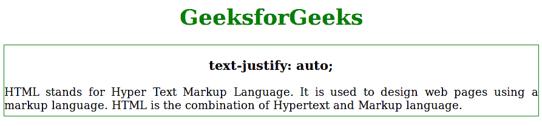
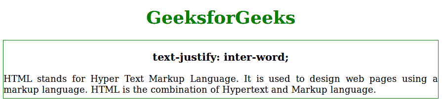
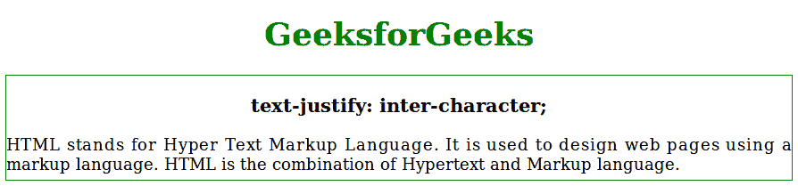

# CSS |文本对齐属性

> 原文:[https://www.geeksforgeeks.org/css-text-justify-property/](https://www.geeksforgeeks.org/css-text-justify-property/)

CSS 中的文本对齐属性用于将文本对齐设置为对齐。它将单词扩展成一整行。

**语法:**

```
text-justify: auto|inter-word|inter-character|none:initial|inherit;
```

**属性值:**文本对齐属性值如下所示:

*   **auto:** It is used to allow the browser to determine which justification property would be better for the given text.

    **语法:**

    ```
    text-justify: auto;
    ```

    **例:**

    ```
    <!DOCTYPE html> 
    <html> 
        <head> 
            <title>text-justify property</title> 
            <style> 
                #main { 
                    border:1px solid green;
                    padding-bottom: 6px;
                } 
                #geeks { 
                    text-align:justify;
                    text-justify:auto;
                } 
                h1, h2, h3 {
                    text-align:center;
                }
            </style> 
        </head> 
        <body> 
            <h1 style = "color:green">
                GeeksforGeeks
            </h1> 

            <div id = "main"> 

                <h3>text-justify: auto;</h3> 

                <!-- text-justify property used here -->
                <div id = "geeks">
                 HTML stands for Hyper Text Markup Language. 
                 It is used to design web pages using a markup
                 language. HTML is the combination of Hypertext
                 and Markup language.
            </div> 
            </div>
        </body> 
    </html>                    
    ```

    **输出:**
    

*   **inter-word:** The text is justified by increasing or decreasing the spacing between individual words in a text.

    **语法:**

    ```
    text-justify: inter-word;
    ```

    **示例:**

    ```
    <!DOCTYPE html> 
    <html> 
        <head> 
            <title>text-justify property</title> 
            <style> 
                #main { 
                    border:1px solid green;
                    padding-bottom: 6px;
                } 
                #geeks { 
                    text-align:justify;
                    text-justify:inter-word;
                } 
                h1, h2, h3 {
                    text-align:center;
                }
            </style> 
        </head> 
        <body> 
            <h1 style = "color:green">
                GeeksforGeeks
            </h1> 

            <div id = "main"> 

                <h3>text-justify: inter-word;</h3> 

                <!-- text-justify property used here -->
                <div id = "geeks">
                 HTML stands for Hyper Text Markup Language. 
                 It is used to design web pages using a markup
                 language. HTML is the combination of Hypertext
                 and Markup language.
            </div> 
            </div>
        </body> 
    </html>                    
    ```

    **输出:**
    

*   **inter-character:** The text is justified by increasing or decreasing the spacing between individual characters in a text.

    **语法:**

    ```
    text-justify: inter-character;
    ```

    **示例:**

    ```
    <!DOCTYPE html> 
    <html> 
        <head> 
            <title>text-justify property</title> 
            <style> 
                #main { 
                    border:1px solid green;
                    padding-bottom: 6px;
                } 
                #geeks { 
                    text-align:justify;
                    text-justify:inter-character;
                } 
                h1, h2, h3 {
                    text-align:center;
                }
            </style> 
        </head> 
        <body> 
            <h1 style = "color:green">
                GeeksforGeeks
            </h1> 

            <div id = "main"> 

                <h3>text-justify: inter-character;</h3> 

                <!-- text-justify property used here -->
                <div id = "geeks">
                 HTML stands for Hyper Text Markup Language. 
                 It is used to design web pages using a markup
                 language. HTML is the combination of Hypertext
                 and Markup language.
            </div> 
            </div>
        </body> 
    </html>                    
    ```

    **输出:**
    

*   **none:** It is used to disable the justification methods used in the text.

    **语法:**

    ```
    text-justify: auto;
    ```

    **示例:**

    ```
    <!DOCTYPE html> 
    <html> 
        <head> 
            <title>text-justify property</title> 
            <style> 
                #main { 
                    border:1px solid green;
                    padding-bottom: 6px;
                } 
                #geeks { 
                    text-align:justify;
                    text-justify:auto;
                } 
                h1, h2, h3 {
                    text-align:center;
                }
            </style> 
        </head> 
        <body> 
            <h1 style = "color:green">
                GeeksforGeeks
            </h1> 

            <div id = "main"> 

                <h3>text-justify: auto;</h3> 

                <!-- text-justify property used here -->
                <div id = "geeks">
                 HTML stands for Hyper Text Markup Language. 
                 It is used to design web pages using a markup
                 language. HTML is the combination of Hypertext
                 and Markup language.
            </div> 
            </div>
        </body> 
    </html>                    
    ```

    **输出:**
    

**支持的浏览器:***文本对齐属性*支持的浏览器如下:

*   谷歌 Chrome
*   Internet Explorer 11.0
*   Firefox 55.0
*   歌剧
*   Safari 10.0.3