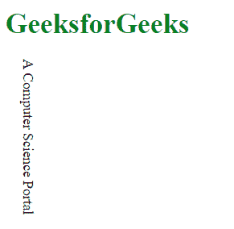
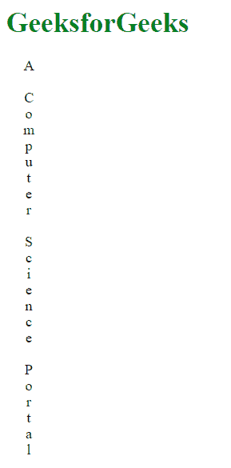

# CSS |文本方向属性

> 原文:[https://www . geesforgeks . org/CSS-text-orientation-property/](https://www.geeksforgeeks.org/css-text-orientation-property/)

CSS 中的**文本方向属性**用于设置一行中字符的方向。这个属性在垂直脚本中很有用，比如创建垂直的表格标题，定义行的名称等等。

**语法:**

```html
text-orientation: mixed|upright|sideways;
```

**属性:**

*   **mixed:** This value is used to rotate the character of text into 90 degree clockwise. It is the default value.

    **示例:**

    ```html
    <!DOCTYPE html>
    <head>
        <title>
            CSS | text-orientation Property
        </title>

        <style>
            h1 {
                color:green;
            }
            p {
                writing-mode: vertical-rl;
                text-orientation: mixed;
            }
        </style>
    </head>

    <body>
        <h1>GeeksforGeeks</h1>

        <p>A Computer Science Portal</p>
    </body>

    </html>
    ```

    **输出:**
    

*   **直立:**该值从屏幕右侧向下开始文本。
    T3】例:

```html
<!DOCTYPE html>
<head>
    <title>
        CSS | text-orientation Property
    </title>

    <style>
        h1 {
            color:green;
        }
        p {
            writing-mode: vertical-rl;
            text-orientation: upright;
        }
    </style>
</head>

<body>
    <h1>GeeksforGeeks</h1>

    <p>A Computer Science Portal</p>
</body>

</html>
```

**输出:**


*   **sideways:** This value rotates the text line into 90 degree clockwise.

    **示例:**

    ```html
    <!DOCTYPE html>
    <head>
        <title>
            CSS | text-orientation Property
        </title>

        <style>
            h1 {
                color:green;
            }
            p {
                writing-mode: vertical-rl;
                text-orientation: sideways;
            }
        </style>
    </head>

    <body>
        <h1>GeeksforGeeks</h1>

        <p>A Computer Science Portal</p>
    </body>

    </html>
    ```

    **输出:**
    

**注意:**文本方向属性取决于[书写模式属性](https://www.geeksforgeeks.org/css-writing-mode-property/)，如果没有设置在**水平-tb** 上，则该属性有效。

**支持的浏览器:***文本导向属性*支持的浏览器如下:

*   谷歌 Chrome
*   火狐浏览器
*   歌剧