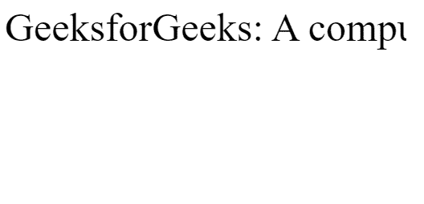
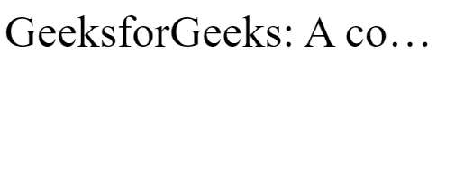
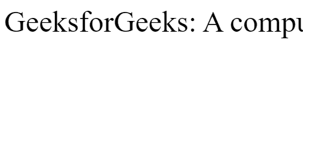
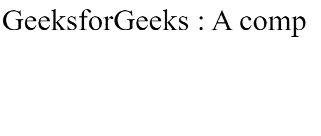
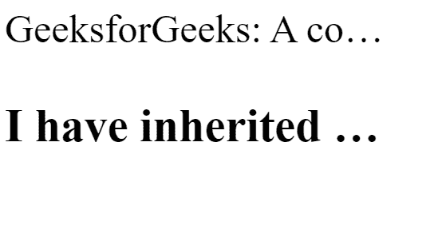

# CSS 文本-溢出属性

> 原文:[https://www.geeksforgeeks.org/css-text-overflow-property/](https://www.geeksforgeeks.org/css-text-overflow-property/)

CSS 中的**文本溢出**属性用于指定某些文本已经溢出并隐藏在视图之外。[空白属性](https://www.geeksforgeeks.org/css-white-space-property/)必须设置为*无标记*，而*溢出属性*必须设置为*隐藏*。溢出的内容可以被剪裁，显示省略号(“…”)或显示自定义字符串。

**语法:**

```html
text-overflow: clip|string|ellipsis|initial|inherit;
```

**属性值:**下面的例子很好地描述了所有的属性。

**剪辑:**文字被剪辑，看不到。这是默认值。

**语法:**

```html
text-overflow: clip;
```

**示例:**本示例说明了**文本溢出**属性的使用，该属性的值被设置为 clip。

## 超文本标记语言

```html
<html>
<head>
    <title> CSS | text-overflow Property </title>
    <style type="text/css">
    div {
        width: 500px;
        font-size: 50px;
        white-space: nowrap;
        overflow: hidden;
        text-overflow: clip;
    }
    </style>
</head>

<body>
    <div>GeeksforGeeks: A computer science portal for geeks.</div>
</body>
</html>
```

**输出:**



CSS 文本溢出剪辑

**省略号:**文本被剪裁，剪裁后的文本表示为**“…”**。

**语法:**

```html
text-overflow: ellipsis;
```

**示例:**本示例说明了**文本溢出**属性的使用，该属性的值被设置为省略号。

## 超文本标记语言

```html
<html>
<head>
    <title> CSS | text-overflow Property </title>
    <style type="text/css">
    div {
        width: 500px;
        font-size: 50px;
        white-space: nowrap;
        overflow: hidden;
        text-overflow: ellipsis;
    }
    </style>
</head>

<body>
    <div> GeeksforGeeks: A computer science portal for geeks. </div>
</body>
</html>
```

**输出:**



**字符串:**使用编码器选择的字符串向用户表示剪切的文本。此选项仅在火狐浏览器中可见。

**语法:**

```html
text-overflow: string;
```

其中字符串由开发人员定义。

**示例:**本示例说明了**文本溢出**属性的使用，该属性的值被设置为特定的字符串值。

## 超文本标记语言

```html
<html>
<head>
    <title> CSS | text-overflow Property </title>
    <style type="text/css">
    div {
        width: 500px;
        font-size: 50px;
        white-space: nowrap;
        overflow: hidden;
        text-overflow: " ";
    }
    </style>
</head>

<body>
    <div> GeeksforGeeks: A computer science portal for geeks. </div>
</body>
</html>
```

**输出:**



[**初始**](https://www.geeksforgeeks.org/css-value-initial/) **:** 用于将元素的 CSS 属性设置为默认值 ie。，该值会将 text-overflow 属性设置为默认值。

**语法:**

```html
text-overflow: initial;
```

**示例:**本示例说明了**文本溢出**属性的使用，该属性的值设置为初始值。

## 超文本标记语言

```html
<html>
<head>
    <title> CSS | text-overflow Property </title>
    <style type="text/css">
    div {
        width: 500px;
        font-size: 50px;
        white-space: nowrap;
        overflow: hidden;
        text-overflow: initial;
    }
    </style>
</head>

<body>
    <div> GeeksforGeeks : A computer science portal for geeks. </div>
</body>
</html>
```

**输出:**



[**继承**](https://www.geeksforgeeks.org/css-value-inherit/) **:** 用于从元素的父元素属性值 ie 继承元素的属性。，该值会将 text-overflow 属性设置为父元素的值。

**语法:**

```html
text-overflow: inherit;
```

**示例:**该示例说明了**文本溢出**属性的使用，该属性的值被设置为继承。

## 超文本标记语言

```html
<html>
<head>
    <title> CSS | text-overflow Property </title>
    <style type="text/css">
    div {
        width: 500px;
        font-size: 50px;
        white-space: nowrap;
        overflow: hidden;
        text-overflow: ellipsis;
    }

    h3 {
        width: 500px;
        white-space: nowrap;
        overflow: hidden;
        text-overflow: inherit;
    }
    </style>
</head>

<body>
    <div> GeeksforGeeks: A computer science portal for geeks.
        <h3>
         I have inherited my overflow property from div.
        </h3>
    </div>
</body>
</html>
```

**输出:**



**支持的浏览器:***文本溢出属性*支持的浏览器如下:

*   Chrome 1.0
*   Firefox 7.0
*   微软边缘 12.0
*   IE 6.0
*   Safari 1.3
*   Opera 11.0