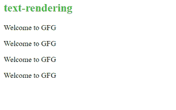

# CSS 文本渲染

> 原文:[https://www.geeksforgeeks.org/css-text-rendering/](https://www.geeksforgeeks.org/css-text-rendering/)

文本呈现是一个属性，允许您在呈现文本时选择要优化的内容。它向呈现引擎发送关于呈现文本时要优化什么的信息。

它实际上不是 CSS 属性，也没有在任何 CSS 标准中定义。这是一个 SVG 属性，但是 Gecko 和 Webkit 浏览器允许您将这个属性应用于 HTML 元素。这样做在速度、易读性(清晰度)和几何精度等其他方面进行了折衷。

**语法:**

```css
text-rendering : auto | optimizeSpeed | 
                 optimizeLegibility | geometricPrecision;
```

**值:**

*   **自动:**浏览器会预测何时可以在绘制文本时调整速度、可读性和几何精度。不同的浏览器响应不同的值。
*   **优化速度:**在绘制文本时，与易读性和几何精度相比，浏览器更优先考虑渲染速度。它禁用字距调整和连字。
*   **优化可打印性:**在绘制文本时，与渲染速度和几何精度相比，浏览器优先考虑更易读性。它支持字距调整和可选连字。
*   **几何精度:**与绘制文本时的渲染速度和易读性相比，浏览器优先考虑更高的几何精度。字体的某些方面，如字距调整，不是线性缩放的，因此它可以使使用这些字体的文本看起来更好。

**示例:**

## 超文本标记语言

```css
<!DOCTYPE html>
<html>
   <head>
      <title>Geeks For Geeks</title>
      <style>
         .auto {
         text-rendering: auto;
         }
         .optimizeSpeed{
         text-rendering: optimizeSpeed;
         }
         .optimizeLegibility {
         text-rendering: optimizeLegibility;
         }
         .geometricPrecision{
         text-rendering: geometricPrecision;
         }
      </style>
   </head>
   <body>
      <h2 style="color:#3FBF3F">text-rendering</h2>
      <p class="auto">Welcome to GFG</p>

      <p class="optimizeSpeed">Welcome to GFG</p>

      <p class="optimizeLegibility">Welcome to GFG</p>

      <p class="geometricPrecision">Welcome to GFG</p>

   </body>
</html>
```

**输出:**

