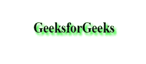

# CSS 文本-阴影属性

> 原文:[https://www.geeksforgeeks.org/css-text-shadow-property/](https://www.geeksforgeeks.org/css-text-shadow-property/)

CSS 中的**文本-阴影**属性用于给文本添加阴影。此属性接受要应用于文本的阴影列表，用逗号分隔。文本阴影属性的默认值是无。

**语法:**

```css
text-shadow: h-shadow v-shadow blur-radius color|none|initial|
inherit;
```

**属性值:**

*   **h-shadow:** 需要这个属性&用来指定水平阴影的位置。它接受负值。
*   **v 形阴影:**这个属性是必需的&用来指定垂直阴影的位置。它也接受负值。
*   **模糊半径:**用于设置模糊半径。其默认值为 0 &可选。
*   **无:**表示文本没有添加阴影，这是默认值。
*   **颜色:**用于设置阴影的颜色。它是可选的。
*   **初始值:**用于将文字阴影设置为默认值。
*   **inherit:** 该属性从其父元素继承而来。

**示例:**此示例显示了文本阴影属性的使用，其特定值以像素为单位分配。

## 超文本标记语言

```css
<!DOCTYPE html>
<html>
<head>
    <title> CSS | text-shadow Property </title>
    <style>
    h1 {
        text-shadow: 5px 5px 8px #00FF00;
    }
    </style>
</head>

<body>
    <h1> GeeksforGeeks </h1>
</body>
</html>
```

**输出:**



**支持的浏览器:**以下列出了**文本阴影** *属性*支持的浏览器:

*   谷歌 Chrome 4.0
*   Internet Explorer 10.0
*   微软边缘 12.0
*   Firefox 3.5
*   歌剧 9.6
*   Safari 4.0