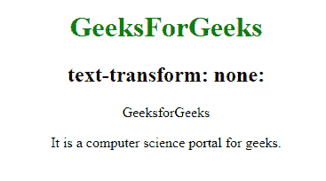
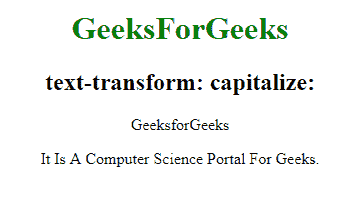
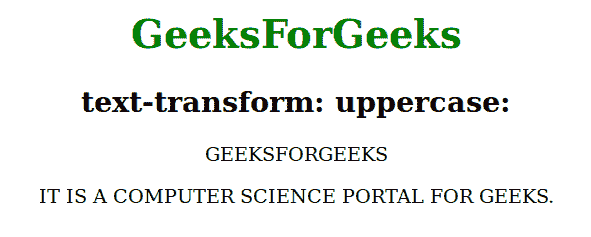
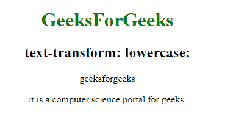
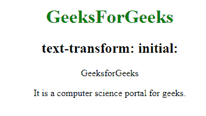

# CSS 文本转换属性

> 原文:[https://www.geeksforgeeks.org/css-text-transform-property/](https://www.geeksforgeeks.org/css-text-transform-property/)

**文本转换**属性用于控制文本的大小写。
**语法:**

```
text-transform: none|capitalize|uppercase|lowercase|initial|inherit; 
```

**房产价值:**

*   **无:**有默认值。它没有大写。
    **语法:**

```
text-transform: none;
```

*   **例:**

## 超文本标记语言

```
<!DOCTYPE html>
<html>

<head>
    <title>
        CSS text-transform Property
    </title>
    <style>
        h1 {
            color: green;
        }

        p.gfg {
            text-transform: none;
        }
    </style>
</head>

<body>
    <center>
        <h1>GeeksForGeeks</h1>

        <h2>text-transform: none:</h2>
        <p class="gfg">GeeksforGeeks</p>

        <p class="gfg">
         It is a computer science portal for geeks.
        </p>

</body>

</html>
```

*   **输出:**



*   **大写:**用于将每个单词的第一个字符转换为大写。
    **语法:**

```
text-transform:capitalize;
```

*   **例:**

## 超文本标记语言

```
<!DOCTYPE html>
<html>

<head>
    <title>
        CSS text-transform Property
    </title>
    <style>
        h1 {
            color: green;
        }

        p.gfg {
            text-transform: capitalize;
        }
    </style>
</head>

<body>
    <center>
        <h1>GeeksForGeeks</h1>

        <h2>text-transform: capitalize:</h2>
        <p class="gfg">GeeksforGeeks</p>

        <p class="gfg">
         It is a computer science portal for geeks.
        </p>

</body>

</html>
```

*   **输出:**



*   **大写:**用于将每个单词中的所有字符转换或变换为大写。
    **语法:**

```
text-transform:uppercase;
```

*   **例:**

## 超文本标记语言

```
<!DOCTYPE html>
<html>

<head>
    <title>
        CSS text-transform Property
    </title>
    <style>
        h1 {
            color: green;
        }

        p.gfg {
            text-transform: uppercase;
        }
    </style>
</head>

<body>
    <center>
        <h1>GeeksForGeeks</h1>

        <h2>text-transform: uppercase:</h2>
        <p class="gfg">GeeksforGeeks</p>

        <p class="gfg">
         It is a computer science portal for geeks.
        </p>

</body>

</html>
```

*   **输出:**



*   **小写:**用于将每个单词中的所有字符转换或变换为 alowercase。
    **语法:**

```
text-transform:lowercase;
```

*   **例:**

## 超文本标记语言

```
<!DOCTYPE html>
<html>

<head>
    <title>
        CSS text-transform Property
    </title>
    <style>
        h1 {
            color: green;
        }

        p.gfg {
            text-transform: lowercase;
        }
    </style>
</head>

<body>
    <center>
        <h1>GeeksForGeeks</h1>

        <h2>text-transform: lowercase:</h2>
        <p class="gfg">GeeksforGeeks</p>

        <p class="gfg">
         It is a computer science portal for geeks.
        </p>

</body>

</html>
```

*   **输出:**



*   **初始值:**将属性设置为默认值。
    **语法:**

```
text-transform:initial;
```

*   **例:**

## 超文本标记语言

```
<!DOCTYPE html>
<html>

<head>
    <title>
        CSS text-transform Property
    </title>
    <style>
        h1 {
            color: green;
        }

        p.gfg {
            text-transform: initial;
        }
    </style>
</head>

<body>
    <center>
        <h1>GeeksForGeeks</h1>

        <h2>text-transform: initial:</h2>
        <p class="gfg">GeeksforGeeks</p>

        <p class="gfg">
         It is a computer science portal for geeks.
        </p>

</body>

</html>
```

*   **输出:**



**支持的浏览器:**CSS 文本转换属性支持的浏览器如下:

*   谷歌 Chrome 1.0
*   Internet Explorer 4.0
*   Firefox 1.0
*   Opera 1.0
*   Safari 3.5