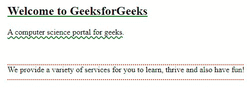

# CSS 文本-下划线-偏移属性

> 原文:[https://www . geesforgeks . org/CSS-text-underline-offset-property/](https://www.geeksforgeeks.org/css-text-underline-offset-property/)

在本文中，我们将讨论 CSS 中的**文本-下划线-偏移**属性。它与带下划线的文本一起使用，但不是它的一部分。设置下划线与其原始位置的偏移距离。默认情况下，它被设置为自动，但我们可以通过指定长度或百分比来增加它。如果任何元素包含多条文本装饰线，那么文本-下划线-偏移仅导致下划线作为其值，而不是其他可能的值，即上划线、线贯通。

**语法:**

```html
text-underline-offset: auto|<length>|<percentage>;
```

**属性值:**

*   **自动:**这是一个默认值，浏览器将在其中选择适当的下划线偏移量。
*   **<长度> :** 它以长度单位表示下划线的偏移量(也包括负值)，就像 *em* 一样。
*   **<百分比> :** 以百分比表示下划线的偏移量。
*   **初始值:**这是自动设置的默认属性。
*   **继承:**继承父级的下划线偏移值。
*   **取消设置:**删除元素当前的偏移值。

**示例:**在本例中，我们将看到 3 个属性值的实现。

## 超文本标记语言

```html
<!DOCTYPE html>
<html>

<head>
    <title>text-underline-offset property in CSS</title>

    <style>
        h2 {
            text-decoration: underline solid green;
            text-underline-offset: auto;
        }

        span {
            text-decoration: underline wavy green;
            text-underline-offset: 0.1em;
        }

        p {
            text-decoration: underline overline dotted red;
            text-underline-offset: 90%;
        }
    </style>
</head>

<body>
    <h2>Welcome to GeeksforGeeks</h2>
    <span>A computer science portal for geeks.</span>

    <p>
        We provide a variety of services for 
        you to learn, thrive and also have
        fun!
    </p>
</body>

</html>
```

**说明:**对于标题标签，文本设置为纯绿色下划线&文本-下划线-偏移量设置为自动值。同样，我们将< span >标签的文字修饰值设置为下划线波浪绿色&长度值即文字-下划线-偏移值设置为 0.1 μm，在这种情况下，我们使用了百分比属性即< p >标签的文字修饰值设置为下划线上划线红色&文字-下划线-偏移值设置为 90%。

**输出:**



**支持的浏览器:**

*   Chrome 87.0 及以上版本
*   Edge 87.0 及以上
*   Firefox 70.0 及以上版本
*   Opera 73.0 及以上版本
*   Safari 12.1 及以上版本