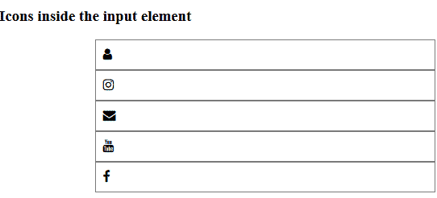
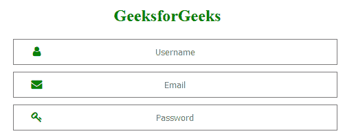

# CSS 将图标放入表单中的输入元素内

> 原文:[https://www . geesforgeks . org/CSS-to-put-icon-in-a-in-input-element-in-a-form/](https://www.geeksforgeeks.org/css-to-put-icon-inside-an-input-element-in-a-form/)

要在输入元素内添加图标，广泛使用 **[< i >](https://www.geeksforgeeks.org/html-i-tag/)** 标签和 **[< span >](https://www.geeksforgeeks.org/span-tag-html/)** 标签在网页上添加图标。要在网页上或某个特定区域添加任何图标，它需要标题标签内的 fontawesome 链接。fontawesome 图标可以通过在图标名称前使用 fa 前缀来放置。

**fontawesome 链接:**[https://cdnjs . cloudflare . com/Ajax/libs/font-awesome/4 . 7 . 0/CSS/font-awesome . min . CSS](https://cdnjs.cloudflare.com/ajax/libs/font-awesome/4.7.0/css/font-awesome.min.css)
**注:**无需下载或安装。

**示例-1:**

```html
<!DOCTYPE html>
<html>

<head>
    <link rel="stylesheet" 
          href=
"https://cdnjs.cloudflare.com/ajax/libs/font-awesome/4.7.0/css/font-awesome.min.css">
    <style>
        .input-icons i {
            position: absolute;
        }

        .input-icons {
            width: 100%;
            margin-bottom: 10px;
        }

        .icon {
            padding: 10px;
            min-width: 40px;
        }

        .input-field {
            width: 100%;
            padding: 10px;
            text-align: center;
        }
    </style>
</head>

<body>
    <h3>
      Icons inside the input element
  </h3>
    <div style="max-width:400px;margin:auto">
        <div class="input-icons">
            <i class="fa fa-user icon"></i>
            <input class="input-field" type="text">
            <i class="fa fa-instagram icon"></i>
            <input class="input-field" type="text">
            <i class="fa fa-envelope icon"></i>
            <input class="input-field" type="text">
            <i class="fa fa-youtube icon"></i>
            <input class="input-field" type="text">
            <i class="fa fa-facebook icon"></i>
            <input class="input-field" type="text">
        </div>
  </div>
</body>

</html>
```

**输出:**


**示例-2:**

```html
<!DOCTYPE html>
<html>

<head>
    <link rel="stylesheet"
          href=
"https://cdnjs.cloudflare.com/ajax/libs/font-awesome/4.7.0/css/font-awesome.min.css">
    <style>
        .input-icons i {
            position: absolute;
        }

        .input-icons {
            width: 100%;
            margin-bottom: 10px;
        }

        .icon {
            padding: 10px;
            color: green;
            min-width: 50px;
            text-align: center;
        }

        .input-field {
            width: 100%;
            padding: 10px;
            text-align: center;
        }

        h2 {
            color: green;
        }
    </style>
</head>

<body>
    <center>
        <form style="max-width:450px;margin:auto">
            <h2>GeeksforGeeks</h2>
            <div class="input-icons">
                <i class="fa fa-user icon">
              </i>
                <input class="input-field" 
                       type="text" 
                       placeholder="Username">
            </div>

            <div class="input-icons">
                <i class="fa fa-envelope icon">
              </i>
                <input class="input-field" 
                       type="text"
                       placeholder="Email">
            </div>

            <div class="input-icons">
                <i class="fa fa-key icon">
              </i>
                <input class="input-field" 
                       type="password"
                       placeholder="Password">
            </div>
        </form>
    </center>
</body>

</html>
```

**输出:**


HTML 是网页的基础，通过构建网站和网络应用程序用于网页开发。您可以通过以下 [HTML 教程](https://www.geeksforgeeks.org/html-tutorials/)和 [HTML 示例](https://www.geeksforgeeks.org/html-examples/)从头开始学习 HTML。

CSS 是网页的基础，通过设计网站和网络应用程序用于网页开发。你可以通过以下 [CSS 教程](https://www.geeksforgeeks.org/css-tutorials/)和 [CSS 示例](https://www.geeksforgeeks.org/css-examples/)从头开始学习 CSS。