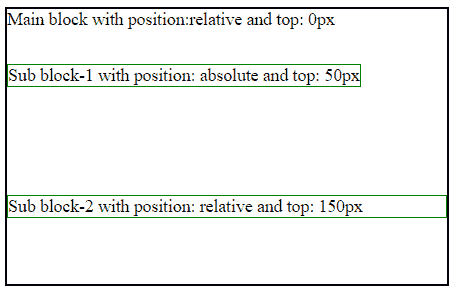
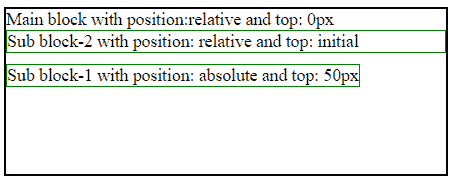
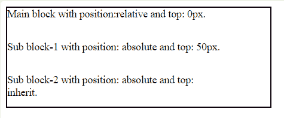

# CSS 顶级属性

> 原文:[https://www.geeksforgeeks.org/css-top-property/](https://www.geeksforgeeks.org/css-top-property/)

CSS 中的 top 属性用于描述元素的顶部位置。top 属性随元素的位置而变化。

*   如果位置值是固定的或绝对的，元素会相对于其父元素或包含它的块的上边缘调整其上边缘。
*   如果位置值是相对的，则元素相对于其当前上边缘进行定位。
*   如果位置值是静态的，那么由于 top 属性，元素没有任何影响。

**语法:**

```
top: length| initial| inherit| auto;
```

**属性值:**下面的例子很好地描述了所有的属性。

**长度:**此属性用于指定元素的顶部位置。长度值可以是负数、null 或正数。长度值可以是 px、cm 等形式。

**示例:**此示例说明了*长度*属性的使用，该属性将用于设置 px、cm 等中的顶部边缘位置。

## 超文本标记语言

```
<!DOCTYPE html>
<html>
<head>
    <title> CSS top Property </title>

    <!-- CSS property used here -->
    <style>
    .gfg1 {
        position: relative;
        top: 00px;
        width: 400px;
        height: 250px;
        border: 2px solid black;
    }

    .gfg2 {
        position: absolute;
        top: 50px;
        border: 1px solid green;
    }

    .gfg3 {
        position: relative;
        top: 150px;
        border: 1px solid green;
    }
    </style>
</head>

<body>
    <div class="gfg1">
      Main block with position: relative and top: 0px
        <div class="gfg2">
          Sub block-1 with position: absolute and top: 50px
        </div>
        <div class="gfg3">
          Sub block-2 with position: relative and top: 150px
        </div>
    </div>
</body>
</html>
```

**输出:**



[](https://www.geeksforgeeks.org/css-value-initial/)****:**用于将元素的 CSS 属性设置为默认值。初始关键字可以用于任何 CSS 属性和任何 HTML 元素。**

****示例:**该示例说明了使用*初始*属性将该值设置为默认值。**

## **超文本标记语言**

```
<!DOCTYPE html>
<html>
<head>
    <title> CSS top Property </title>

    <!-- CSS property used here -->
    <style>
    .gfg1 {
        position: relative;
        width: 400px;
        height: 150px;
        border: 2px solid black;
    }

    .gfg2 {
        position: absolute;
        top: 50px;
        border: 1px solid green;
    }

    .gfg3 {
        position: relative;
        top: initial;
        border: 1px solid green;
    }
    </style>
</head>

<body>
    <div class="gfg1">
      Main block with position: relative and top: 0px
        <div class="gfg2">
          Sub block-1 with position: absolute and top: 50px
        </div>
        <div class="gfg3">
          Sub block-2 with position: relative and top: initial
        </div>
    </div>
</body>
</html>
```

****输出:****

****

**[**继承**](https://www.geeksforgeeks.org/css-value-inherit/) **:** 此属性用于从元素的父元素属性值继承元素的属性。inherit 关键字可用于继承任何 CSS 属性和任何 HTML 元素。**

****示例:**该示例说明了使用*继承*属性，从其父元素属性值继承属性。**

## **超文本标记语言**

```
<!DOCTYPE html>
<html>
<head>
    <title> CSS top Property </title>

    <!-- CSS property used here -->
    <style>
    .gfg1 {
        position: relative;
        width: 400px;
        height: 150px;
        border: 2px solid black;
    }

    .gfg2 {
        position: absolute;
        top: 50px;
    }

    .gfg3 {
        position: absolute;
        top: inherit;
    }
    </style>
</head>

<body>
    <div class="gfg1">
      Main block with position: relative and top: 0px.
        <div class="gfg2">
          Sub block-1 with position: absolute and top: 50px.
            <div class="gfg3">
              Sub block-2 with position: absolute and top: inherit.
            </div>
        </div>
    </div>
</body>
</html>
```

****输出:****

****

****支持的浏览器:**T2 顶级属性支持的浏览器如下:**

*   **谷歌 Chrome 1.0**
*   **Internet Explorer 5.0**
*   **微软边缘 12.0**
*   **Firefox 1.0**
*   **Opera 6.0**
*   **Safari 1.0**