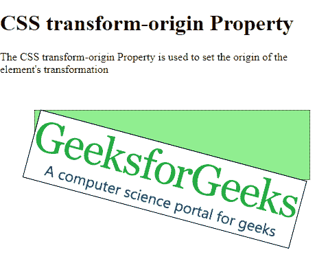
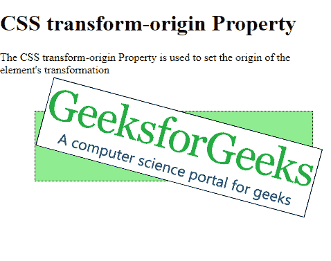
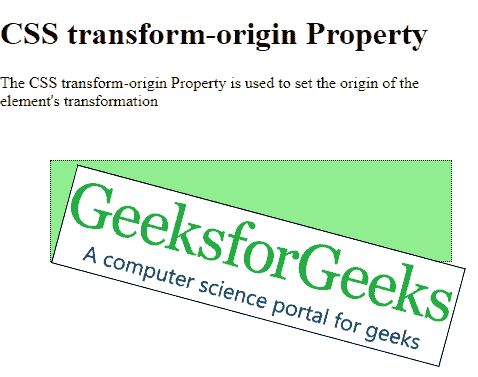
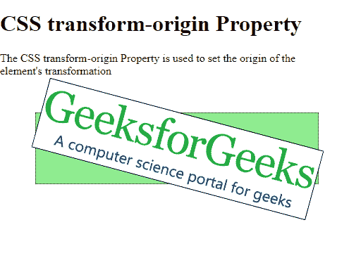

# CSS |变换原点属性

> 原文:[https://www . geesforgeks . org/CSS-transform-origin-property/](https://www.geeksforgeeks.org/css-transform-origin-property/)

CSS 的**变换原点**属性用于指定元素的旋转原点。它是元素旋转的点。它可以用于 2D 和三维旋转。

**语法:**

```css
transform-origin: position | initial | inherit
```

**属性值:**

*   **position:** This specifies the position of the origin of rotation. It takes 3 values corresponding to the distance from the left edge of the box, the distance from the top edge of the box and the z-axis of rotation.

    这些值可以用长度单位、百分比或关键字来指定。z 轴值始终使用长度单位指定。

    **示例 1:** 以长度单位指定位置

    ```css
    <!DOCTYPE html>
    <html>

    <head>
        <style>
            .outer {
                margin: 50px;
                border: 1px dotted;
                position: relative;
                height: 100px;
                width: 400px;
                background-color: lightgreen;
            }

            .box {
                position: absolute;
                border: 1px solid;
                background: url(
    "https://contribute.geeksforgeeks.org/wp-content/uploads/geeksforgeeks-logo.png"
                ) no-repeat;

                background-size: cover;
                height: 100px;
                width: 400px;
                transform: rotate(15deg);
                transform-origin: 10px 30px;
            }
        </style>
    </head>

    <body>
        <h1>CSS transform-origin Property</h1>
        <p>The CSS transform-origin Property is used to set
          the origin of the element's transformation</p>
        <div class="outer">
            <div class="box"></div>
        </div>
    </body>

    </html>
    ```

    **输出:**
    

    **示例 2:** 以百分比指定位置

    ```css
    <!DOCTYPE html>
    <html>

    <head>
        <style>
            .outer {
                margin: 50px;
                border: 1px dotted;
                position: relative;
                height: 100px;
                width: 400px;
                background-color: lightgreen;
            }

            .box {
                position: absolute;
                border: 1px solid;
                background: url(
    "https://contribute.geeksforgeeks.org/wp-content/uploads/geeksforgeeks-logo.png"
                ) no-repeat;

                background-size: cover;
                height: 100px;
                width: 400px;
                transform: rotate(15deg);
                transform-origin: 50% 75%;
            }
        </style>
    </head>

    <body>
        <h1>CSS transform-origin Property</h1>
        <p>The CSS transform-origin Property is 
          used to set the origin of the element's
          transformation</p>
        <div class="outer">
            <div class="box"></div>
        </div>
    </body>

    </html>
    ```

    **输出:**
    

    **示例 3:** 指定关键字中的位置

    ```css
    <!DOCTYPE html>
    <html>

    <head>
        <style>
            .outer {
                margin: 50px;
                border: 1px dotted;
                position: relative;
                height: 100px;
                width: 400px;
                background-color: lightgreen;
            }

            .box {
                position: absolute;
                border: 1px solid;
                background: url(
    "https://contribute.geeksforgeeks.org/wp-content/uploads/geeksforgeeks-logo.png"
                ) no-repeat;

                background-size: cover;
                height: 100px;
                width: 400px;
                transform: rotate(15deg);
                transform-origin: bottom left;
            }
        </style>
    </head>

    <body>
        <h1>CSS transform-origin Property</h1>
        <p>The CSS transform-origin Property is 
          used to set the origin of the element's
          transformation</p>
        <div class="outer">
            <div class="box"></div>
        </div>
    </body>

    </html>
    ```

    **输出:**
    

*   **initial:** This is used to set the property to its default value.

    **示例:**

    ```css
    <!DOCTYPE html>
    <html>

    <head>
        <style>
            .outer {
                margin: 50px;
                border: 1px dotted;
                position: relative;
                height: 100px;
                width: 400px;
                background-color: lightgreen;
            }

            .box {
                position: absolute;
                border: 1px solid;
                background: url(
    "https://contribute.geeksforgeeks.org/wp-content/uploads/geeksforgeeks-logo.png"
                ) no-repeat;

                background-size: cover;
                height: 100px;
                width: 400px;
                transform: rotate(15deg);
                transform-origin: initial;
            }
        </style>
    </head>

    <body>
        <h1>CSS transform-origin Property</h1>
        <p>The CSS transform-origin Property is
          used to set the origin of the element's
          transformation</p>
        <div class="outer">
            <div class="box"></div>
        </div>
    </body>

    </html>
    ```

    **输出:**
    

*   **inherit:** This is used to inherit the property from its parent.

    **示例:**

    ```css
    <!DOCTYPE html>
    <html>

    <head>
        <style>
            /* this acts as the parent */

            .outer {
                margin: 50px;
                border: 1px dotted;
                position: relative;
                height: 100px;
                width: 400px;
                background-color: lightgreen;
                /* set the property of the parent */
                transform-origin: bottom left;
            }

            .box {
                position: absolute;
                border: 1px solid;
                background: url(
    "https://contribute.geeksforgeeks.org/wp-content/uploads/geeksforgeeks-logo.png"
                ) no-repeat;

                background-size: cover;
                height: 100px;
                width: 400px;
                transform: rotate(15deg);
                /* inherits the property of the parent */
                transform-origin: inherit;
            }
        </style>
    </head>

    <body>
        <h1>CSS transform-origin Property</h1>
        <p>The CSS transform-origin Property is used to set
          the origin of the element's transformation</p>
        <div class="outer">
            <div class="box"></div>
        </div>
    </body>

    </html>
    ```

    **输出:**
    

**支持的浏览器:***变换源*属性支持的浏览器如下:

*   Chrome 35.0
*   Internet Explorer 10.0
*   Firefox 16.0
*   Safari 9.0
*   Opera 23.0