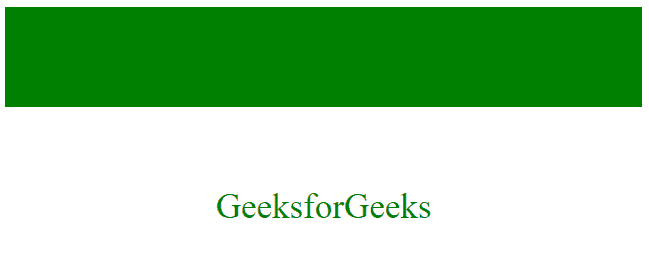

# CSS 变换属性

> 原文:[https://www.geeksforgeeks.org/css-transform-property/](https://www.geeksforgeeks.org/css-transform-property/)

CSS 中的**变换属性**用于改变可视化格式模型的坐标空间。这用于在元素上添加倾斜、旋转、平移等效果。

**语法:**

```
transform: none|transform-functions|initial|inherit;
```

**注意:**变换可以是二维或三维类型。

**值:**

*   **无**:不发生转化。
*   **矩阵(x，x，x，x，x，x):** 指定二维类型的矩阵变换。需要 6 个值。
*   **matrix3d(x，x，x，x，x，x，x，x，x，x):** 指定一个三维类型的矩阵变换。它需要 9 个值。
*   **平移(X，y):** 指定在 X 轴和 Y 轴上的平移。
*   **平移 3d(x，Y，z):** 指定在 X，Y 和 Z 轴上的平移。
*   **translateX(x):** 仅指定 X 轴上的平移。
*   **平移(y):** 仅指定 Y 轴上的平移。
*   **平移 Z(z):** 仅指定 Z 轴上的平移。
*   **旋转(角度):**指定旋转的角度。
*   **rotateX(角度):**指定旋转角度对应的沿 X 轴的旋转。
*   **旋转(角度):**指定旋转角度对应的沿 Y 轴的旋转。
*   **roteteZ(角度):**指定旋转角度对应的沿 Z 轴的旋转。
*   **比例(X，y):** 指定沿 X 轴和 Y 轴的比例变换。
*   **scale3d(x，Y，z):** 指定沿 X，Y，Z 轴的比例变换。
*   **scaleX(x):** 指定沿 X 轴的比例变换。
*   **scaleY(y):** 指定沿 Y 轴的比例变换。
*   **scaleZ(z):** 指定沿 Z 轴的比例变换。
*   **scale3d(x，Y，z):** 指定沿 X，Y，Z 轴的比例变换。
*   **倾斜(角度，角度):**指定倾斜角度对应的 X 轴和 Y 轴的倾斜变换。
*   **偏斜(角度)**:指定偏斜角度对应的沿 X 轴的偏斜变换。
*   **偏斜(角度)**:指定偏斜角度对应的 Y 轴沿线的偏斜变换。
*   **歪斜(角度)**:指定歪斜角度对应的沿 Z 轴的歪斜变换。
*   **透视(x)** :指定元素的透视。参考:[透视属性](https://www.geeksforgeeks.org/css-perspective-property/)
*   **初始**:将元素初始化为默认值。
*   **继承**:从其父元素继承值。

**示例 1:** 无变换属性。

## 超文本标记语言

```
<!DOCTYPE html>
<html>
<head>
    <title> CSS Transform Property </title>
    <style>
    .main {
        display: grid;
        padding: 30px;
        background-color: green;
    }

    .GFG {
        text-align: center;
        font-size: 35px;
        background-color: white;
        color: green;
    }
    </style>
</head>

<body>
    <div class="main">
        <div class="GFG">GeeksforGeeks</div>
    </div>
</body>
</html>
```

**输出:**


**示例 2:** 本示例描述 Matrix()属性值。

## 超文本标记语言

```
<!DOCTYPE html>
<html>
<head>
    <title> CSS Transform Property </title>
    <style>
    .main {
        display: grid;
        padding: 30px;
        background-color: green;
    }

    .GFG {
        text-align: center;
        font-size: 35px;
        background-color: white;
        color: green;
        transform: matrix(1, 0, -1, 1, 1, 0);
    }
    </style>
</head>

<body>
    <div class="main">
        <div class="GFG">GeeksforGeeks</div>
    </div>
</body>
</html>
```

**输出:**


**示例 3:** 本示例描述 Matrix3d()属性值。

## 超文本标记语言

```
<!DOCTYPE html>
<html>
<head>
    <title> CSS Transform Property </title>
    <style>
    .main {
        display: grid;
        padding: 30px;
        background-color: green;
        transform-style: preserve-3d;
    }

    .GFG {
        text-align: center;
        font-size: 35px;
        background-color: white;
        color: green;
        transform-style: preserve-3d;
        position: absolute;
        transform: translate(150px, 75%, 5em)
    }
    </style>
</head>

<body>
    <div class="main">
        <div class="GFG">GeeksforGeeks</div>
    </div>
</body>
</html>
```

**输出:**


**示例 4:** 本示例描述 translate()属性值。

## 超文本标记语言

```
<!DOCTYPE html>
<html>
<head>
    <title> CSS Transform Property </title>
    <style>
    .main {
        display: grid;
        padding: 30px;
        background-color: green;
    }

    .GFG {
        text-align: center;
        font-size: 35px;
        background-color: white;
        color: green;
        transform: translate(150px, 65%);
    }
    </style>
</head>

<body>
    <div class="main">
        <div class="GFG">GeeksforGeeks</div>
    </div>
</body>
</html>
```

**输出:**


**示例 5:** 本示例描述 translate3d()属性值。

## 超文本标记语言

```
<!DOCTYPE html>
<html>
<head>
    <title> CSS Transform Property </title>
    <style>
    .main {
        display: grid;
        padding: 30px;
        background-color: green;
    }

    .GFG {
        text-align: center;
        font-size: 35px;
        background-color: white;
        color: green;
        transform: translate(150px, 65%, 5em);
    }
    </style>
</head>

<body>
    <div class="main">
        <div class="GFG">GeeksforGeeks</div>
    </div>
</body>
</html>
```

**输出:**


**示例 6:** 本示例描述 translateX()属性值。

## 超文本标记语言

```
<!DOCTYPE html>
<html>
<head>
    <title> CSS Transform Property </title>
    <style>
    .main {
        display: grid;
        padding: 30px;
        background-color: green;
    }

    .GFG {
        text-align: center;
        font-size: 35px;
        background-color: white;
        color: green;
        transform: translateX(150px);
    }
    </style>
</head>

<body>
    <div class="main">
        <div class="GFG">GeeksforGeeks</div>
    </div>
</body>
</html>
```

**输出:**


**示例 7:** 本示例描述 translateY()属性值。

## 超文本标记语言

```
<!DOCTYPE html>
<html>
<head>
    <title> CSS Transform Property </title>
    <style>
    .main {
        display: grid;
        padding: 30px;
        background-color: green;
    }

    .GFG {
        text-align: center;
        font-size: 35px;
        background-color: white;
        color: green;
        transform: translateY(150px);
    }
    </style>
</head>

<body>
    <div class="main">
        <div class="GFG">GeeksforGeeks</div>
    </div>
</body>
</html>
```

**输出:**



**示例 8:** 本示例描述 translateZ()属性值。

## 超文本标记语言

```
<!DOCTYPE html>
<html>
<head>
    <title> CSS Transform Property </title>
    <style>
    .main {
        display: grid;
        padding: 30px;
        background-color: green;
    }

    .GFG {
        text-align: center;
        font-size: 35px;
        background-color: white;
        color: green;
        transform: translateZ(150px);
    }
    </style>
</head>

<body>
    <div class="main">
        <div class="GFG">GeeksforGeeks</div>
    </div>
</body>
</html>
```

**输出:**


**示例 9:** 本示例描述 rotate()属性值。

## 超文本标记语言

```
<!DOCTYPE html>
<html>
<head>
    <title> CSS Transform Property </title>
    <style>
    .main {
        display: grid;
        padding: 30px;
        background-color: green;
    }

    .GFG {
        text-align: center;
        font-size: 35px;
        background-color: white;
        color: green;
        transform: rotate(45deg);
    }
    </style>
</head>

<body>
    <div class="main">
        <div class="GFG">GeeksforGeeks</div>
    </div>
</body>
</html>
```

**输出:**


**示例 10:** 本示例描述 rotateX()属性值。

## 超文本标记语言

```
<!DOCTYPE html>
<html>
<head>
    <title> CSS Transform Property </title>
    <style>
    .main {
        display: grid;
        padding: 30px;
        background-color: green;
    }

    .GFG {
        text-align: center;
        font-size: 35px;
        background-color: white;
        color: green;
        transform: rotateX(75deg);
    }
    </style>
</head>

<body>
    <div class="main">
        <div class="GFG">GeeksforGeeks</div>
    </div>
</body>
</html>
```

**输出:**


**示例 11:** 本示例描述 rotateY()属性值。

## 超文本标记语言

```
<!DOCTYPE html>
<html>
<head>
    <title> CSS Transform Property </title>
    <style>
    .main {
        display: grid;
        padding: 30px;
        background-color: green;
    }

    .GFG {
        text-align: center;
        font-size: 35px;
        background-color: white;
        color: green;
        transform: rotateY(75deg);
    }
    </style>
</head>

<body>
    <div class="main">
        <div class="GFG">GeeksforGeeks</div>
    </div>
</body>
</html>
```

**输出:**


**示例 12:** 本示例描述 rotateZ()属性值。

## 超文本标记语言

```
<!DOCTYPE html>
<html>
<head>
    <title> CSS Transform Property </title>
    <style>
    .main {
        display: grid;
        padding: 30px;
        background-color: green;
    }

    .GFG {
        text-align: center;
        font-size: 35px;
        background-color: white;
        color: green;
        transform: rotateZ(75deg);
    }
    </style>
</head>

<body>
    <div class="main">
        <div class="GFG">GeeksforGeeks</div>
    </div>
</body>
</html>
```

**输出:**


**示例 13:** 本示例描述 scale()属性值。

## 超文本标记语言

```
<!DOCTYPE html>
<html>
<head>
    <title> CSS Transform Property </title>
    <style>
    .main {
        display: grid;
        padding: 30px;
        background-color: green;
    }

    .GFG {
        text-align: center;
        font-size: 35px;
        background-color: white;
        color: green;
        transform: scale(1, 2);
    }
    </style>
</head>

<body>
    <div class="main">
        <div class="GFG">GeeksforGeeks</div>
    </div>
</body>
</html>
```

**输出:**


**示例 14:** 本示例描述 scale3d()属性值。

## 超文本标记语言

```
<!DOCTYPE html>
<html>
<head>
    <title> CSS Transform Property </title>
    <style>
    .main {
        display: grid;
        padding: 30px;
        background-color: green;
    }

    .GFG {
        text-align: center;
        font-size: 35px;
        background-color: white;
        color: green;
        transform: scale3d(2, 1, 5);
    }
    </style>
</head>

<body>
    <div class="main">
        <div class="GFG">GeeksforGeeks</div>
    </div>
</body>
</html>
```

**输出:**


**示例 15:** 本示例描述 scaleX()属性值。

## 超文本标记语言

```
<!DOCTYPE html>
<html>
<head>
    <title> CSS Transform Property </title>
    <style>
    .main {
        display: grid;
        padding: 30px;
        background-color: green;
    }

    .GFG {
        text-align: center;
        font-size: 35px;
        background-color: white;
        color: green;
        transform: scaleX(2);
    }
    </style>
</head>

<body>
    <div class="main">
        <div class="GFG">GeeksforGeeks</div>
    </div>
</body>
</html>
```

**输出:**


**示例 16:** 本示例描述 scaleY()属性值。

## 超文本标记语言

```
<!DOCTYPE html>
<html>
<head>
    <title> CSS Transform Property </title>
    <style>
    .main {
        display: grid;
        padding: 30px;
        background-color: green;
    }

    .GFG {
        text-align: center;
        font-size: 35px;
        background-color: white;
        color: green;
        transform: scaleY(2);
    }
    </style>
</head>

<body>
    <div class="main">
        <div class="GFG">GeeksforGeeks</div>
    </div>
</body>
</html>
```

**输出:**


**示例 17:** 本示例描述 scaleZ()属性值。

## 超文本标记语言

```
<!DOCTYPE html>
<html>
<head>
    <title> CSS Transform Property </title>
    <style>
    .main {
        display: grid;
        padding: 30px;
        background-color: green;
    }

    .GFG {
        text-align: center;
        font-size: 35px;
        background-color: white;
        color: green;
        transform: scaleZ(2);
    }
    </style>
</head>

<body>
    <div class="main">
        <div class="GFG">GeeksforGeeks</div>
    </div>
</body>
</html>
```

**输出:**


**示例 18:** 本示例描述 skew()属性值。

## 超文本标记语言

```
<!DOCTYPE html>
<html>
<head>
    <title> CSS Transform Property </title>
    <style>
    .main {
        display: grid;
        padding: 30px;
        background-color: green;
    }

    .GFG {
        text-align: center;
        font-size: 35px;
        background-color: white;
        color: green;
        transform: skew(30deg, 30deg);
    }
    </style>
</head>

<body>
    <div class="main">
        <div class="GFG">GeeksforGeeks</div>
    </div>
</body>
</html>
```

**输出:**


**示例 19:** 本示例描述了 skewX()属性值。

## 超文本标记语言

```
<!DOCTYPE html>
<html>
<head>
    <title> CSS Transform Property </title>
    <style>
    .main {
        display: grid;
        padding: 30px;
        background-color: green;
    }

    .GFG {
        text-align: center;
        font-size: 35px;
        background-color: white;
        color: green;
        transform: skewX(30deg);
    }
    </style>
</head>

<body>
    <div class="main">
        <div class="GFG">GeeksforGeeks</div>
    </div>
</body>
</html>
```

**输出:**


**示例 20:** 本示例描述 skewY()属性值。

## 超文本标记语言

```
<!DOCTYPE html>
<html>
<head>
    <title> CSS Transform Property </title>
    <style>
    .main {
        display: grid;
        padding: 30px;
        background-color: green;
    }

    .GFG {
        text-align: center;
        font-size: 35px;
        background-color: white;
        color: green;
        transform: skewY(30deg);
    }
    </style>
</head>

<body>
    <div class="main">
        <div class="GFG">GeeksforGeeks</div>
    </div>
</body>
</html>
```

**输出:**


**例 21:** 本例描述了 perspective()属性值。

## 超文本标记语言

```
<!DOCTYPE html>
<html>
<head>
    <title> CSS Transform Property </title>
    <style>
    .main {
        display: grid;
        padding: 30px;
        background-color: green;
    }

    .GFG {
        text-align: center;
        font-size: 35px;
        background-color: white;
        color: green;
        transform: perspective(30px);
    }
    </style>
</head>

<body>
    <div class="main">
        <div class="GFG">GeeksforGeeks</div>
    </div>
</body>
</html>
```

**输出:**


**示例 22:** 本示例描述了初始属性值。

## 超文本标记语言

```
<!DOCTYPE html>
<html>
<head>
    <title> CSS Transform Property </title>
    <style>
    .main {
        display: grid;
        padding: 30px;
        background-color: green;
    }

    .GFG {
        text-align: center;
        font-size: 35px;
        background-color: white;
        color: green;
        transform: initial;
    }
    </style>
</head>

<body>
    <div class="main">
        <div class="GFG">GeeksforGeeks</div>
    </div>
</body>
</html>
```

**输出:**


**例 23:** 本例描述继承属性值。

## 超文本标记语言

```
<!DOCTYPE html>
<html>
<head>
    <title> CSS Transform Property </title>
    <style>
    .main {
        display: grid;
        padding: 30px;
        background-color: green;
        transform: rotateX(45deg);
    }

    .GFG {
        text-align: center;
        font-size: 35px;
        background-color: white;
        color: green;
        transform: inherit;
    }
    </style>
</head>

<body>
    <div class="main">
        <div class="GFG">GeeksforGeeks</div>
    </div>
</body>
</html>
```

**输出:**


**注意:**当三维值用于二维元素时，有时不会给出正确的输出，因此不建议将三维值用于二维元素。

**支持的浏览器:***变换属性*支持的浏览器如下:

*   **二维变换:**
    *   Chrome 36.0，4.0 -webkit-
    *   Edge 10.0，9.0 毫秒-
    *   火狐 16.0， 3.5 -moz-
    *   Safari 9.0，3.2 -webkit-
    *   操作 23.0、15.0 -webkit、10.5 -o-
*   **三维变换:**
    *   Chrome 36.0、12.0 -webkit-
    *   Edge 12.0
    *   Firefox 10.0
    *   Safari 9.0，4.0 -webkit-
    *   Opera 23.0，15.0 -webkit-